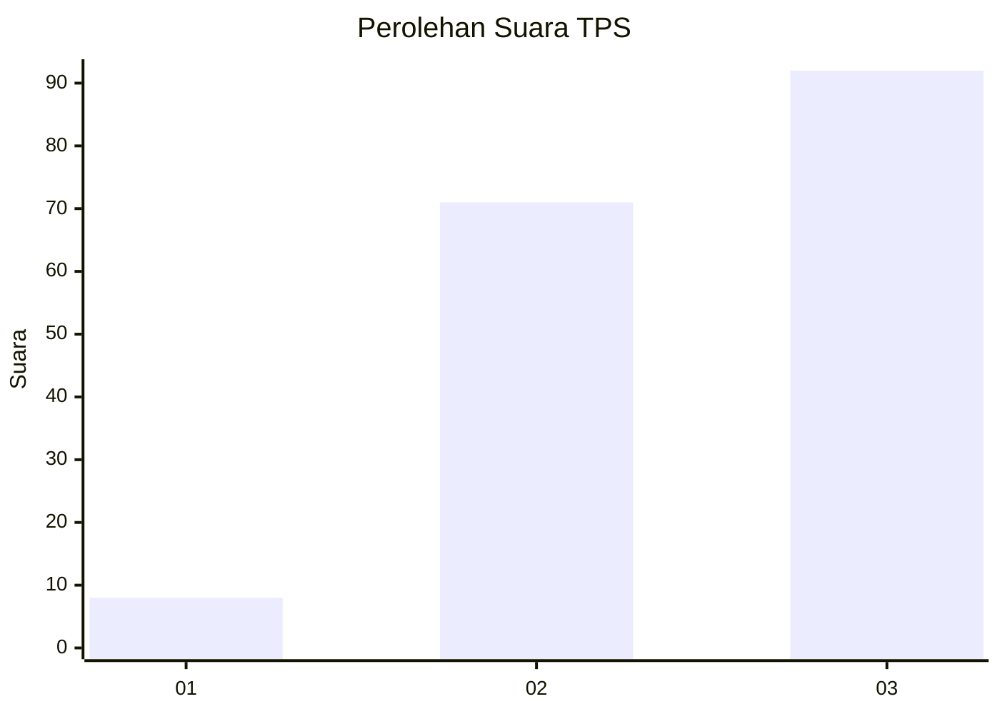
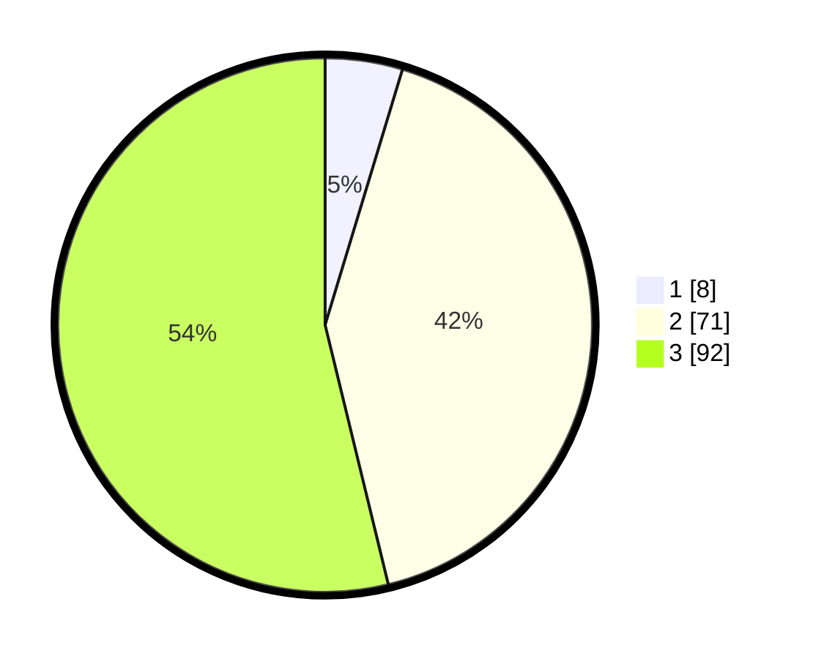

# Hasil

## Grafik

## Tabel

| No. | Nama Paslon    | Suara | Suara (raw) | Persentase |
|:--- |:-------------- | -----:| -----------:| ----------:|
| 1   | ANIES MUHAIMIN | 8     | [8][p-1]    | 4,68       |
| 2   | PRABOWO GIBRAN | 71    | [71][p-2]   | 41,52      |
| 3   | GANJAR MAHFUD  | 92    | [92][p-3]   | 53,80      |

[p-1]: https://github.com/gigit-pemilu/pemilu-2024/blob/main/pilpres/hitung-suara/sub/33-jawa-tengah/sub/15-grobogan/sub/16-godong/sub/2008-latak/sub/004-tps/sub/paslon-1.txt
[p-2]: https://github.com/gigit-pemilu/pemilu-2024/blob/main/pilpres/hitung-suara/sub/33-jawa-tengah/sub/15-grobogan/sub/16-godong/sub/2008-latak/sub/004-tps/sub/paslon-2.txt
[p-3]: https://github.com/gigit-pemilu/pemilu-2024/blob/main/pilpres/hitung-suara/sub/33-jawa-tengah/sub/15-grobogan/sub/16-godong/sub/2008-latak/sub/004-tps/sub/paslon-3.txt

## Foto C Plano

https://sirekap-obj-formc.kpu.go.id/d6c8/pemilu/ppwp/33/15/16/20/08/3315162008004-20240214-204334--cd4ecb42-2651-401b-a25a-f3afab1229ba.jpg

https://sirekap-obj-formc.kpu.go.id/d6c8/pemilu/ppwp/33/15/16/20/08/3315162008004-20240214-204825--e9d11c5f-1c05-4065-8527-8008ef2b22f0.jpg

https://sirekap-obj-formc.kpu.go.id/d6c8/pemilu/ppwp/33/15/16/20/08/3315162008004-20240214-205022--ee4acb6f-2fe4-4662-8657-ff94dc7b124e.jpg

## Metadata

| Key        | Value               |
| ---------- | ------------------- |
| Time Stamp | 2024-02-15 22:30:27 |

