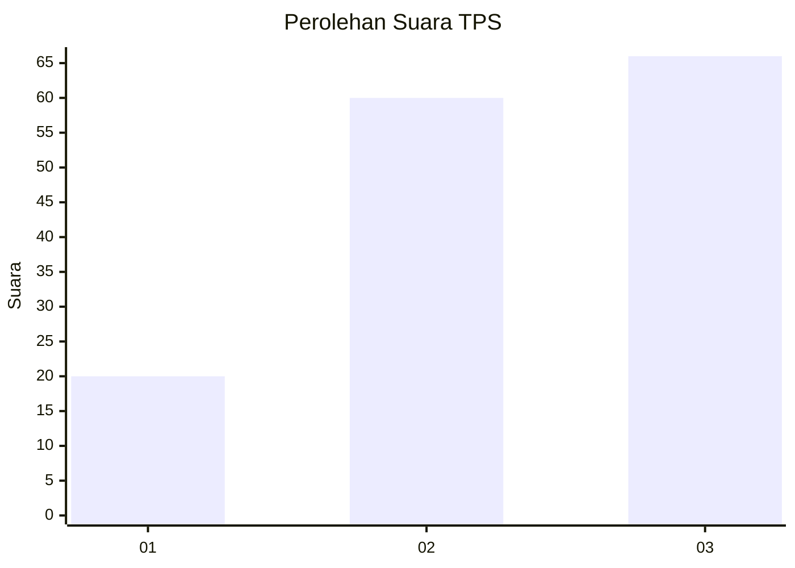
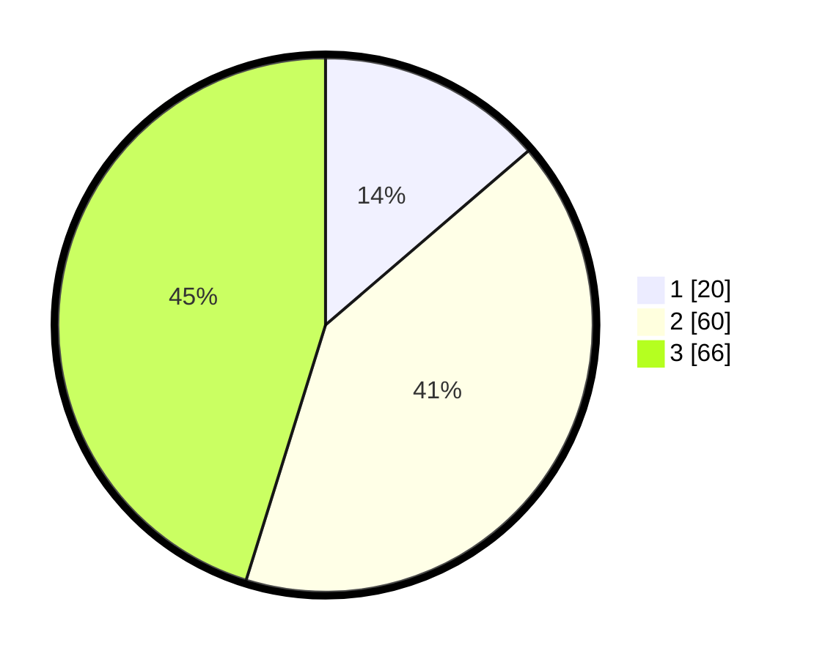

# Hasil

## Grafik

## Tabel

| No. | Nama Paslon    | Suara | Suara (raw) | Persentase |
|:--- |:-------------- | -----:| -----------:| ----------:|
| 1   | ANIES MUHAIMIN | 20    | [20][p-1]   | 13,70      |
| 2   | PRABOWO GIBRAN | 60    | [60][p-2]   | 41,10      |
| 3   | GANJAR MAHFUD  | 66    | [66][p-3]   | 45,21      |

[p-1]: https://github.com/gigit-pemilu/pemilu-2024-33-jawa-tengah/blob/main/pilpres/hitung-suara/sub/33-jawa-tengah/sub/15-grobogan/sub/16-godong/sub/2009-tungu/sub/003-tps/sub/paslon-1.txt
[p-2]: https://github.com/gigit-pemilu/pemilu-2024-33-jawa-tengah/blob/main/pilpres/hitung-suara/sub/33-jawa-tengah/sub/15-grobogan/sub/16-godong/sub/2009-tungu/sub/003-tps/sub/paslon-2.txt
[p-3]: https://github.com/gigit-pemilu/pemilu-2024-33-jawa-tengah/blob/main/pilpres/hitung-suara/sub/33-jawa-tengah/sub/15-grobogan/sub/16-godong/sub/2009-tungu/sub/003-tps/sub/paslon-3.txt

## Foto C Plano

https://sirekap-obj-formc.kpu.go.id/c22b/pemilu/ppwp/33/15/16/20/09/3315162009003-20240214-141733--cb6fab0c-88af-4101-89fb-30958885f16b.jpg

https://sirekap-obj-formc.kpu.go.id/c22b/pemilu/ppwp/33/15/16/20/09/3315162009003-20240214-141743--fe5a8614-e81a-441d-81c1-d116a7352881.jpg

https://sirekap-obj-formc.kpu.go.id/c22b/pemilu/ppwp/33/15/16/20/09/3315162009003-20240214-204005--67385ce8-9cc9-4daf-a69d-f155e05b1327.jpg

## Metadata

| Key        | Value               |
| ---------- | ------------------- |
| Time Stamp | 2024-02-14 21:46:01 |

