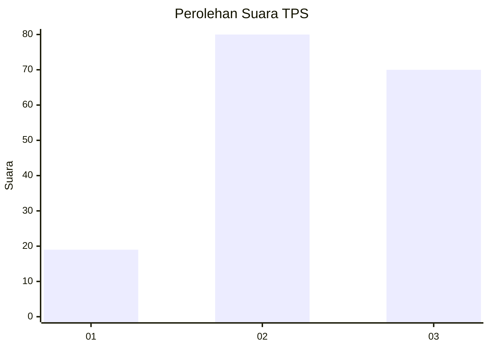
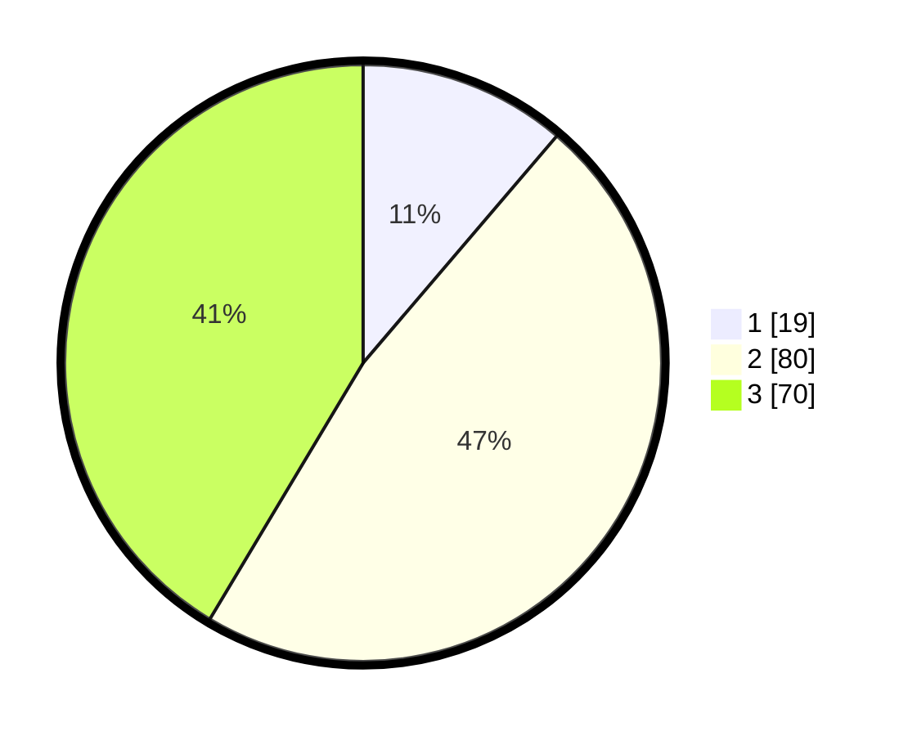

# Hasil

## Grafik

## Tabel

| No. | Nama Paslon    | Suara | Suara (raw) | Persentase |
|:--- |:-------------- | -----:| -----------:| ----------:|
| 1   | ANIES MUHAIMIN | 19    | [19][p-1]   | 11,24      |
| 2   | PRABOWO GIBRAN | 80    | [80][p-2]   | 47,34      |
| 3   | GANJAR MAHFUD  | 70    | [70][p-3]   | 41,42      |

[p-1]: https://github.com/gigit-pemilu/pemilu-2024/blob/main/pilpres/hitung-suara/sub/33-jawa-tengah/sub/15-grobogan/sub/16-godong/sub/2011-wanutunggal/sub/004-tps/sub/paslon-1.txt
[p-2]: https://github.com/gigit-pemilu/pemilu-2024/blob/main/pilpres/hitung-suara/sub/33-jawa-tengah/sub/15-grobogan/sub/16-godong/sub/2011-wanutunggal/sub/004-tps/sub/paslon-2.txt
[p-3]: https://github.com/gigit-pemilu/pemilu-2024/blob/main/pilpres/hitung-suara/sub/33-jawa-tengah/sub/15-grobogan/sub/16-godong/sub/2011-wanutunggal/sub/004-tps/sub/paslon-3.txt

## Foto C Plano

https://sirekap-obj-formc.kpu.go.id/0186/pemilu/ppwp/33/15/16/20/11/3315162011004-20240214-140941--0a0531fb-4080-40b0-980e-405410eb9d6b.jpg

https://sirekap-obj-formc.kpu.go.id/0186/pemilu/ppwp/33/15/16/20/11/3315162011004-20240214-141038--0cbc7312-cc18-4698-8ec5-f3679243c852.jpg

https://sirekap-obj-formc.kpu.go.id/0186/pemilu/ppwp/33/15/16/20/11/3315162011004-20240214-184705--4bd56af2-46da-496e-acaf-68b158f5c048.jpg

## Metadata

| Key        | Value               |
| ---------- | ------------------- |
| Time Stamp | 2024-02-15 19:00:26 |

## DATA PEMILIH TETAP

Jumlah pemilih dalam DPT: **235**.
 * L: **433**.
 * P: **346**.

## DATA PENGGUNA HAK PILIH

Jumlah pengguna hak pilih dalam DPT: **675**.
 * L: **838**.
 * P: **93**.

Jumlah pengguna hak pilih dalam DPTb: **802**.
 * L: **3**.
 * P: **800**.

Jumlah pengguna hak pilih dalam DPK: **2**.
 * L: **804**.
 * P: **2**.

Jumlah pengguna hak pilih: **539**.
 * L: **884**.
 * P: **38**.

## JUMLAH SUARA SAH DAN TIDAK SAH

JUMLAH SELURUH SUARA SAH: **169**.

JUMLAH SUARA TIDAK SAH: **10**.

JUMLAH SELURUH SUARA SAH DAN SUARA TIDAK SAH: **179**.

