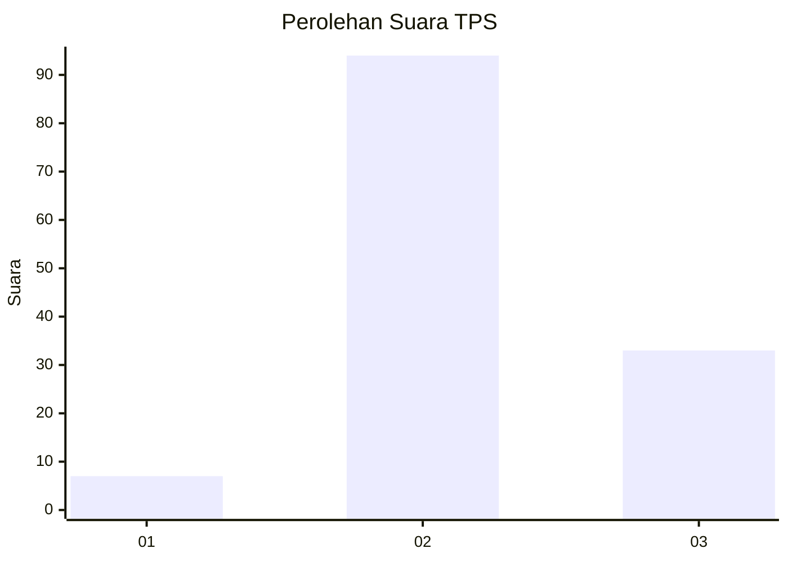
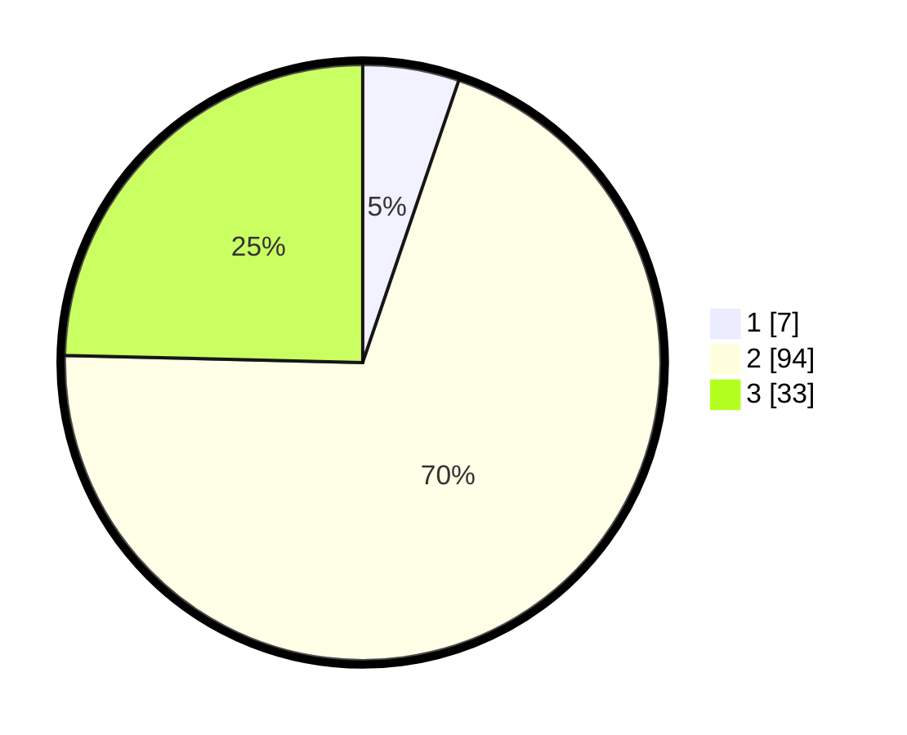

# Hasil

## Grafik

## Tabel

| No. | Nama Paslon    | Suara | Suara (raw) | Persentase |
|:--- |:-------------- | -----:| -----------:| ----------:|
| 1   | ANIES MUHAIMIN | 7     | [7][p-1]    | 5,22       |
| 2   | PRABOWO GIBRAN | 94    | [94][p-2]   | 70,15      |
| 3   | GANJAR MAHFUD  | 33    | [33][p-3]   | 24,63      |

[p-1]: https://github.com/gigit-pemilu/pemilu-2024/blob/main/pilpres/hitung-suara/sub/33-jawa-tengah/sub/15-grobogan/sub/16-godong/sub/2019-kopek/sub/006-tps/sub/paslon-1.txt
[p-2]: https://github.com/gigit-pemilu/pemilu-2024/blob/main/pilpres/hitung-suara/sub/33-jawa-tengah/sub/15-grobogan/sub/16-godong/sub/2019-kopek/sub/006-tps/sub/paslon-2.txt
[p-3]: https://github.com/gigit-pemilu/pemilu-2024/blob/main/pilpres/hitung-suara/sub/33-jawa-tengah/sub/15-grobogan/sub/16-godong/sub/2019-kopek/sub/006-tps/sub/paslon-3.txt

## Foto C Plano

https://sirekap-obj-formc.kpu.go.id/fb7a/pemilu/ppwp/33/15/16/20/19/3315162019006-20240214-213726--0abd8612-d97d-47bc-87bd-3beef8cfc1c6.jpg

https://sirekap-obj-formc.kpu.go.id/fb7a/pemilu/ppwp/33/15/16/20/19/3315162019006-20240214-213735--c93e7985-d120-4ad1-8509-e03fc4b3d9de.jpg

https://sirekap-obj-formc.kpu.go.id/fb7a/pemilu/ppwp/33/15/16/20/19/3315162019006-20240214-213740--bf2fffef-9999-42f7-971f-c76beba9e312.jpg

## Metadata

| Key        | Value               |
| ---------- | ------------------- |
| Time Stamp | 2024-02-15 12:00:28 |

