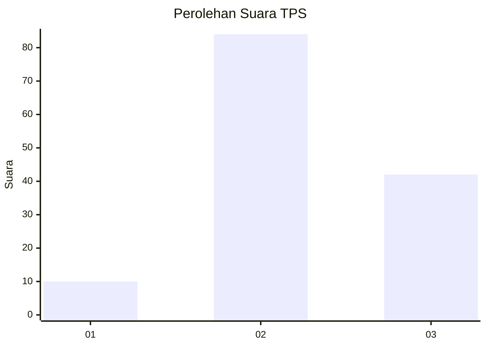
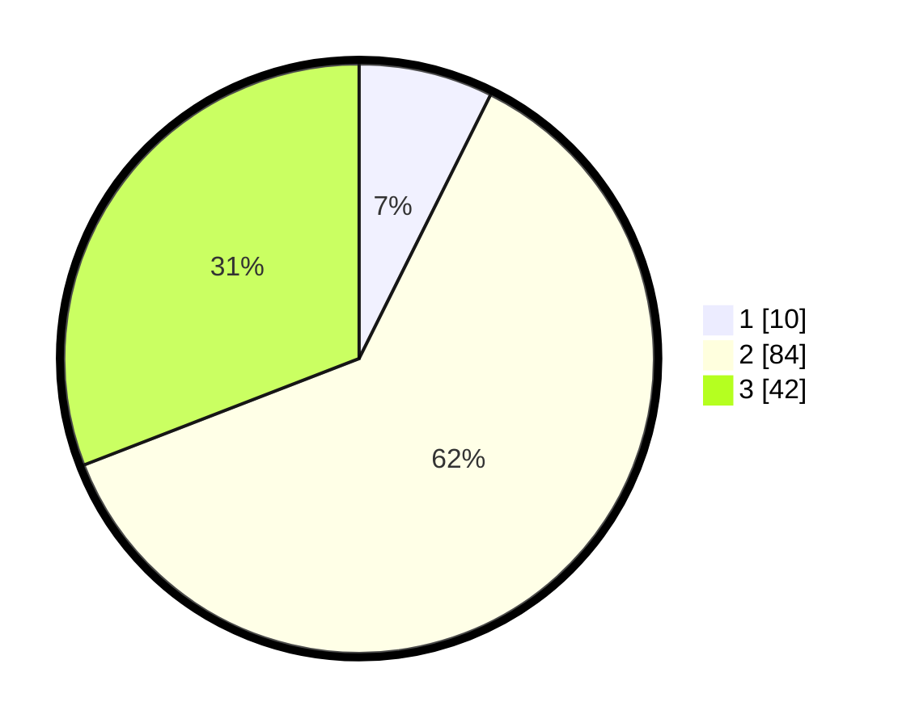

# Hasil

## Grafik

## Tabel

| No. | Nama Paslon    | Suara | Suara (raw) | Persentase |
|:--- |:-------------- | -----:| -----------:| ----------:|
| 1   | ANIES MUHAIMIN | 10    | [10][p-1]   | 7,35       |
| 2   | PRABOWO GIBRAN | 84    | [84][p-2]   | 61,76      |
| 3   | GANJAR MAHFUD  | 42    | [42][p-3]   | 30,88      |

[p-1]: https://github.com/gigit-pemilu/pemilu-2024-33-jawa-tengah/blob/main/pilpres/hitung-suara/sub/33-jawa-tengah/sub/15-grobogan/sub/16-godong/sub/2023-jatilor/sub/001-tps/sub/paslon-1.txt
[p-2]: https://github.com/gigit-pemilu/pemilu-2024-33-jawa-tengah/blob/main/pilpres/hitung-suara/sub/33-jawa-tengah/sub/15-grobogan/sub/16-godong/sub/2023-jatilor/sub/001-tps/sub/paslon-2.txt
[p-3]: https://github.com/gigit-pemilu/pemilu-2024-33-jawa-tengah/blob/main/pilpres/hitung-suara/sub/33-jawa-tengah/sub/15-grobogan/sub/16-godong/sub/2023-jatilor/sub/001-tps/sub/paslon-3.txt

## Foto C Plano

https://sirekap-obj-formc.kpu.go.id/cb09/pemilu/ppwp/33/15/16/20/23/3315162023001-20240214-141149--352d5d4f-9aad-439c-bee6-2c1889766488.jpg

https://sirekap-obj-formc.kpu.go.id/cb09/pemilu/ppwp/33/15/16/20/23/3315162023001-20240214-140934--a014a990-15c8-4537-adb6-a656f7f96461.jpg

https://sirekap-obj-formc.kpu.go.id/cb09/pemilu/ppwp/33/15/16/20/23/3315162023001-20240214-225713--5d6aba0a-221d-42c5-928c-73bc62dc54c2.jpg

## Metadata

| Key        | Value               |
| ---------- | ------------------- |
| Time Stamp | 2024-02-15 00:41:44 |

