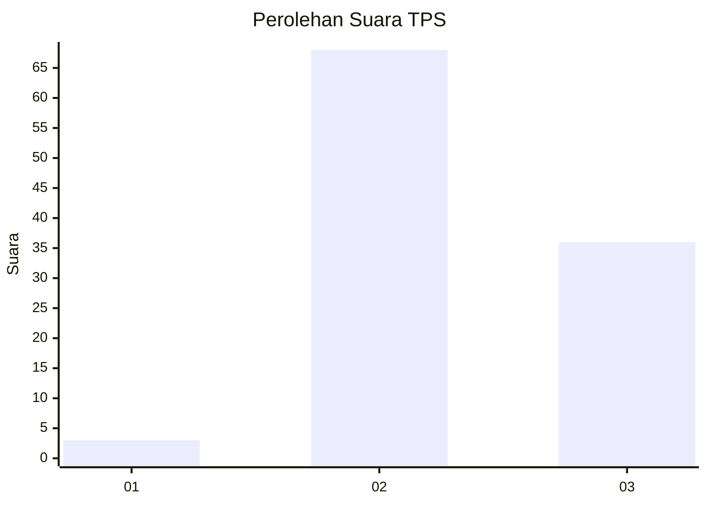
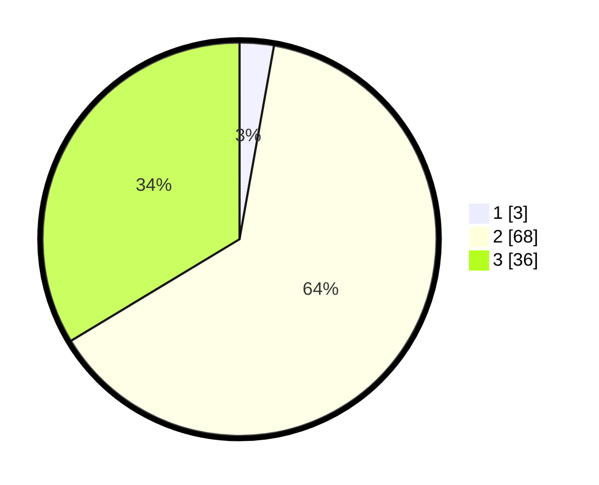

# Hasil

## Grafik

## Tabel

| No. | Nama Paslon    | Suara | Suara (raw) | Persentase |
|:--- |:-------------- | -----:| -----------:| ----------:|
| 1   | ANIES MUHAIMIN | 3     | [3][p-1]    | 2,80       |
| 2   | PRABOWO GIBRAN | 68    | [68][p-2]   | 63,55      |
| 3   | GANJAR MAHFUD  | 36    | [36][p-3]   | 33,64      |

[p-1]: https://github.com/gigit-pemilu/pemilu-2024-33-jawa-tengah/blob/main/pilpres/hitung-suara/sub/33-jawa-tengah/sub/15-grobogan/sub/16-godong/sub/2026-godong/sub/009-tps/sub/paslon-1.txt
[p-2]: https://github.com/gigit-pemilu/pemilu-2024-33-jawa-tengah/blob/main/pilpres/hitung-suara/sub/33-jawa-tengah/sub/15-grobogan/sub/16-godong/sub/2026-godong/sub/009-tps/sub/paslon-2.txt
[p-3]: https://github.com/gigit-pemilu/pemilu-2024-33-jawa-tengah/blob/main/pilpres/hitung-suara/sub/33-jawa-tengah/sub/15-grobogan/sub/16-godong/sub/2026-godong/sub/009-tps/sub/paslon-3.txt

## Foto C Plano

https://sirekap-obj-formc.kpu.go.id/a520/pemilu/ppwp/33/15/16/20/26/3315162026009-20240215-191332--3195ad4c-4c0d-4aa5-b150-242b41cb2369.jpg

https://sirekap-obj-formc.kpu.go.id/a520/pemilu/ppwp/33/15/16/20/26/3315162026009-20240215-191614--bd141473-2363-4f26-8d7d-5401c592e4d1.jpg

https://sirekap-obj-formc.kpu.go.id/a520/pemilu/ppwp/33/15/16/20/26/3315162026009-20240215-191710--aed5c578-40dd-4078-9033-29fd4866c128.jpg

## Metadata

| Key        | Value               |
| ---------- | ------------------- |
| Time Stamp | 2024-02-16 12:51:22 |

