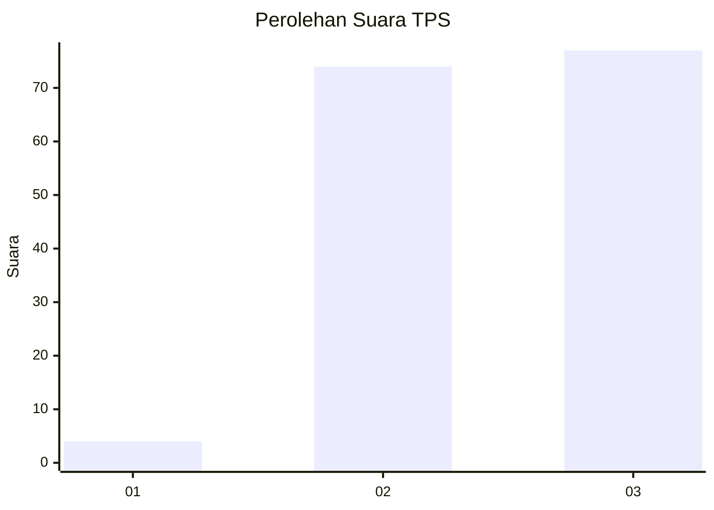
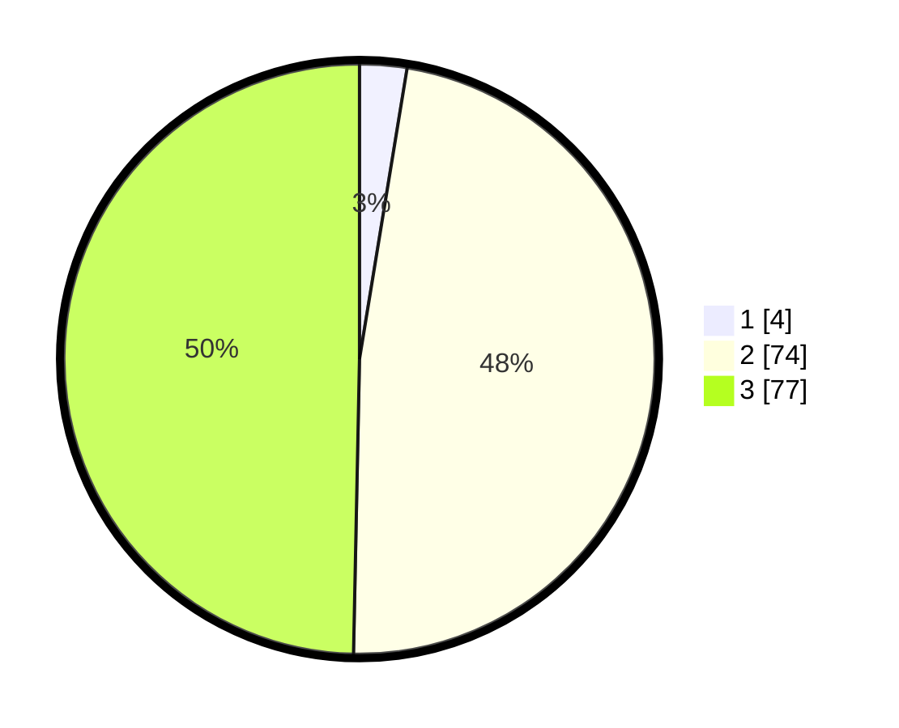

# Hasil

## Grafik

## Tabel

| No. | Nama Paslon    | Suara | Suara (raw) | Persentase |
|:--- |:-------------- | -----:| -----------:| ----------:|
| 1   | ANIES MUHAIMIN | 4     | [4][p-1]    | 2,58       |
| 2   | PRABOWO GIBRAN | 74    | [74][p-2]   | 47,74      |
| 3   | GANJAR MAHFUD  | 77    | [77][p-3]   | 49,68      |

[p-1]: https://github.com/gigit-pemilu/pemilu-2024/blob/main/pilpres/hitung-suara/sub/33-jawa-tengah/sub/15-grobogan/sub/17-gubug/sub/2001-penadaran/sub/005-tps/sub/paslon-1.txt
[p-2]: https://github.com/gigit-pemilu/pemilu-2024/blob/main/pilpres/hitung-suara/sub/33-jawa-tengah/sub/15-grobogan/sub/17-gubug/sub/2001-penadaran/sub/005-tps/sub/paslon-2.txt
[p-3]: https://github.com/gigit-pemilu/pemilu-2024/blob/main/pilpres/hitung-suara/sub/33-jawa-tengah/sub/15-grobogan/sub/17-gubug/sub/2001-penadaran/sub/005-tps/sub/paslon-3.txt

## Foto C Plano

https://sirekap-obj-formc.kpu.go.id/5b52/pemilu/ppwp/33/15/17/20/01/3315172001005-20240214-141722--2b902159-5f13-4eb2-89a8-b0a581d4ce28.jpg

https://sirekap-obj-formc.kpu.go.id/5b52/pemilu/ppwp/33/15/17/20/01/3315172001005-20240217-203848--8142a4b0-c3fd-4615-9d7b-e6485f5eebd3.jpg

https://sirekap-obj-formc.kpu.go.id/5b52/pemilu/ppwp/33/15/17/20/01/3315172001005-20240217-102132--4dcb9630-1075-4396-ab46-b23e22b61f08.jpg

## Metadata

| Key        | Value               |
| ---------- | ------------------- |
| Time Stamp | 2024-02-19 06:16:00 |

