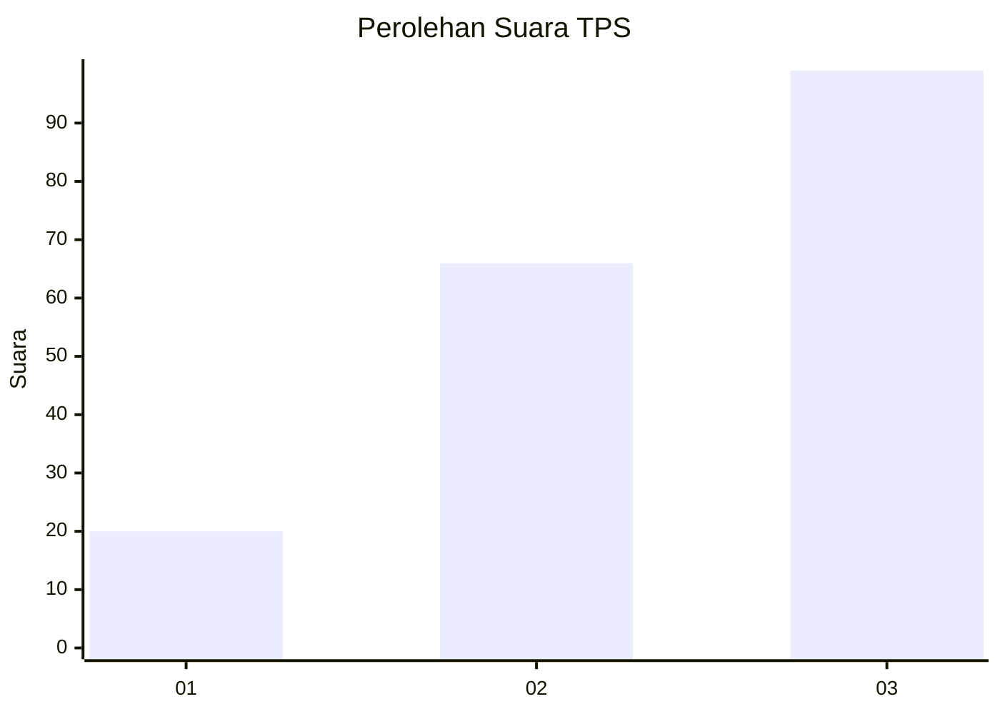
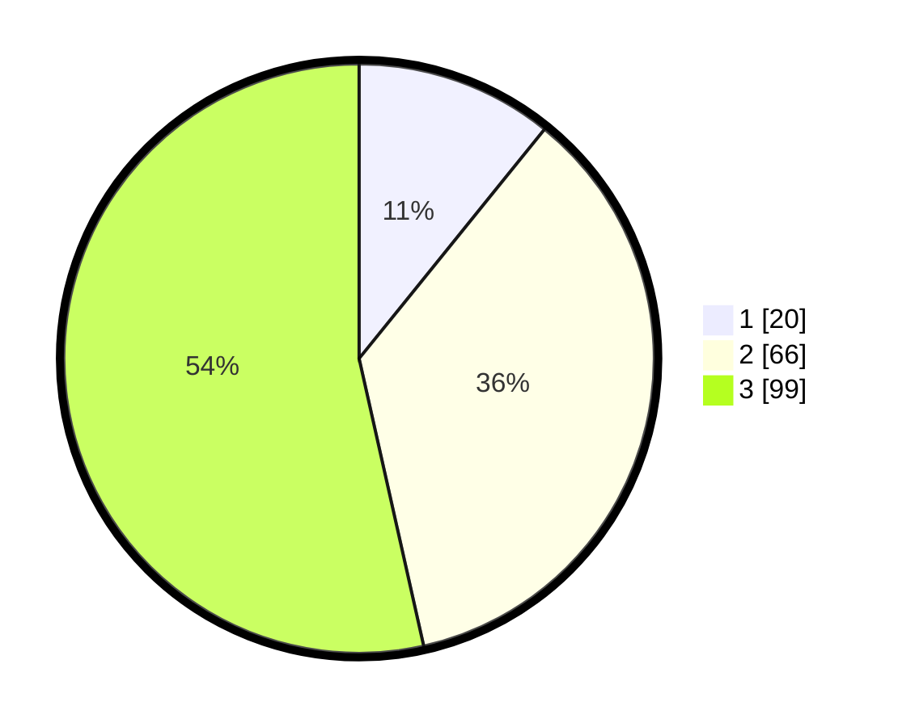

# Hasil

## Grafik

## Tabel

| No. | Nama Paslon    | Suara | Suara (raw) | Persentase |
|:--- |:-------------- | -----:| -----------:| ----------:|
| 1   | ANIES MUHAIMIN | 20    | [20][p-1]   | 10,81      |
| 2   | PRABOWO GIBRAN | 66    | [66][p-2]   | 35,68      |
| 3   | GANJAR MAHFUD  | 99    | [99][p-3]   | 53,51      |

[p-1]: https://github.com/gigit-pemilu/pemilu-2024-33-jawa-tengah/blob/main/pilpres/hitung-suara/sub/33-jawa-tengah/sub/15-grobogan/sub/17-gubug/sub/2010-papanrejo/sub/006-tps/sub/paslon-1.txt
[p-2]: https://github.com/gigit-pemilu/pemilu-2024-33-jawa-tengah/blob/main/pilpres/hitung-suara/sub/33-jawa-tengah/sub/15-grobogan/sub/17-gubug/sub/2010-papanrejo/sub/006-tps/sub/paslon-2.txt
[p-3]: https://github.com/gigit-pemilu/pemilu-2024-33-jawa-tengah/blob/main/pilpres/hitung-suara/sub/33-jawa-tengah/sub/15-grobogan/sub/17-gubug/sub/2010-papanrejo/sub/006-tps/sub/paslon-3.txt

## Foto C Plano

https://sirekap-obj-formc.kpu.go.id/8789/pemilu/ppwp/33/15/17/20/10/3315172010006-20240216-224427--2c6e62aa-a2d0-4214-8478-282bc9ffddf1.jpg

https://sirekap-obj-formc.kpu.go.id/8789/pemilu/ppwp/33/15/17/20/10/3315172010006-20240216-234822--f990e84c-3278-44d2-8c29-8388ad42101a.jpg

https://sirekap-obj-formc.kpu.go.id/8789/pemilu/ppwp/33/15/17/20/10/3315172010006-20240217-002742--19295e62-eb29-49de-a9ab-ae1b81f09891.jpg

## Metadata

| Key        | Value               |
| ---------- | ------------------- |
| Time Stamp | 2024-02-17 14:45:18 |

