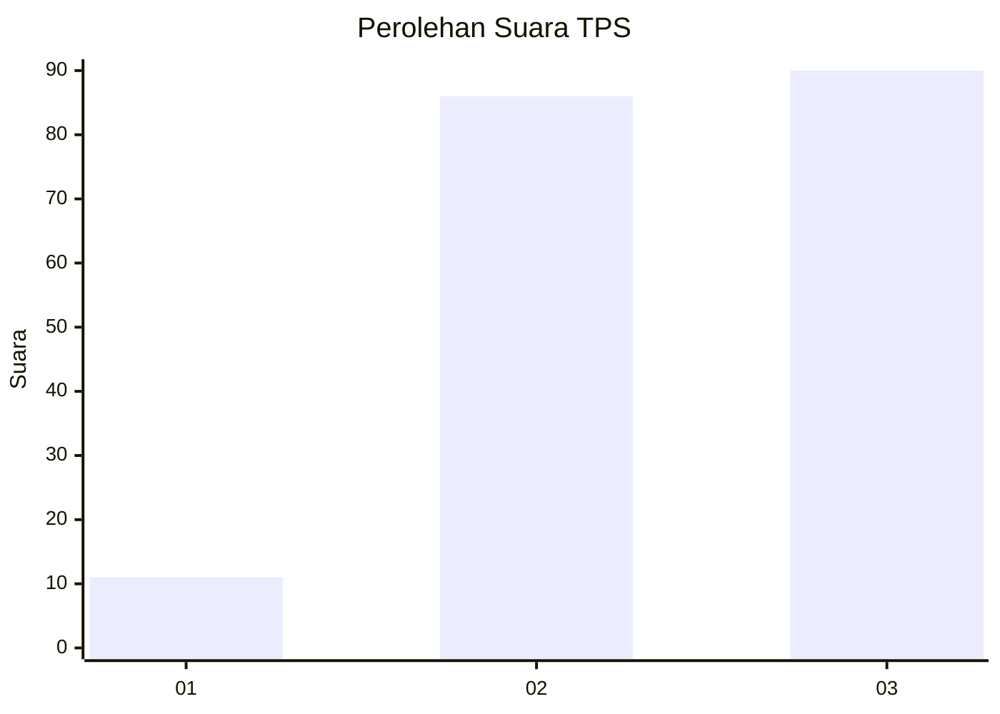
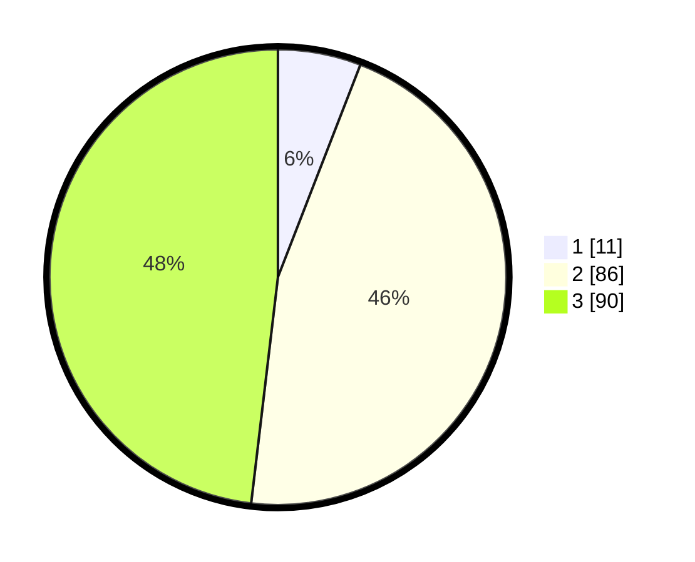

# Hasil

## Grafik

## Tabel

| No. | Nama Paslon    | Suara | Suara (raw) | Persentase |
|:--- |:-------------- | -----:| -----------:| ----------:|
| 1   | ANIES MUHAIMIN | 11    | [11][p-1]   | 5,88       |
| 2   | PRABOWO GIBRAN | 86    | [86][p-2]   | 45,99      |
| 3   | GANJAR MAHFUD  | 90    | [90][p-3]   | 48,13      |

[p-1]: https://github.com/gigit-pemilu/pemilu-2024/blob/main/pilpres/hitung-suara/sub/33-jawa-tengah/sub/15-grobogan/sub/17-gubug/sub/2012-kuwaron/sub/005-tps/sub/paslon-1.txt
[p-2]: https://github.com/gigit-pemilu/pemilu-2024/blob/main/pilpres/hitung-suara/sub/33-jawa-tengah/sub/15-grobogan/sub/17-gubug/sub/2012-kuwaron/sub/005-tps/sub/paslon-2.txt
[p-3]: https://github.com/gigit-pemilu/pemilu-2024/blob/main/pilpres/hitung-suara/sub/33-jawa-tengah/sub/15-grobogan/sub/17-gubug/sub/2012-kuwaron/sub/005-tps/sub/paslon-3.txt

## Foto C Plano

https://sirekap-obj-formc.kpu.go.id/687c/pemilu/ppwp/33/15/17/20/12/3315172012005-20240215-152153--c2c5723e-e109-431b-8b15-c08a5039afe1.jpg

https://sirekap-obj-formc.kpu.go.id/687c/pemilu/ppwp/33/15/17/20/12/3315172012005-20240215-152318--3e1f9807-6ec7-48b9-b5af-8c92b2a1e20d.jpg

https://sirekap-obj-formc.kpu.go.id/687c/pemilu/ppwp/33/15/17/20/12/3315172012005-20240215-152520--ecbdcf10-624c-4f08-b4c1-e9916895a8b9.jpg

## Metadata

| Key        | Value               |
| ---------- | ------------------- |
| Time Stamp | 2024-02-15 17:30:25 |

