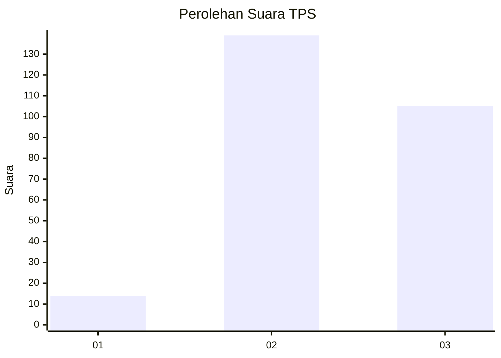
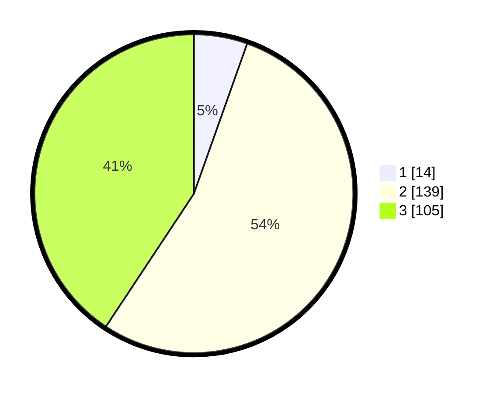

# Hasil

## Grafik

## Tabel

| No. | Nama Paslon    | Suara | Suara (raw) | Persentase |
|:--- |:-------------- | -----:| -----------:| ----------:|
| 1   | ANIES MUHAIMIN | 14    | [14][p-1]   | 5,43       |
| 2   | PRABOWO GIBRAN | 139   | [139][p-2]  | 53,88      |
| 3   | GANJAR MAHFUD  | 105   | [105][p-3]  | 40,70      |

[p-1]: https://github.com/gigit-pemilu/pemilu-2024/blob/main/pilpres/hitung-suara/sub/33-jawa-tengah/sub/15-grobogan/sub/18-tegowanu/sub/2002-tlogorejo/sub/011-tps/sub/paslon-1.txt
[p-2]: https://github.com/gigit-pemilu/pemilu-2024/blob/main/pilpres/hitung-suara/sub/33-jawa-tengah/sub/15-grobogan/sub/18-tegowanu/sub/2002-tlogorejo/sub/011-tps/sub/paslon-2.txt
[p-3]: https://github.com/gigit-pemilu/pemilu-2024/blob/main/pilpres/hitung-suara/sub/33-jawa-tengah/sub/15-grobogan/sub/18-tegowanu/sub/2002-tlogorejo/sub/011-tps/sub/paslon-3.txt

## Foto C Plano

https://sirekap-obj-formc.kpu.go.id/e0cc/pemilu/ppwp/33/15/18/20/02/3315182002011-20240215-073626--4162209c-65bf-4e09-9c86-ffaeb145a91d.jpg

https://sirekap-obj-formc.kpu.go.id/e0cc/pemilu/ppwp/33/15/18/20/02/3315182002011-20240215-073635--54b03507-c336-48d9-bf42-a56cdedf0f6e.jpg

https://sirekap-obj-formc.kpu.go.id/e0cc/pemilu/ppwp/33/15/18/20/02/3315182002011-20240215-073644--9b620c61-1b31-4b56-a998-bd5e94a2c7db.jpg

## Metadata

| Key        | Value               |
| ---------- | ------------------- |
| Time Stamp | 2024-02-15 22:30:27 |

