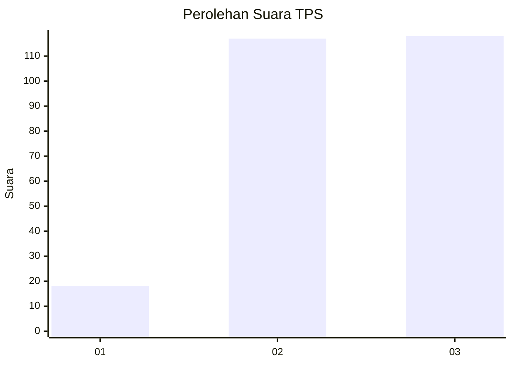
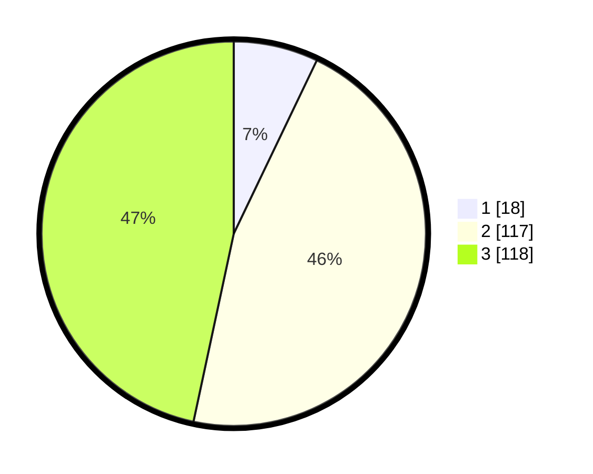

# Hasil

## Grafik

## Tabel

| No. | Nama Paslon    | Suara | Suara (raw) | Persentase |
|:--- |:-------------- | -----:| -----------:| ----------:|
| 1   | ANIES MUHAIMIN | 18    | [18][p-1]   | 7,11       |
| 2   | PRABOWO GIBRAN | 117   | [117][p-2]  | 46,25      |
| 3   | GANJAR MAHFUD  | 118   | [118][p-3]  | 46,64      |

[p-1]: https://github.com/gigit-pemilu/pemilu-2024-33-jawa-tengah/blob/main/pilpres/hitung-suara/sub/33-jawa-tengah/sub/15-grobogan/sub/18-tegowanu/sub/2003-medani/sub/004-tps/sub/paslon-1.txt
[p-2]: https://github.com/gigit-pemilu/pemilu-2024-33-jawa-tengah/blob/main/pilpres/hitung-suara/sub/33-jawa-tengah/sub/15-grobogan/sub/18-tegowanu/sub/2003-medani/sub/004-tps/sub/paslon-2.txt
[p-3]: https://github.com/gigit-pemilu/pemilu-2024-33-jawa-tengah/blob/main/pilpres/hitung-suara/sub/33-jawa-tengah/sub/15-grobogan/sub/18-tegowanu/sub/2003-medani/sub/004-tps/sub/paslon-3.txt

## Foto C Plano

https://sirekap-obj-formc.kpu.go.id/2e91/pemilu/ppwp/33/15/18/20/03/3315182003004-20240214-215528--a6b5a1ca-5175-4979-af95-5945cb57fbf2.jpg

https://sirekap-obj-formc.kpu.go.id/2e91/pemilu/ppwp/33/15/18/20/03/3315182003004-20240214-215549--b4c83b4d-f4ae-49fe-8857-8bdea08bed9e.jpg

https://sirekap-obj-formc.kpu.go.id/2e91/pemilu/ppwp/33/15/18/20/03/3315182003004-20240214-215621--792d9367-41db-4fa0-8ebd-d76cfa360695.jpg

## Metadata

| Key        | Value               |
| ---------- | ------------------- |
| Time Stamp | 2024-02-15 18:00:26 |

