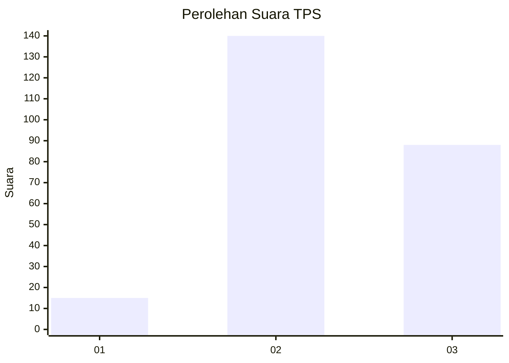
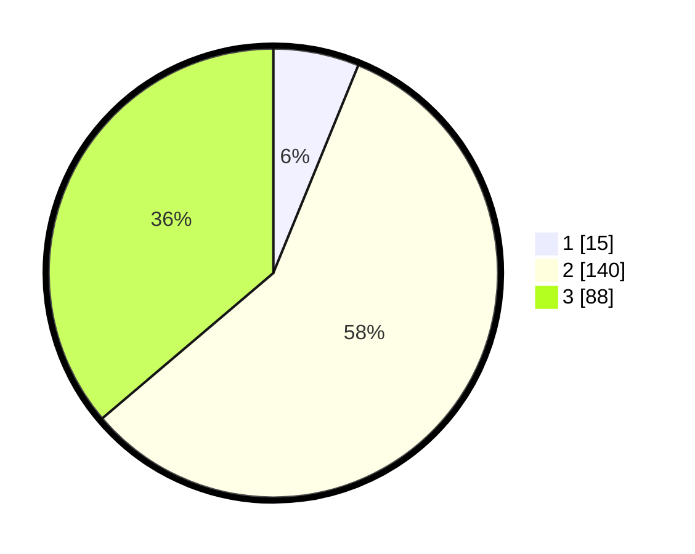

# Hasil

## Grafik

## Tabel

| No. | Nama Paslon    | Suara | Suara (raw) | Persentase |
|:--- |:-------------- | -----:| -----------:| ----------:|
| 1   | ANIES MUHAIMIN | 15    | [15][p-1]   | 6,17       |
| 2   | PRABOWO GIBRAN | 140   | [140][p-2]  | 57,61      |
| 3   | GANJAR MAHFUD  | 88    | [88][p-3]   | 36,21      |

[p-1]: https://github.com/gigit-pemilu/pemilu-2024/blob/main/pilpres/hitung-suara/sub/33-jawa-tengah/sub/15-grobogan/sub/18-tegowanu/sub/2009-tegowanuwetan/sub/002-tps/sub/paslon-1.txt
[p-2]: https://github.com/gigit-pemilu/pemilu-2024/blob/main/pilpres/hitung-suara/sub/33-jawa-tengah/sub/15-grobogan/sub/18-tegowanu/sub/2009-tegowanuwetan/sub/002-tps/sub/paslon-2.txt
[p-3]: https://github.com/gigit-pemilu/pemilu-2024/blob/main/pilpres/hitung-suara/sub/33-jawa-tengah/sub/15-grobogan/sub/18-tegowanu/sub/2009-tegowanuwetan/sub/002-tps/sub/paslon-3.txt

## Foto C Plano

https://sirekap-obj-formc.kpu.go.id/e465/pemilu/ppwp/33/15/18/20/09/3315182009002-20240214-214248--b7198835-28ef-4cec-b03e-c27e934f10e0.jpg

https://sirekap-obj-formc.kpu.go.id/e465/pemilu/ppwp/33/15/18/20/09/3315182009002-20240214-211112--d0b7d524-7587-44da-86bd-2a4e49c1bfd2.jpg

https://sirekap-obj-formc.kpu.go.id/e465/pemilu/ppwp/33/15/18/20/09/3315182009002-20240214-202923--75e2a63b-ba5a-4576-ab0c-54d107544fd0.jpg

## Metadata

| Key        | Value               |
| ---------- | ------------------- |
| Time Stamp | 2024-02-16 09:30:28 |

