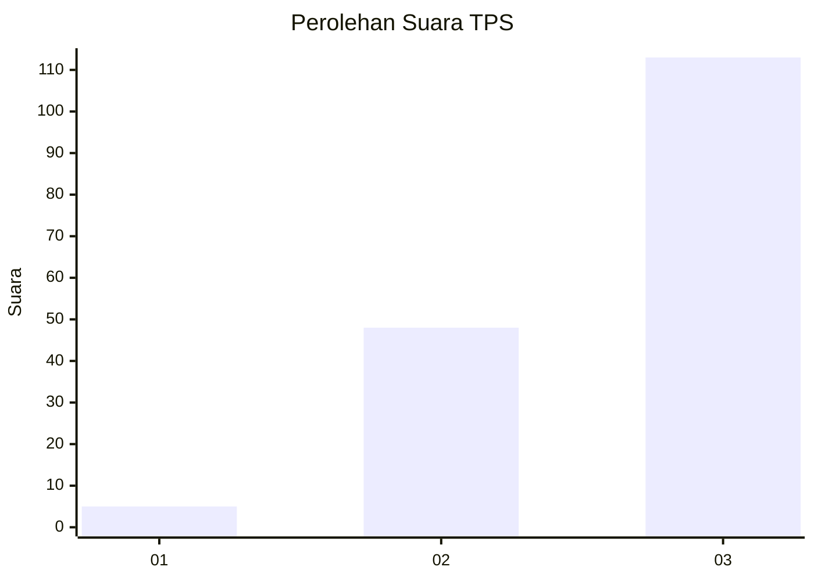
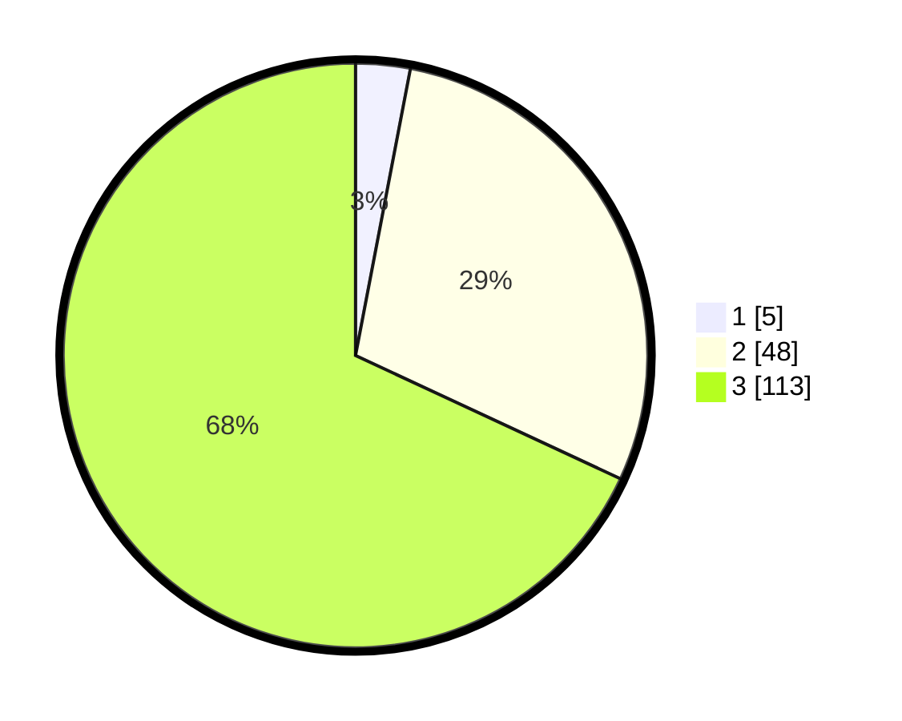

# Hasil

## Grafik

## Tabel

| No. | Nama Paslon    | Suara | Suara (raw) | Persentase |
|:--- |:-------------- | -----:| -----------:| ----------:|
| 1   | ANIES MUHAIMIN | 5     | [5][p-1]    | 3,01       |
| 2   | PRABOWO GIBRAN | 48    | [48][p-2]   | 28,92      |
| 3   | GANJAR MAHFUD  | 113   | [113][p-3]  | 68,07      |

[p-1]: https://github.com/gigit-pemilu/pemilu-2024-33-jawa-tengah/blob/main/pilpres/hitung-suara/sub/33-jawa-tengah/sub/15-grobogan/sub/19-tanggungharjo/sub/2001-ringinpitu/sub/007-tps/sub/paslon-1.txt
[p-2]: https://github.com/gigit-pemilu/pemilu-2024-33-jawa-tengah/blob/main/pilpres/hitung-suara/sub/33-jawa-tengah/sub/15-grobogan/sub/19-tanggungharjo/sub/2001-ringinpitu/sub/007-tps/sub/paslon-2.txt
[p-3]: https://github.com/gigit-pemilu/pemilu-2024-33-jawa-tengah/blob/main/pilpres/hitung-suara/sub/33-jawa-tengah/sub/15-grobogan/sub/19-tanggungharjo/sub/2001-ringinpitu/sub/007-tps/sub/paslon-3.txt

## Foto C Plano

https://sirekap-obj-formc.kpu.go.id/aafb/pemilu/ppwp/33/15/19/20/01/3315192001007-20240217-160615--434ffcae-7770-4026-9f54-dbb6062c99e8.jpg

https://sirekap-obj-formc.kpu.go.id/aafb/pemilu/ppwp/33/15/19/20/01/3315192001007-20240214-213452--e2f1dc96-876f-42c3-b719-5e698c5a6655.jpg

https://sirekap-obj-formc.kpu.go.id/aafb/pemilu/ppwp/33/15/19/20/01/3315192001007-20240214-210750--e7d3c614-9d48-4511-9847-1c9a912b8f6b.jpg

## Metadata

| Key        | Value               |
| ---------- | ------------------- |
| Time Stamp | 2024-02-17 16:36:25 |

