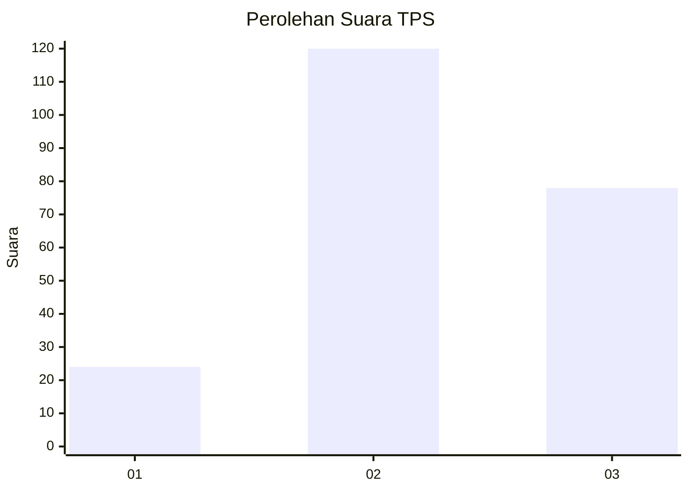
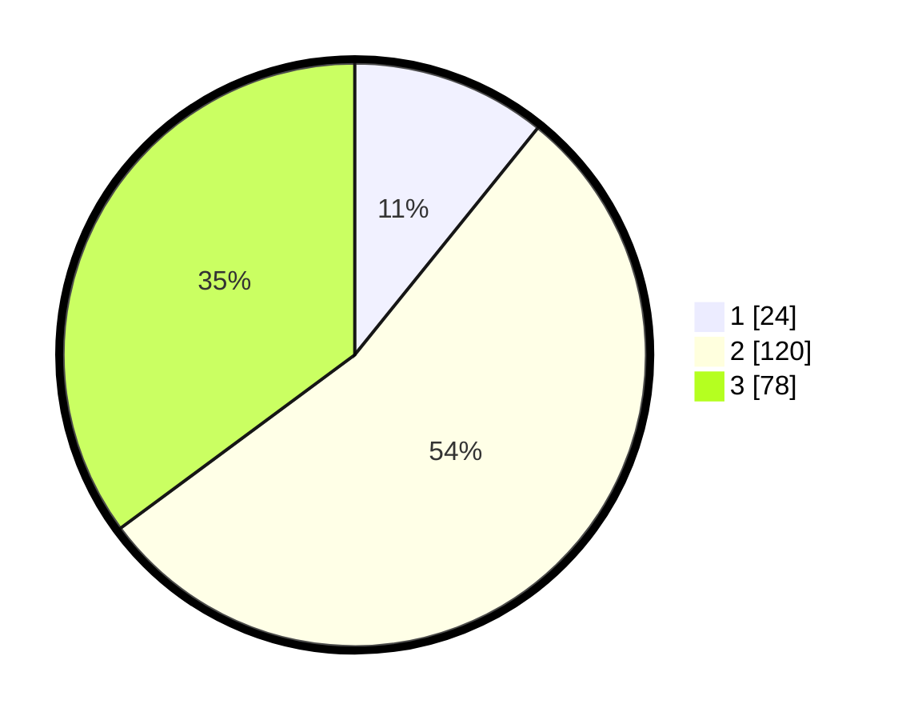

# Hasil

## Grafik

## Tabel

| No. | Nama Paslon    | Suara | Suara (raw) | Persentase |
|:--- |:-------------- | -----:| -----------:| ----------:|
| 1   | ANIES MUHAIMIN | 24    | [24][p-1]   | 10,81      |
| 2   | PRABOWO GIBRAN | 120   | [120][p-2]  | 54,05      |
| 3   | GANJAR MAHFUD  | 78    | [78][p-3]   | 35,14      |

[p-1]: https://github.com/gigit-pemilu/pemilu-2024/blob/main/pilpres/hitung-suara/sub/33-jawa-tengah/sub/15-grobogan/sub/19-tanggungharjo/sub/2006-sugihmanik/sub/003-tps/sub/paslon-1.txt
[p-2]: https://github.com/gigit-pemilu/pemilu-2024/blob/main/pilpres/hitung-suara/sub/33-jawa-tengah/sub/15-grobogan/sub/19-tanggungharjo/sub/2006-sugihmanik/sub/003-tps/sub/paslon-2.txt
[p-3]: https://github.com/gigit-pemilu/pemilu-2024/blob/main/pilpres/hitung-suara/sub/33-jawa-tengah/sub/15-grobogan/sub/19-tanggungharjo/sub/2006-sugihmanik/sub/003-tps/sub/paslon-3.txt

## Foto C Plano

https://sirekap-obj-formc.kpu.go.id/da4a/pemilu/ppwp/33/15/19/20/06/3315192006003-20240217-212103--a201cb49-129a-45cf-a5e1-b19fc4a5e13a.jpg

https://sirekap-obj-formc.kpu.go.id/da4a/pemilu/ppwp/33/15/19/20/06/3315192006003-20240217-212422--fa333509-33d7-4db2-99f5-31ce1d1e9a9e.jpg

https://sirekap-obj-formc.kpu.go.id/da4a/pemilu/ppwp/33/15/19/20/06/3315192006003-20240217-212459--25a6eb1c-05fe-4280-bcc6-91a38acab0ea.jpg

## Metadata

| Key        | Value               |
| ---------- | ------------------- |
| Time Stamp | 2024-02-19 06:16:00 |

