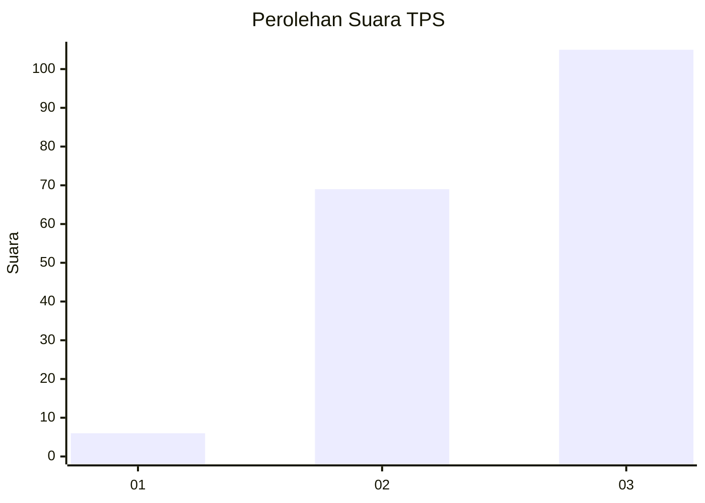
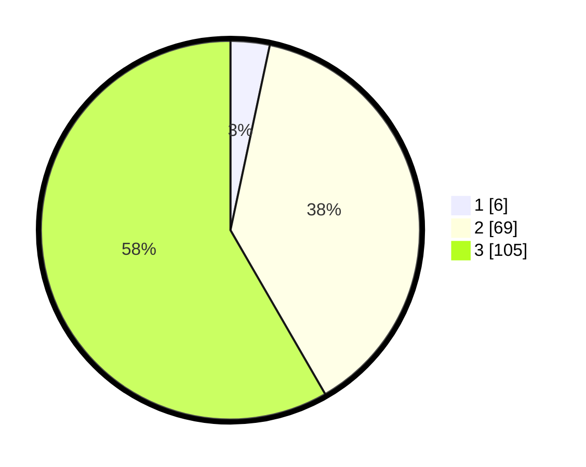

# Hasil

## Grafik

## Tabel

| No. | Nama Paslon    | Suara | Suara (raw) | Persentase |
|:--- |:-------------- | -----:| -----------:| ----------:|
| 1   | ANIES MUHAIMIN | 6     | [6][p-1]    | 3,33       |
| 2   | PRABOWO GIBRAN | 69    | [69][p-2]   | 38,33      |
| 3   | GANJAR MAHFUD  | 105   | [105][p-3]  | 58,33      |

[p-1]: https://github.com/gigit-pemilu/pemilu-2024-33-jawa-tengah/blob/main/pilpres/hitung-suara/sub/33-jawa-tengah/sub/15-grobogan/sub/19-tanggungharjo/sub/2007-tanggungharjo/sub/013-tps/sub/paslon-1.txt
[p-2]: https://github.com/gigit-pemilu/pemilu-2024-33-jawa-tengah/blob/main/pilpres/hitung-suara/sub/33-jawa-tengah/sub/15-grobogan/sub/19-tanggungharjo/sub/2007-tanggungharjo/sub/013-tps/sub/paslon-2.txt
[p-3]: https://github.com/gigit-pemilu/pemilu-2024-33-jawa-tengah/blob/main/pilpres/hitung-suara/sub/33-jawa-tengah/sub/15-grobogan/sub/19-tanggungharjo/sub/2007-tanggungharjo/sub/013-tps/sub/paslon-3.txt

## Foto C Plano

https://sirekap-obj-formc.kpu.go.id/a1f0/pemilu/ppwp/33/15/19/20/07/3315192007013-20240215-064631--b9a0f8ba-75ab-427e-a35a-2da520488db9.jpg

https://sirekap-obj-formc.kpu.go.id/a1f0/pemilu/ppwp/33/15/19/20/07/3315192007013-20240215-063901--9b2f6cb9-89b0-478a-bc8c-e70c11c4b945.jpg

https://sirekap-obj-formc.kpu.go.id/a1f0/pemilu/ppwp/33/15/19/20/07/3315192007013-20240217-092826--b5db0f7c-d779-45c8-9a59-61390ed3ad79.jpg

## Metadata

| Key        | Value               |
| ---------- | ------------------- |
| Time Stamp | 2024-02-17 09:30:03 |

