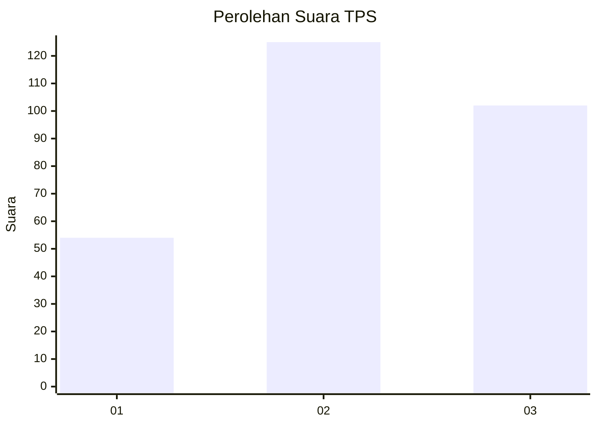
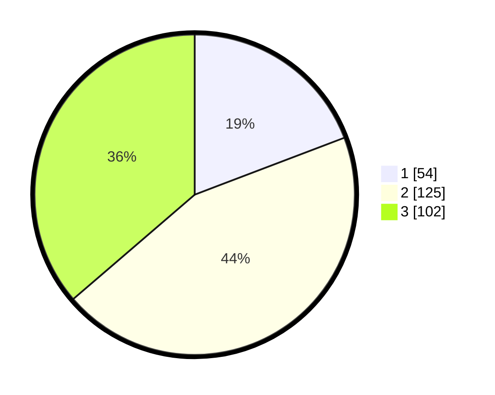

# Hasil

## Grafik

## Tabel

| No. | Nama Paslon    | Suara | Suara (raw) | Persentase |
|:--- |:-------------- | -----:| -----------:| ----------:|
| 1   | ANIES MUHAIMIN | 54    | [54][p-1]   | 19,22      |
| 2   | PRABOWO GIBRAN | 125   | [125][p-2]  | 44,48      |
| 3   | GANJAR MAHFUD  | 102   | [102][p-3]  | 36,30      |

[p-1]: https://github.com/gigit-pemilu/pemilu-2024-33-jawa-tengah/blob/main/pilpres/hitung-suara/sub/33-jawa-tengah/sub/15-grobogan/sub/19-tanggungharjo/sub/2008-brabo/sub/014-tps/sub/paslon-1.txt
[p-2]: https://github.com/gigit-pemilu/pemilu-2024-33-jawa-tengah/blob/main/pilpres/hitung-suara/sub/33-jawa-tengah/sub/15-grobogan/sub/19-tanggungharjo/sub/2008-brabo/sub/014-tps/sub/paslon-2.txt
[p-3]: https://github.com/gigit-pemilu/pemilu-2024-33-jawa-tengah/blob/main/pilpres/hitung-suara/sub/33-jawa-tengah/sub/15-grobogan/sub/19-tanggungharjo/sub/2008-brabo/sub/014-tps/sub/paslon-3.txt

## Foto C Plano

https://sirekap-obj-formc.kpu.go.id/6daf/pemilu/ppwp/33/15/19/20/08/3315192008014-20240217-233742--8e7ba96e-8002-401e-9bbe-85a7d7da3cf2.jpg

https://sirekap-obj-formc.kpu.go.id/6daf/pemilu/ppwp/33/15/19/20/08/3315192008014-20240217-212337--dd8b064f-b40c-4a6c-a01e-7c1ac82d10aa.jpg

https://sirekap-obj-formc.kpu.go.id/6daf/pemilu/ppwp/33/15/19/20/08/3315192008014-20240217-233255--6e49f8a7-0402-4e36-9a66-a20d2ce627eb.jpg

## Metadata

| Key        | Value               |
| ---------- | ------------------- |
| Time Stamp | 2024-02-19 06:16:00 |

