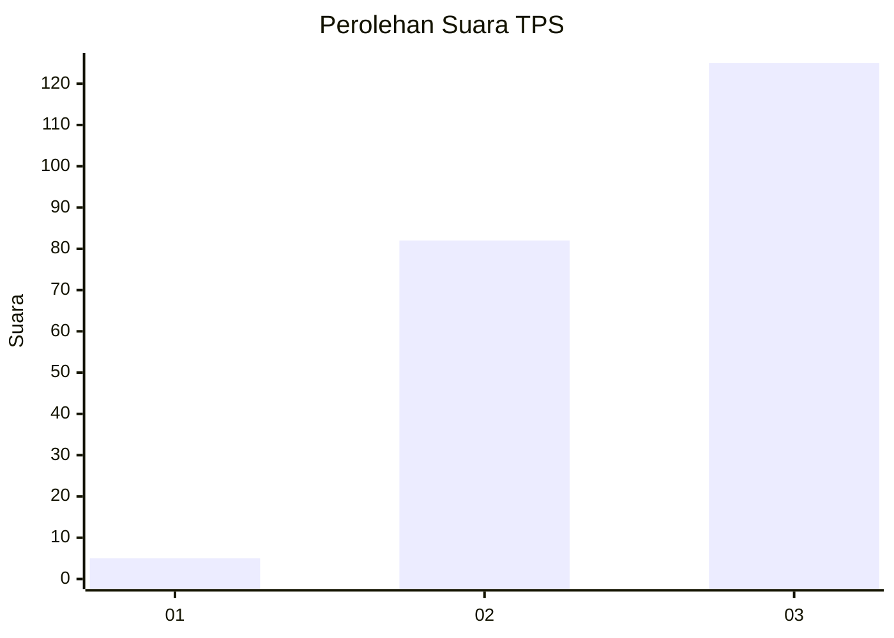
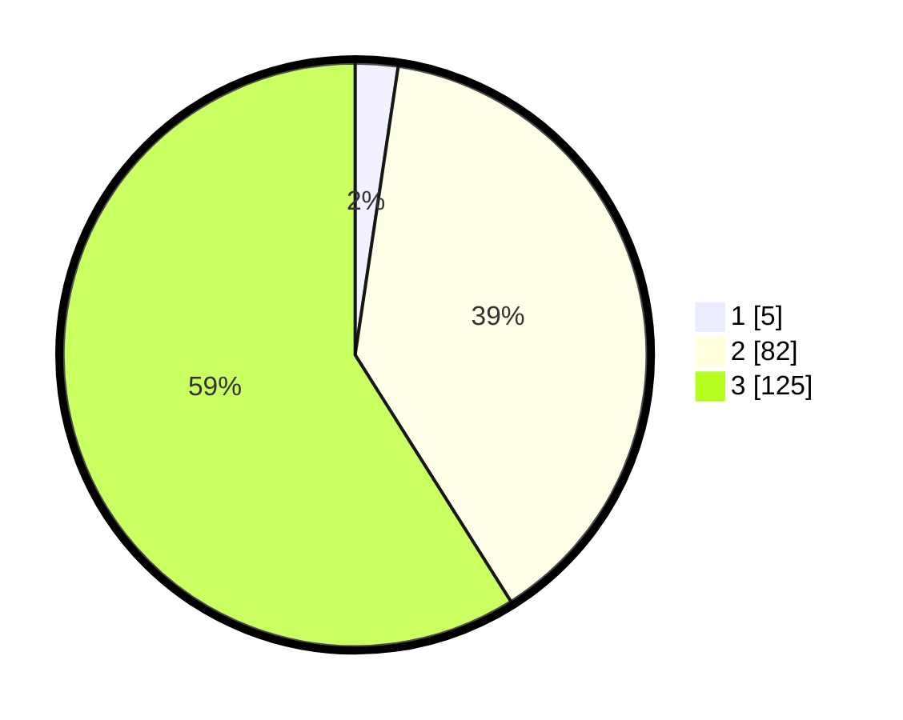

# Hasil

## Grafik

## Tabel

| No. | Nama Paslon    | Suara | Suara (raw) | Persentase |
|:--- |:-------------- | -----:| -----------:| ----------:|
| 1   | ANIES MUHAIMIN | 5     | [5][p-1]    | 2,36       |
| 2   | PRABOWO GIBRAN | 82    | [82][p-2]   | 38,68      |
| 3   | GANJAR MAHFUD  | 125   | [125][p-3]  | 58,96      |

[p-1]: https://github.com/gigit-pemilu/pemilu-2024/blob/main/pilpres/hitung-suara/sub/33-jawa-tengah/sub/16-blora/sub/01-jati/sub/2001-bangkleyan/sub/002-tps/sub/paslon-1.txt
[p-2]: https://github.com/gigit-pemilu/pemilu-2024/blob/main/pilpres/hitung-suara/sub/33-jawa-tengah/sub/16-blora/sub/01-jati/sub/2001-bangkleyan/sub/002-tps/sub/paslon-2.txt
[p-3]: https://github.com/gigit-pemilu/pemilu-2024/blob/main/pilpres/hitung-suara/sub/33-jawa-tengah/sub/16-blora/sub/01-jati/sub/2001-bangkleyan/sub/002-tps/sub/paslon-3.txt

## Foto C Plano

https://sirekap-obj-formc.kpu.go.id/de47/pemilu/ppwp/33/16/01/20/01/3316012001002-20240215-002256--5cd6700f-fecf-49c6-8f8c-07e35f31fda8.jpg

https://sirekap-obj-formc.kpu.go.id/de47/pemilu/ppwp/33/16/01/20/01/3316012001002-20240215-002311--a01cafe2-9a0a-4f69-bf29-8981829b9830.jpg

https://sirekap-obj-formc.kpu.go.id/de47/pemilu/ppwp/33/16/01/20/01/3316012001002-20240215-002335--bf1c34e4-f90f-4132-b073-06fe2ea7748d.jpg

## Metadata

| Key        | Value               |
| ---------- | ------------------- |
| Time Stamp | 2024-02-15 16:30:25 |

