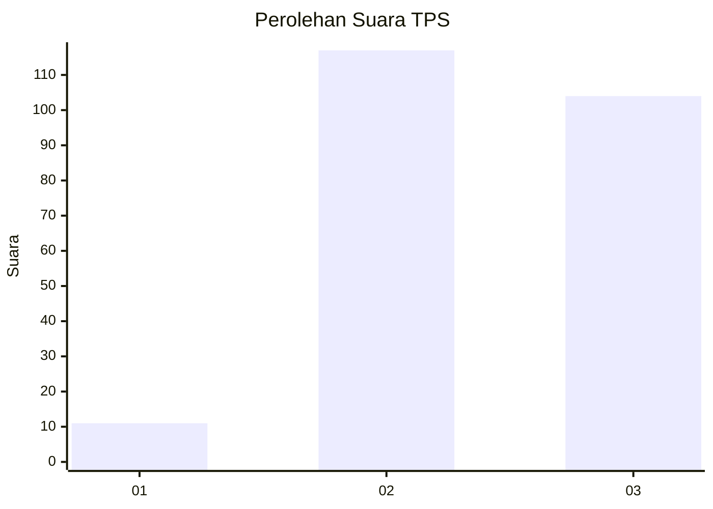
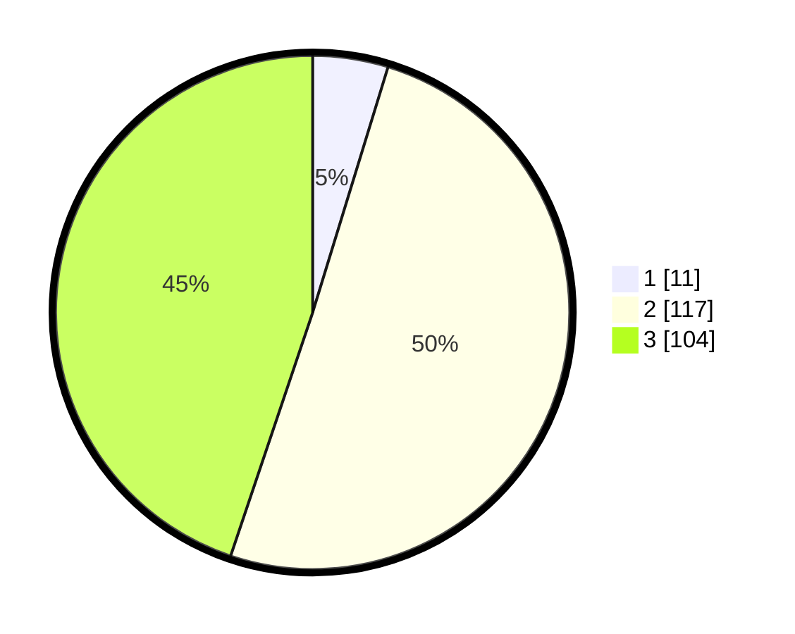

# Hasil

## Grafik

## Tabel

| No. | Nama Paslon    | Suara | Suara (raw) | Persentase |
|:--- |:-------------- | -----:| -----------:| ----------:|
| 1   | ANIES MUHAIMIN | 11    | [11][p-1]   | 4,74       |
| 2   | PRABOWO GIBRAN | 117   | [117][p-2]  | 50,43      |
| 3   | GANJAR MAHFUD  | 104   | [104][p-3]  | 44,83      |

[p-1]: https://github.com/gigit-pemilu/pemilu-2024/blob/main/pilpres/hitung-suara/sub/33-jawa-tengah/sub/16-blora/sub/01-jati/sub/2001-bangkleyan/sub/004-tps/sub/paslon-1.txt
[p-2]: https://github.com/gigit-pemilu/pemilu-2024/blob/main/pilpres/hitung-suara/sub/33-jawa-tengah/sub/16-blora/sub/01-jati/sub/2001-bangkleyan/sub/004-tps/sub/paslon-2.txt
[p-3]: https://github.com/gigit-pemilu/pemilu-2024/blob/main/pilpres/hitung-suara/sub/33-jawa-tengah/sub/16-blora/sub/01-jati/sub/2001-bangkleyan/sub/004-tps/sub/paslon-3.txt

## Foto C Plano

https://sirekap-obj-formc.kpu.go.id/bf02/pemilu/ppwp/33/16/01/20/01/3316012001004-20240215-011645--2139ed03-16c5-404e-bf39-67b898572fc7.jpg

https://sirekap-obj-formc.kpu.go.id/bf02/pemilu/ppwp/33/16/01/20/01/3316012001004-20240214-141042--58a62086-6d22-4da7-848f-9105370d8601.jpg

https://sirekap-obj-formc.kpu.go.id/bf02/pemilu/ppwp/33/16/01/20/01/3316012001004-20240215-011327--23c1410e-488e-4898-91a0-b4ed95839e39.jpg

## Metadata

| Key        | Value               |
| ---------- | ------------------- |
| Time Stamp | 2024-02-15 09:00:24 |

