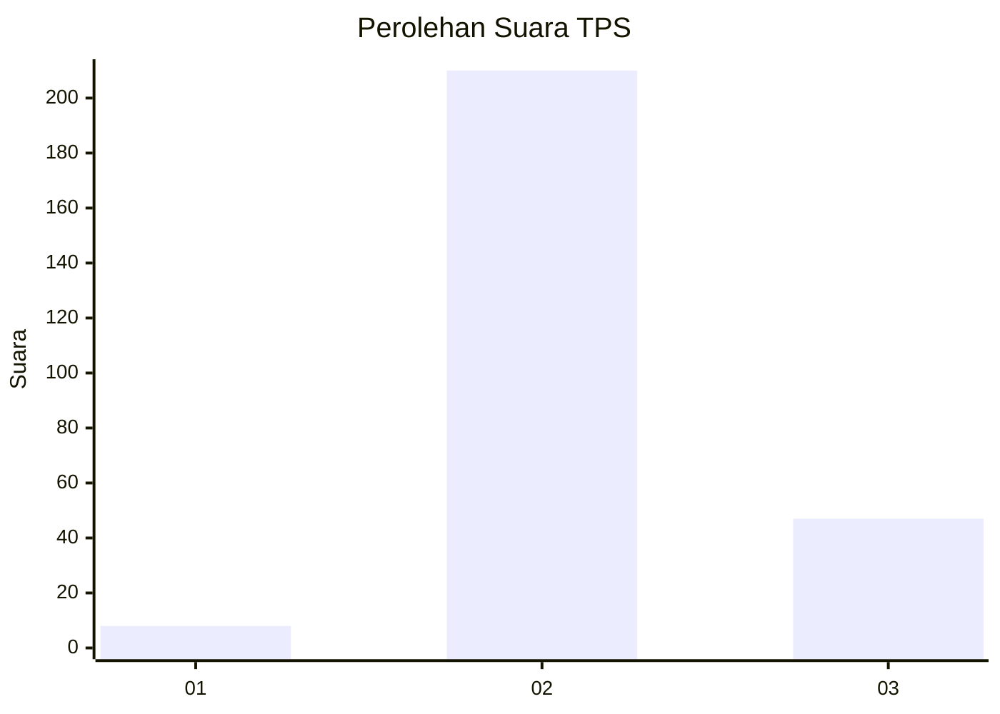

# Hasil

## Grafik

## Tabel

| No. | Nama Paslon    | Suara | Suara (raw) | Persentase |
|:--- |:-------------- | -----:| -----------:| ----------:|
| 1   | ANIES MUHAIMIN | 8     | [8][p-1]    | 3,02       |
| 2   | PRABOWO GIBRAN | 210   | [210][p-2]  | 79,25      |
| 3   | GANJAR MAHFUD  | 47    | [47][p-3]   | 17,74      |

[p-1]: https://github.com/gigit-pemilu/pemilu-2024-33-jawa-tengah/blob/main/pilpres/hitung-suara/sub/33-jawa-tengah/sub/16-blora/sub/01-jati/sub/2002-gempol/sub/010-tps/sub/paslon-1.txt
[p-2]: https://github.com/gigit-pemilu/pemilu-2024-33-jawa-tengah/blob/main/pilpres/hitung-suara/sub/33-jawa-tengah/sub/16-blora/sub/01-jati/sub/2002-gempol/sub/010-tps/sub/paslon-2.txt
[p-3]: https://github.com/gigit-pemilu/pemilu-2024-33-jawa-tengah/blob/main/pilpres/hitung-suara/sub/33-jawa-tengah/sub/16-blora/sub/01-jati/sub/2002-gempol/sub/010-tps/sub/paslon-3.txt

## Foto C Plano

https://sirekap-obj-formc.kpu.go.id/5ea9/pemilu/ppwp/33/16/01/20/02/3316012002010-20240214-211903--a41a51e0-75dc-480a-953f-1aa1f42993c1.jpg

https://sirekap-obj-formc.kpu.go.id/5ea9/pemilu/ppwp/33/16/01/20/02/3316012002010-20240217-201028--b27927da-ddf0-46c1-a7f0-0c014bb3fd77.jpg

https://sirekap-obj-formc.kpu.go.id/5ea9/pemilu/ppwp/33/16/01/20/02/3316012002010-20240214-212458--eb076c2f-94fc-49d2-b74e-4cf79572ace6.jpg

## Metadata

| Key        | Value               |
| ---------- | ------------------- |
| Time Stamp | 2024-02-19 06:16:00 |

