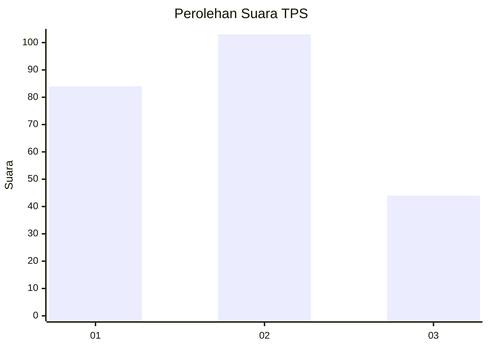
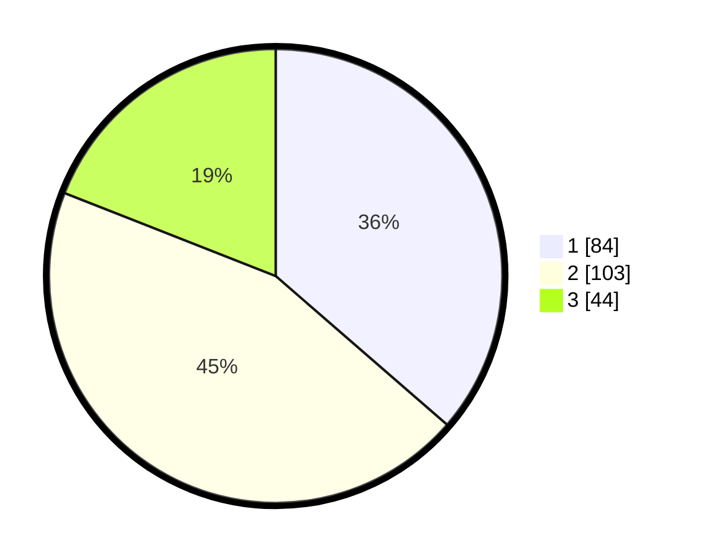

# Hasil

## Grafik

## Tabel

| No. | Nama Paslon    | Suara | Suara (raw) | Persentase |
|:--- |:-------------- | -----:| -----------:| ----------:|
| 1   | ANIES MUHAIMIN | 84    | [84][p-1]   | 36,36      |
| 2   | PRABOWO GIBRAN | 103   | [103][p-2]  | 44,59      |
| 3   | GANJAR MAHFUD  | 44    | [44][p-3]   | 19,05      |

[p-1]: https://github.com/gigit-pemilu/pemilu-2024/blob/main/pilpres/hitung-suara/sub/33-jawa-tengah/sub/16-blora/sub/01-jati/sub/2011-tobo/sub/003-tps/sub/paslon-1.txt
[p-2]: https://github.com/gigit-pemilu/pemilu-2024/blob/main/pilpres/hitung-suara/sub/33-jawa-tengah/sub/16-blora/sub/01-jati/sub/2011-tobo/sub/003-tps/sub/paslon-2.txt
[p-3]: https://github.com/gigit-pemilu/pemilu-2024/blob/main/pilpres/hitung-suara/sub/33-jawa-tengah/sub/16-blora/sub/01-jati/sub/2011-tobo/sub/003-tps/sub/paslon-3.txt

## Foto C Plano

https://sirekap-obj-formc.kpu.go.id/07b5/pemilu/ppwp/33/16/01/20/11/3316012011003-20240215-010539--57298589-2b42-4a3a-bfe5-acfd85b1443a.jpg

https://sirekap-obj-formc.kpu.go.id/07b5/pemilu/ppwp/33/16/01/20/11/3316012011003-20240215-011919--b5a241e6-6fd1-4f6c-bd0f-08f37ca58bc7.jpg

https://sirekap-obj-formc.kpu.go.id/07b5/pemilu/ppwp/33/16/01/20/11/3316012011003-20240217-124931--26a17ad9-0fc5-498f-95e8-a690d123e48d.jpg

## Metadata

| Key        | Value               |
| ---------- | ------------------- |
| Time Stamp | 2024-02-17 13:37:34 |

