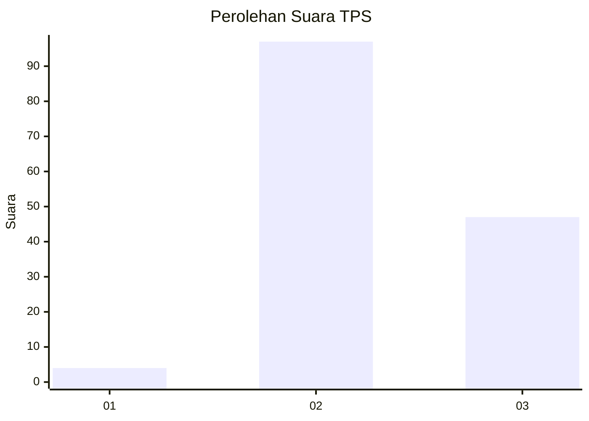
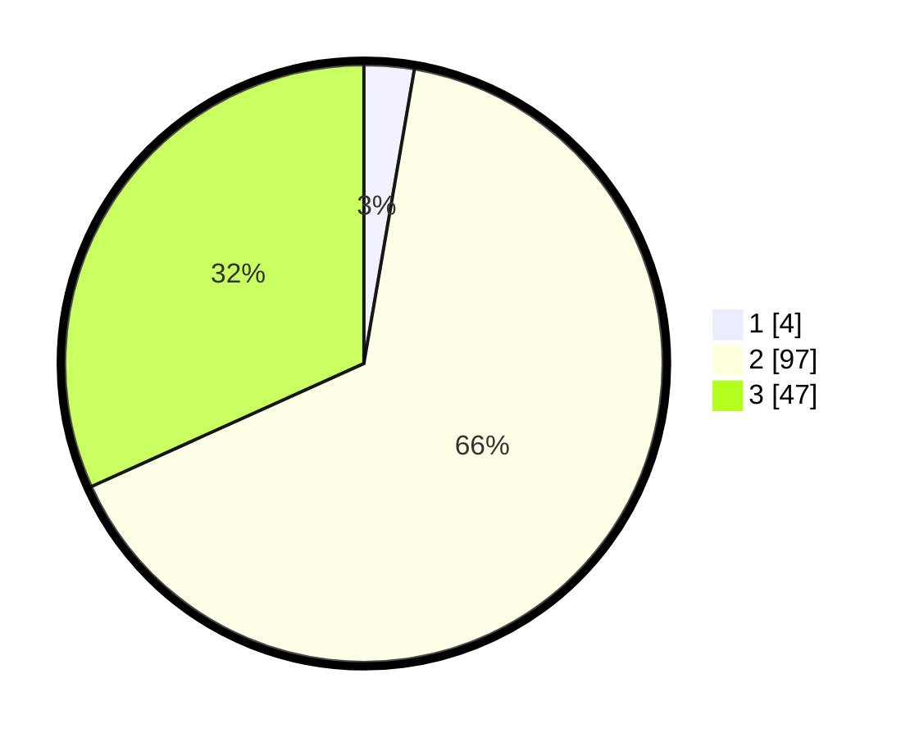

# Hasil

## Grafik

## Tabel

| No. | Nama Paslon    | Suara | Suara (raw) | Persentase |
|:--- |:-------------- | -----:| -----------:| ----------:|
| 1   | ANIES MUHAIMIN | 4     | [4][p-1]    | 2,70       |
| 2   | PRABOWO GIBRAN | 97    | [97][p-2]   | 65,54      |
| 3   | GANJAR MAHFUD  | 47    | [47][p-3]   | 31,76      |

[p-1]: https://github.com/gigit-pemilu/pemilu-2024-33-jawa-tengah/blob/main/pilpres/hitung-suara/sub/33-jawa-tengah/sub/16-blora/sub/01-jati/sub/2011-tobo/sub/005-tps/sub/paslon-1.txt
[p-2]: https://github.com/gigit-pemilu/pemilu-2024-33-jawa-tengah/blob/main/pilpres/hitung-suara/sub/33-jawa-tengah/sub/16-blora/sub/01-jati/sub/2011-tobo/sub/005-tps/sub/paslon-2.txt
[p-3]: https://github.com/gigit-pemilu/pemilu-2024-33-jawa-tengah/blob/main/pilpres/hitung-suara/sub/33-jawa-tengah/sub/16-blora/sub/01-jati/sub/2011-tobo/sub/005-tps/sub/paslon-3.txt

## Foto C Plano

https://sirekap-obj-formc.kpu.go.id/b568/pemilu/ppwp/33/16/01/20/11/3316012011005-20240215-012647--6478b262-a233-431e-8f04-c5cb9033055e.jpg

https://sirekap-obj-formc.kpu.go.id/b568/pemilu/ppwp/33/16/01/20/11/3316012011005-20240214-141945--ca50d48f-8908-4d6d-95a4-6786c232f8d9.jpg

https://sirekap-obj-formc.kpu.go.id/b568/pemilu/ppwp/33/16/01/20/11/3316012011005-20240215-012303--9f8f3e44-b78c-4717-b6ec-1266436f86a4.jpg

## Metadata

| Key        | Value               |
| ---------- | ------------------- |
| Time Stamp | 2024-02-16 16:25:10 |

