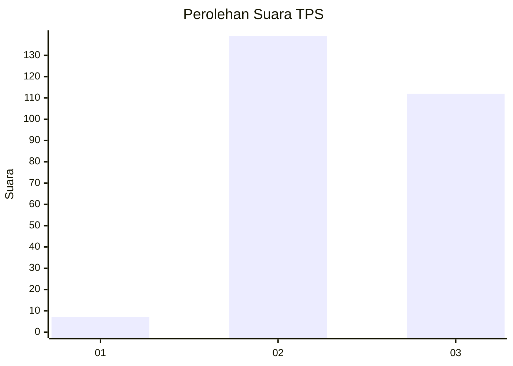
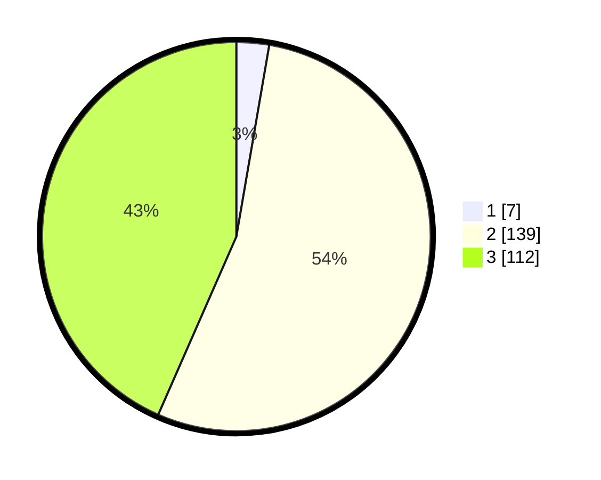

# Hasil

## Grafik

## Tabel

| No. | Nama Paslon    | Suara | Suara (raw) | Persentase |
|:--- |:-------------- | -----:| -----------:| ----------:|
| 1   | ANIES MUHAIMIN | 7     | [7][p-1]    | 2,71       |
| 2   | PRABOWO GIBRAN | 139   | [139][p-2]  | 53,88      |
| 3   | GANJAR MAHFUD  | 112   | [112][p-3]  | 43,41      |

[p-1]: https://github.com/gigit-pemilu/pemilu-2024/blob/main/pilpres/hitung-suara/sub/33-jawa-tengah/sub/16-blora/sub/03-kradenan/sub/2006-mendenrejo/sub/012-tps/sub/paslon-1.txt
[p-2]: https://github.com/gigit-pemilu/pemilu-2024/blob/main/pilpres/hitung-suara/sub/33-jawa-tengah/sub/16-blora/sub/03-kradenan/sub/2006-mendenrejo/sub/012-tps/sub/paslon-2.txt
[p-3]: https://github.com/gigit-pemilu/pemilu-2024/blob/main/pilpres/hitung-suara/sub/33-jawa-tengah/sub/16-blora/sub/03-kradenan/sub/2006-mendenrejo/sub/012-tps/sub/paslon-3.txt

## Foto C Plano

https://sirekap-obj-formc.kpu.go.id/9a10/pemilu/ppwp/33/16/03/20/06/3316032006012-20240215-032910--1ee020aa-5977-4eba-8220-bd50d57ffd5d.jpg

https://sirekap-obj-formc.kpu.go.id/9a10/pemilu/ppwp/33/16/03/20/06/3316032006012-20240214-234612--78e614e9-9307-4e3e-9c1c-f9f571e3a0be.jpg

https://sirekap-obj-formc.kpu.go.id/9a10/pemilu/ppwp/33/16/03/20/06/3316032006012-20240215-035104--4ea548b6-cdf3-49f2-a0f6-879b908912bb.jpg

## Metadata

| Key        | Value               |
| ---------- | ------------------- |
| Time Stamp | 2024-02-15 22:00:27 |

