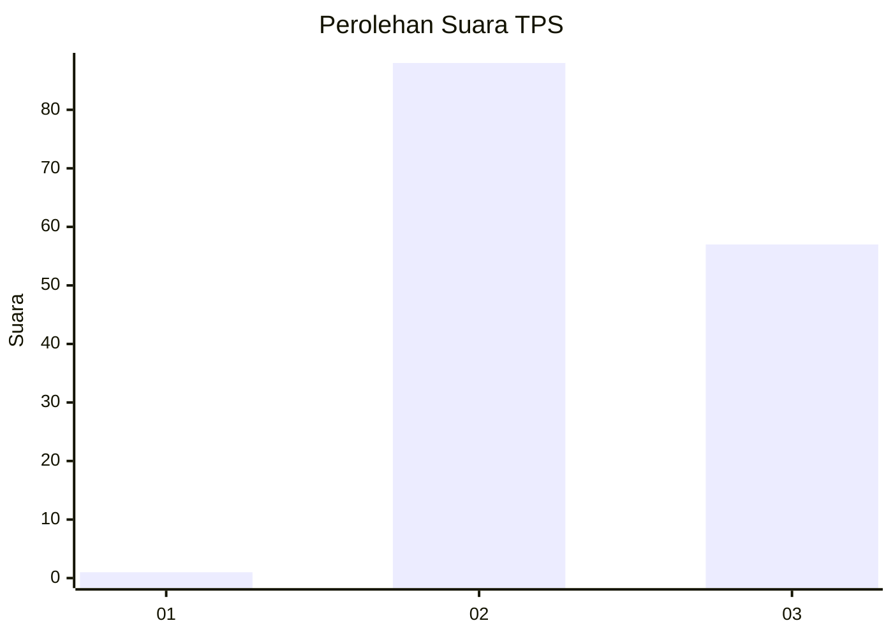
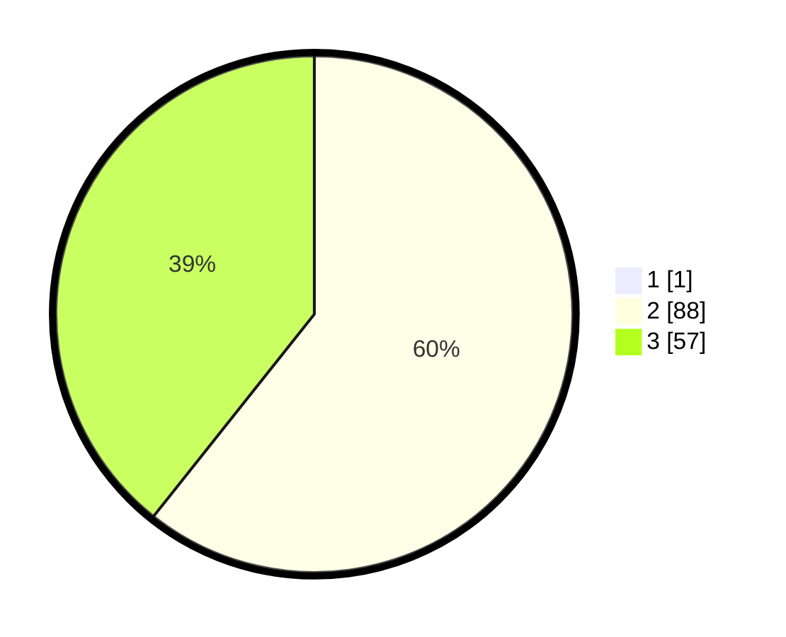

# Hasil

## Grafik

## Tabel

| No. | Nama Paslon    | Suara | Suara (raw) | Persentase |
|:--- |:-------------- | -----:| -----------:| ----------:|
| 1   | ANIES MUHAIMIN | 1     | [1][p-1]    | 0,68       |
| 2   | PRABOWO GIBRAN | 88    | [88][p-2]   | 60,27      |
| 3   | GANJAR MAHFUD  | 57    | [57][p-3]   | 39,04      |

[p-1]: https://github.com/gigit-pemilu/pemilu-2024/blob/main/pilpres/hitung-suara/sub/33-jawa-tengah/sub/16-blora/sub/07-jiken/sub/2001-nglobo/sub/002-tps/sub/paslon-1.txt
[p-2]: https://github.com/gigit-pemilu/pemilu-2024/blob/main/pilpres/hitung-suara/sub/33-jawa-tengah/sub/16-blora/sub/07-jiken/sub/2001-nglobo/sub/002-tps/sub/paslon-2.txt
[p-3]: https://github.com/gigit-pemilu/pemilu-2024/blob/main/pilpres/hitung-suara/sub/33-jawa-tengah/sub/16-blora/sub/07-jiken/sub/2001-nglobo/sub/002-tps/sub/paslon-3.txt

## Foto C Plano

https://sirekap-obj-formc.kpu.go.id/2857/pemilu/ppwp/33/16/07/20/01/3316072001002-20240214-160129--e750580f-7097-4d39-a045-ff73c4b723a1.jpg

https://sirekap-obj-formc.kpu.go.id/2857/pemilu/ppwp/33/16/07/20/01/3316072001002-20240214-160156--a670b8a5-92a2-4f49-8a98-ed5331c095f8.jpg

https://sirekap-obj-formc.kpu.go.id/2857/pemilu/ppwp/33/16/07/20/01/3316072001002-20240214-190332--eaa477db-36a7-45a9-b959-7808cac08e8f.jpg

## Metadata

| Key        | Value               |
| ---------- | ------------------- |
| Time Stamp | 2024-02-16 22:30:00 |

