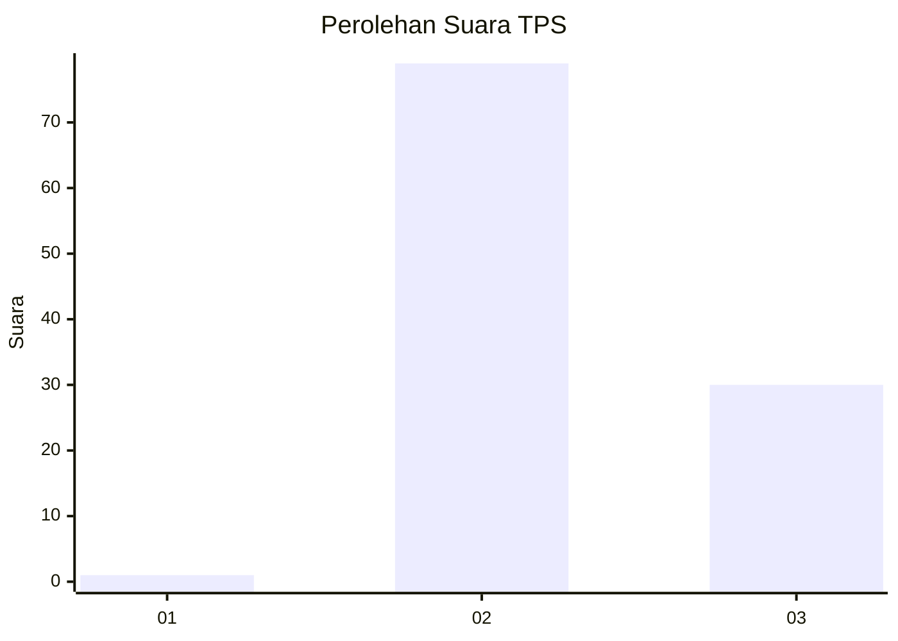
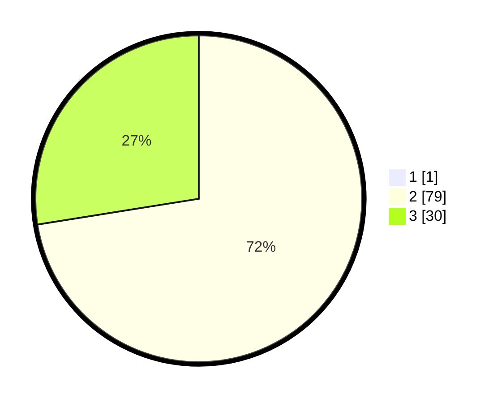

# Hasil

## Grafik

## Tabel

| No. | Nama Paslon    | Suara | Suara (raw) | Persentase |
|:--- |:-------------- | -----:| -----------:| ----------:|
| 1   | ANIES MUHAIMIN | 1     | [1][p-1]    | 0,91       |
| 2   | PRABOWO GIBRAN | 79    | [79][p-2]   | 71,82      |
| 3   | GANJAR MAHFUD  | 30    | [30][p-3]   | 27,27      |

[p-1]: https://github.com/gigit-pemilu/pemilu-2024/blob/main/pilpres/hitung-suara/sub/33-jawa-tengah/sub/16-blora/sub/07-jiken/sub/2007-singonegoro/sub/005-tps/sub/paslon-1.txt
[p-2]: https://github.com/gigit-pemilu/pemilu-2024/blob/main/pilpres/hitung-suara/sub/33-jawa-tengah/sub/16-blora/sub/07-jiken/sub/2007-singonegoro/sub/005-tps/sub/paslon-2.txt
[p-3]: https://github.com/gigit-pemilu/pemilu-2024/blob/main/pilpres/hitung-suara/sub/33-jawa-tengah/sub/16-blora/sub/07-jiken/sub/2007-singonegoro/sub/005-tps/sub/paslon-3.txt

## Foto C Plano

https://sirekap-obj-formc.kpu.go.id/ee1f/pemilu/ppwp/33/16/07/20/07/3316072007005-20240214-215447--b181235c-48fb-4c0d-b433-23910a9ebbd7.jpg

https://sirekap-obj-formc.kpu.go.id/ee1f/pemilu/ppwp/33/16/07/20/07/3316072007005-20240214-230821--bd6f2be2-98df-4379-99c4-c1a24aa8b7b3.jpg

https://sirekap-obj-formc.kpu.go.id/ee1f/pemilu/ppwp/33/16/07/20/07/3316072007005-20240214-230943--4775dfd9-80bc-4f11-9120-0a96e3a1aa7e.jpg

## Metadata

| Key        | Value               |
| ---------- | ------------------- |
| Time Stamp | 2024-02-17 17:30:00 |

