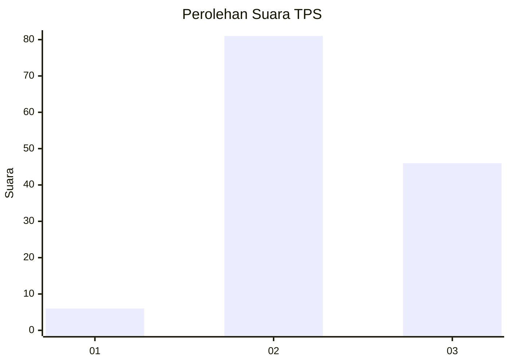
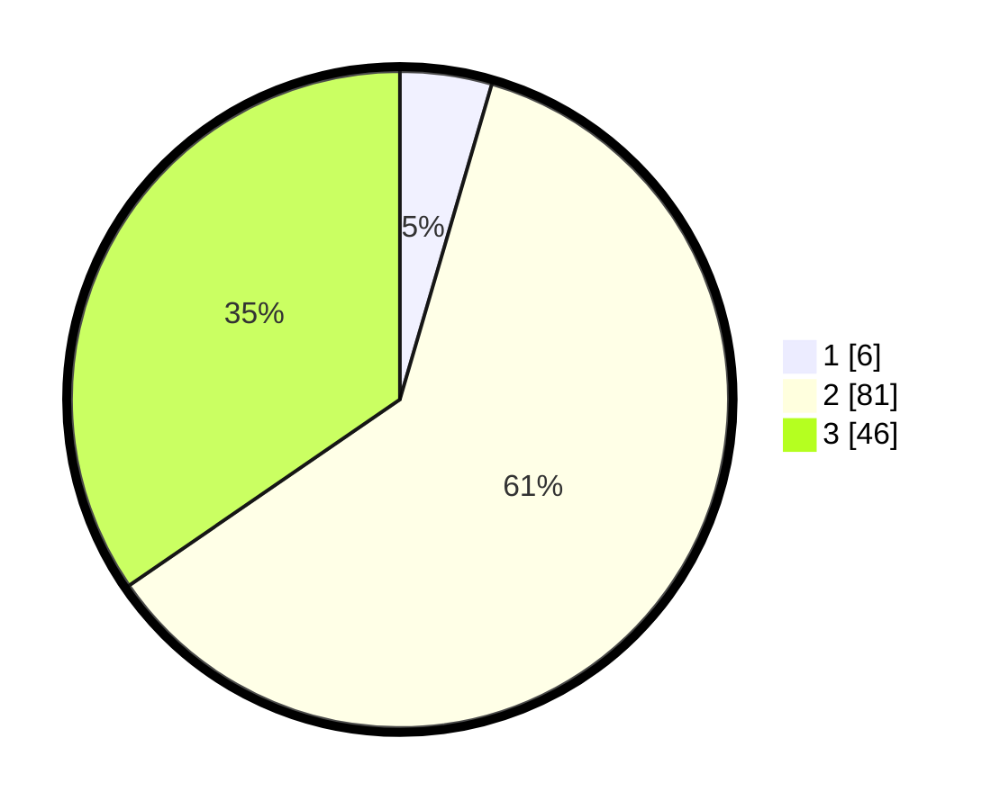

# Hasil

## Grafik

## Tabel

| No. | Nama Paslon    | Suara | Suara (raw) | Persentase |
|:--- |:-------------- | -----:| -----------:| ----------:|
| 1   | ANIES MUHAIMIN | 6     | [6][p-1]    | 4,51       |
| 2   | PRABOWO GIBRAN | 81    | [81][p-2]   | 60,90      |
| 3   | GANJAR MAHFUD  | 46    | [46][p-3]   | 34,59      |

[p-1]: https://github.com/gigit-pemilu/pemilu-2024/blob/main/pilpres/hitung-suara/sub/33-jawa-tengah/sub/16-blora/sub/08-jepon/sub/2001-blungun/sub/001-tps/sub/paslon-1.txt
[p-2]: https://github.com/gigit-pemilu/pemilu-2024/blob/main/pilpres/hitung-suara/sub/33-jawa-tengah/sub/16-blora/sub/08-jepon/sub/2001-blungun/sub/001-tps/sub/paslon-2.txt
[p-3]: https://github.com/gigit-pemilu/pemilu-2024/blob/main/pilpres/hitung-suara/sub/33-jawa-tengah/sub/16-blora/sub/08-jepon/sub/2001-blungun/sub/001-tps/sub/paslon-3.txt

## Foto C Plano

https://sirekap-obj-formc.kpu.go.id/42b3/pemilu/ppwp/33/16/08/20/01/3316082001001-20240215-013438--afad4579-9802-4e5a-b1b2-12523c530c77.jpg

https://sirekap-obj-formc.kpu.go.id/42b3/pemilu/ppwp/33/16/08/20/01/3316082001001-20240214-212819--8d8de4f9-da03-4860-b1e3-765fe0393cf4.jpg

https://sirekap-obj-formc.kpu.go.id/42b3/pemilu/ppwp/33/16/08/20/01/3316082001001-20240220-094113--a47e5ed0-fd9f-40bb-bf46-9cb8e74f0a8e.jpg

## Metadata

| Key        | Value               |
| ---------- | ------------------- |
| Time Stamp | 2024-02-20 10:00:00 |

