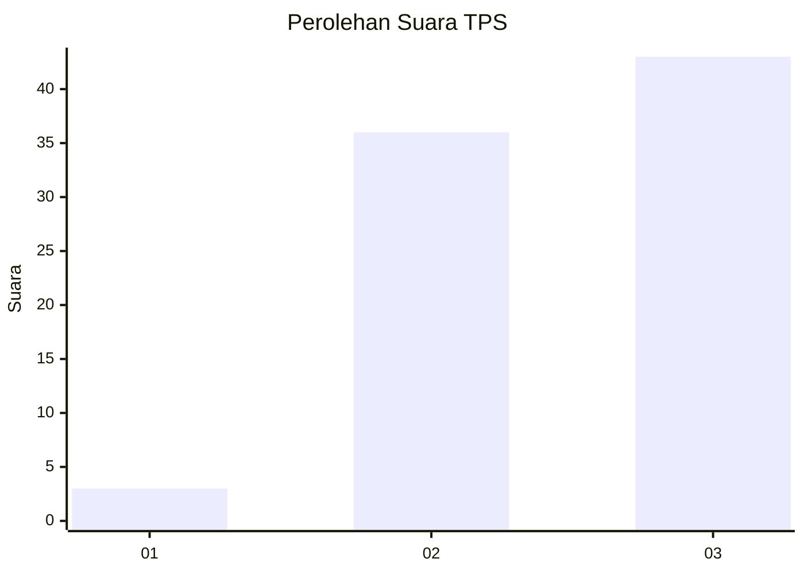
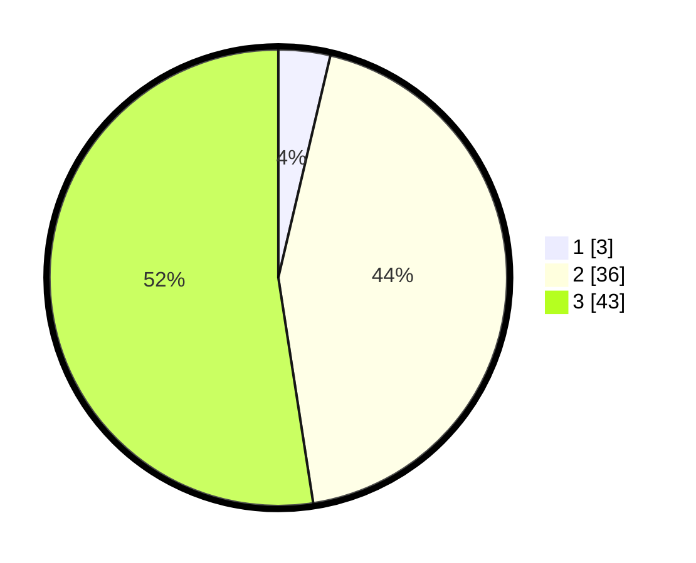

# Hasil

## Grafik

## Tabel

| No. | Nama Paslon    | Suara | Suara (raw) | Persentase |
|:--- |:-------------- | -----:| -----------:| ----------:|
| 1   | ANIES MUHAIMIN | 3     | [3][p-1]    | 3,66       |
| 2   | PRABOWO GIBRAN | 36    | [36][p-2]   | 43,90      |
| 3   | GANJAR MAHFUD  | 43    | [43][p-3]   | 52,44      |

[p-1]: https://github.com/gigit-pemilu/pemilu-2024-33-jawa-tengah/blob/main/pilpres/hitung-suara/sub/33-jawa-tengah/sub/16-blora/sub/09-blora/sub/1015-kunden/sub/901-tps/sub/paslon-1.txt
[p-2]: https://github.com/gigit-pemilu/pemilu-2024-33-jawa-tengah/blob/main/pilpres/hitung-suara/sub/33-jawa-tengah/sub/16-blora/sub/09-blora/sub/1015-kunden/sub/901-tps/sub/paslon-2.txt
[p-3]: https://github.com/gigit-pemilu/pemilu-2024-33-jawa-tengah/blob/main/pilpres/hitung-suara/sub/33-jawa-tengah/sub/16-blora/sub/09-blora/sub/1015-kunden/sub/901-tps/sub/paslon-3.txt

## Foto C Plano

https://sirekap-obj-formc.kpu.go.id/afb8/pemilu/ppwp/33/16/09/10/15/3316091015901-20240214-192058--20098949-2401-4e62-926e-f25212b56d7a.jpg

https://sirekap-obj-formc.kpu.go.id/afb8/pemilu/ppwp/33/16/09/10/15/3316091015901-20240214-192200--6f288d7c-90cf-47e8-ab43-685622785349.jpg

https://sirekap-obj-formc.kpu.go.id/afb8/pemilu/ppwp/33/16/09/10/15/3316091015901-20240214-192305--4301e001-33ac-43d9-a355-8a83b3e36c43.jpg

## Metadata

| Key        | Value               |
| ---------- | ------------------- |
| Time Stamp | 2024-02-14 21:46:01 |

## DATA PEMILIH TETAP

Jumlah pemilih dalam DPT: **83**.
 * L: **82**.
 * P: **1**.

## DATA PENGGUNA HAK PILIH

Jumlah pengguna hak pilih dalam DPT: **51**.
 * L: **51**.
 * P: **0**.

Jumlah pengguna hak pilih dalam DPTb: **33**.
 * L: **29**.
 * P: **4**.

Jumlah pengguna hak pilih dalam DPK: **0**.
 * L: **0**.
 * P: **0**.

Jumlah pengguna hak pilih: **84**.
 * L: **80**.
 * P: **4**.

## JUMLAH SUARA SAH DAN TIDAK SAH

JUMLAH SELURUH SUARA SAH: **82**.

JUMLAH SUARA TIDAK SAH: **2**.

JUMLAH SELURUH SUARA SAH DAN SUARA TIDAK SAH: **84**.

