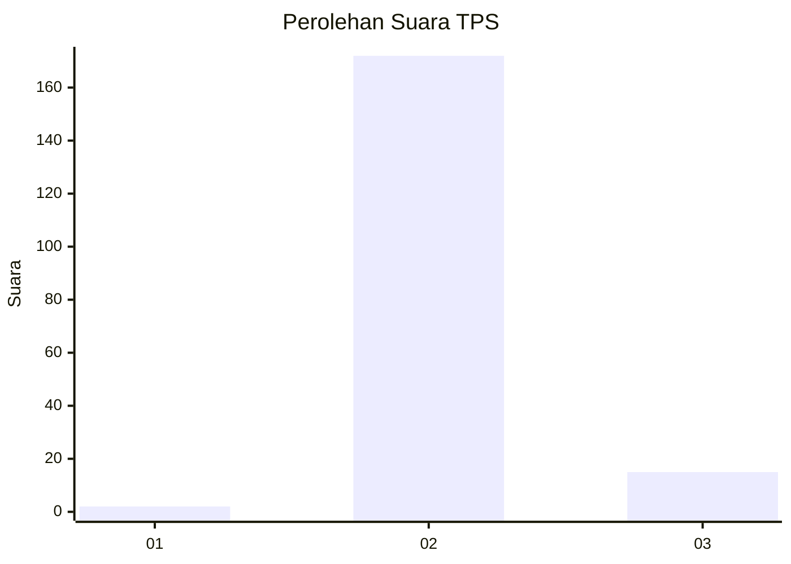
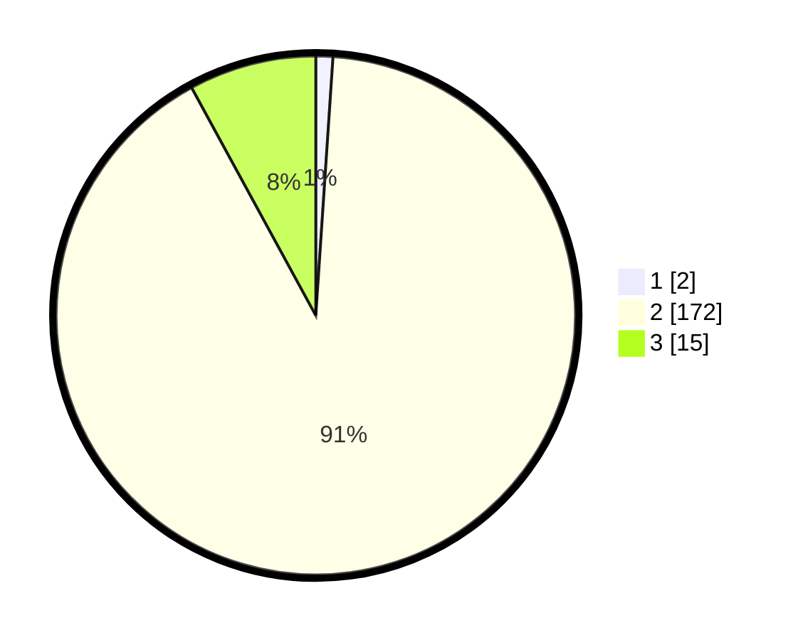

# Hasil

## Grafik

## Tabel

| No. | Nama Paslon    | Suara | Suara (raw) | Persentase |
|:--- |:-------------- | -----:| -----------:| ----------:|
| 1   | ANIES MUHAIMIN | 2     | [2][p-1]    | 1,06       |
| 2   | PRABOWO GIBRAN | 172   | [172][p-2]  | 91,01      |
| 3   | GANJAR MAHFUD  | 15    | [15][p-3]   | 7,94       |

[p-1]: https://github.com/gigit-pemilu/pemilu-2024/blob/main/pilpres/hitung-suara/sub/33-jawa-tengah/sub/16-blora/sub/09-blora/sub/2027-plantungan/sub/001-tps/sub/paslon-1.txt
[p-2]: https://github.com/gigit-pemilu/pemilu-2024/blob/main/pilpres/hitung-suara/sub/33-jawa-tengah/sub/16-blora/sub/09-blora/sub/2027-plantungan/sub/001-tps/sub/paslon-2.txt
[p-3]: https://github.com/gigit-pemilu/pemilu-2024/blob/main/pilpres/hitung-suara/sub/33-jawa-tengah/sub/16-blora/sub/09-blora/sub/2027-plantungan/sub/001-tps/sub/paslon-3.txt

## Foto C Plano

https://sirekap-obj-formc.kpu.go.id/b45b/pemilu/ppwp/33/16/09/20/27/3316092027001-20240214-193309--fa4ce36a-ddc9-408e-9756-2ebc138d4174.jpg

https://sirekap-obj-formc.kpu.go.id/b45b/pemilu/ppwp/33/16/09/20/27/3316092027001-20240214-193409--36f0c963-f929-488f-95f8-d62ac83991f2.jpg

https://sirekap-obj-formc.kpu.go.id/b45b/pemilu/ppwp/33/16/09/20/27/3316092027001-20240214-193532--29b05324-72e2-4a03-a217-46b1e3613d85.jpg

## Metadata

| Key        | Value               |
| ---------- | ------------------- |
| Time Stamp | 2024-02-15 22:00:27 |

