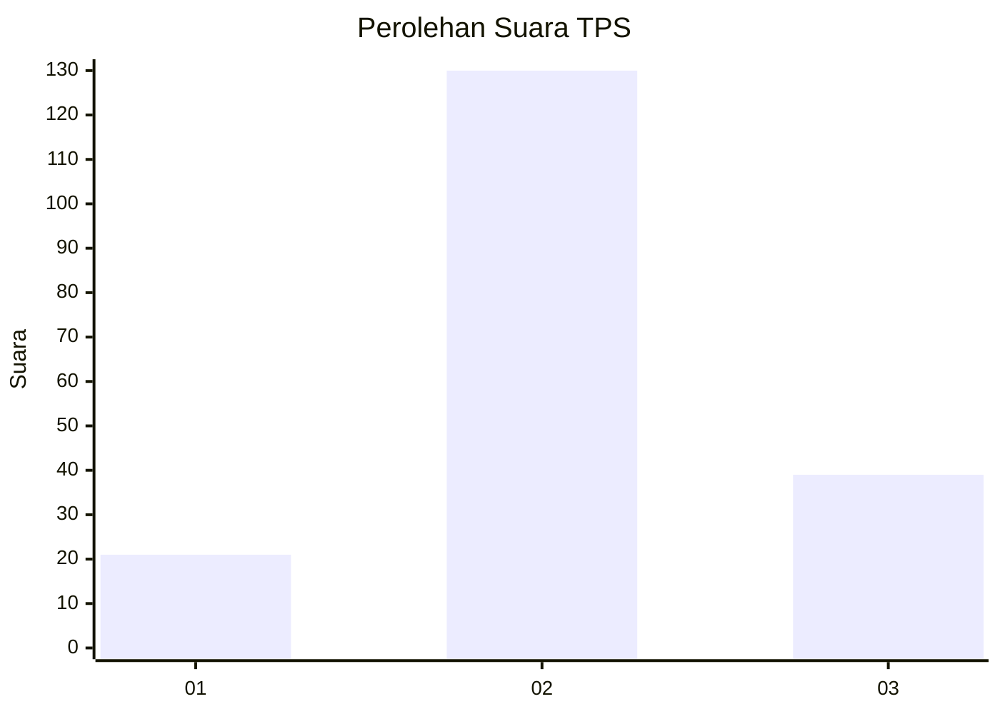
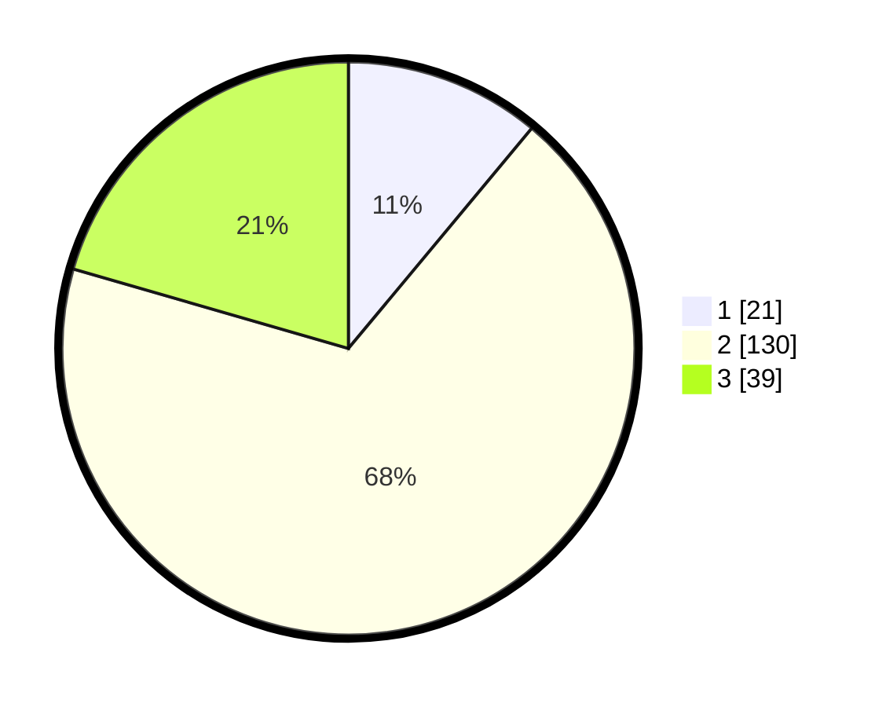

# Hasil

## Grafik

## Tabel

| No. | Nama Paslon    | Suara | Suara (raw) | Persentase |
|:--- |:-------------- | -----:| -----------:| ----------:|
| 1   | ANIES MUHAIMIN | 21    | [21][p-1]   | 11,05      |
| 2   | PRABOWO GIBRAN | 130   | [130][p-2]  | 68,42      |
| 3   | GANJAR MAHFUD  | 39    | [39][p-3]   | 20,53      |

[p-1]: https://github.com/gigit-pemilu/pemilu-2024-33-jawa-tengah/blob/main/pilpres/hitung-suara/sub/33-jawa-tengah/sub/16-blora/sub/10-tunjungan/sub/2001-tawangrejo/sub/006-tps/sub/paslon-1.txt
[p-2]: https://github.com/gigit-pemilu/pemilu-2024-33-jawa-tengah/blob/main/pilpres/hitung-suara/sub/33-jawa-tengah/sub/16-blora/sub/10-tunjungan/sub/2001-tawangrejo/sub/006-tps/sub/paslon-2.txt
[p-3]: https://github.com/gigit-pemilu/pemilu-2024-33-jawa-tengah/blob/main/pilpres/hitung-suara/sub/33-jawa-tengah/sub/16-blora/sub/10-tunjungan/sub/2001-tawangrejo/sub/006-tps/sub/paslon-3.txt

## Foto C Plano

https://sirekap-obj-formc.kpu.go.id/fa78/pemilu/ppwp/33/16/10/20/01/3316102001006-20240216-142239--863af239-3bcb-4c3d-ad98-d2fa534ab9fa.jpg

https://sirekap-obj-formc.kpu.go.id/fa78/pemilu/ppwp/33/16/10/20/01/3316102001006-20240216-142505--aaf83c91-3f48-42ab-bab4-01fddf8743dc.jpg

https://sirekap-obj-formc.kpu.go.id/fa78/pemilu/ppwp/33/16/10/20/01/3316102001006-20240216-142600--d2dbe8e5-f10e-401c-96f0-eb390ed13c36.jpg

## Metadata

| Key        | Value               |
| ---------- | ------------------- |
| Time Stamp | 2024-02-16 14:30:33 |

