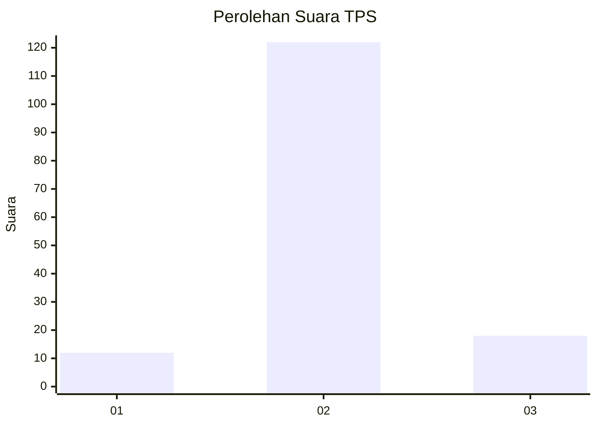
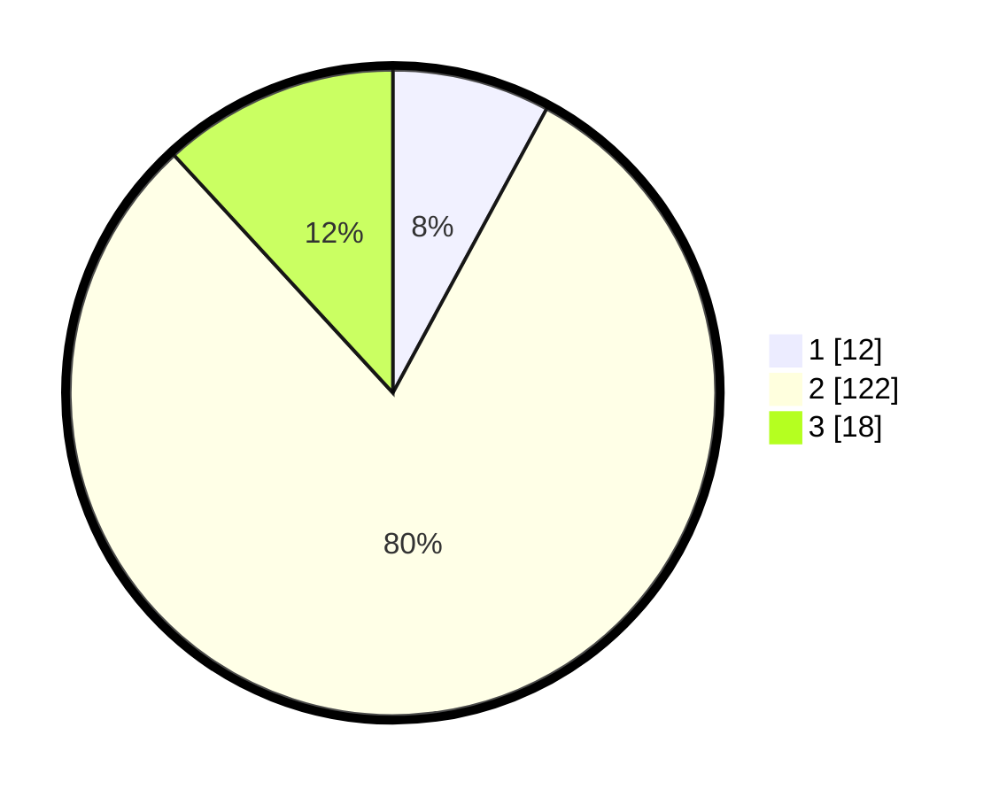

# Hasil

## Grafik

## Tabel

| No. | Nama Paslon    | Suara | Suara (raw) | Persentase |
|:--- |:-------------- | -----:| -----------:| ----------:|
| 1   | ANIES MUHAIMIN | 12    | [12][p-1]   | 7,89       |
| 2   | PRABOWO GIBRAN | 122   | [122][p-2]  | 80,26      |
| 3   | GANJAR MAHFUD  | 18    | [18][p-3]   | 11,84      |

[p-1]: https://github.com/gigit-pemilu/pemilu-2024/blob/main/pilpres/hitung-suara/sub/33-jawa-tengah/sub/16-blora/sub/12-ngawen/sub/2001-rowobungkul/sub/003-tps/sub/paslon-1.txt
[p-2]: https://github.com/gigit-pemilu/pemilu-2024/blob/main/pilpres/hitung-suara/sub/33-jawa-tengah/sub/16-blora/sub/12-ngawen/sub/2001-rowobungkul/sub/003-tps/sub/paslon-2.txt
[p-3]: https://github.com/gigit-pemilu/pemilu-2024/blob/main/pilpres/hitung-suara/sub/33-jawa-tengah/sub/16-blora/sub/12-ngawen/sub/2001-rowobungkul/sub/003-tps/sub/paslon-3.txt

## Foto C Plano

https://sirekap-obj-formc.kpu.go.id/8c02/pemilu/ppwp/33/16/12/20/01/3316122001003-20240214-140942--96dcbc08-5ae9-4b7e-9645-7891b159b488.jpg

https://sirekap-obj-formc.kpu.go.id/8c02/pemilu/ppwp/33/16/12/20/01/3316122001003-20240214-141044--bdf5b823-82f7-44af-8d2d-f187e284b608.jpg

https://sirekap-obj-formc.kpu.go.id/8c02/pemilu/ppwp/33/16/12/20/01/3316122001003-20240214-141113--7ae64f8e-caa1-4dce-9b2f-033acfd56e9a.jpg

## Metadata

| Key        | Value               |
| ---------- | ------------------- |
| Time Stamp | 2024-02-15 03:06:03 |

