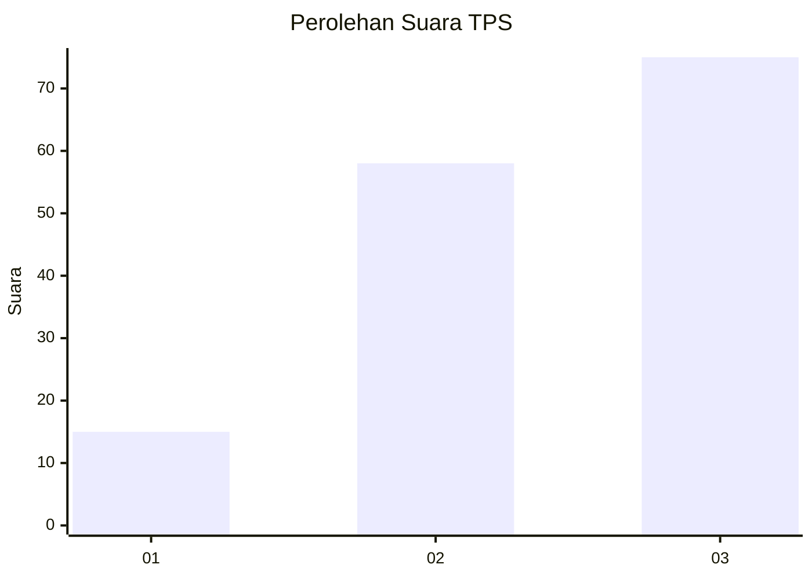
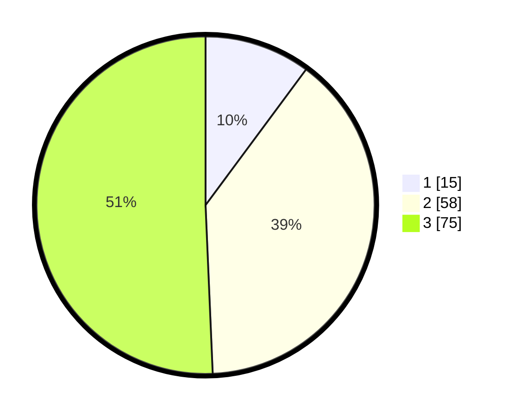

# Hasil

## Grafik

## Tabel

| No. | Nama Paslon    | Suara | Suara (raw) | Persentase |
|:--- |:-------------- | -----:| -----------:| ----------:|
| 1   | ANIES MUHAIMIN | 15    | [15][p-1]   | 10,14      |
| 2   | PRABOWO GIBRAN | 58    | [58][p-2]   | 39,19      |
| 3   | GANJAR MAHFUD  | 75    | [75][p-3]   | 50,68      |

[p-1]: https://github.com/gigit-pemilu/pemilu-2024/blob/main/pilpres/hitung-suara/sub/33-jawa-tengah/sub/16-blora/sub/12-ngawen/sub/2001-rowobungkul/sub/009-tps/sub/paslon-1.txt
[p-2]: https://github.com/gigit-pemilu/pemilu-2024/blob/main/pilpres/hitung-suara/sub/33-jawa-tengah/sub/16-blora/sub/12-ngawen/sub/2001-rowobungkul/sub/009-tps/sub/paslon-2.txt
[p-3]: https://github.com/gigit-pemilu/pemilu-2024/blob/main/pilpres/hitung-suara/sub/33-jawa-tengah/sub/16-blora/sub/12-ngawen/sub/2001-rowobungkul/sub/009-tps/sub/paslon-3.txt

## Foto C Plano

https://sirekap-obj-formc.kpu.go.id/441b/pemilu/ppwp/33/16/12/20/01/3316122001009-20240216-215733--a8f1022c-8622-4de4-809d-440ba7c0b701.jpg

https://sirekap-obj-formc.kpu.go.id/441b/pemilu/ppwp/33/16/12/20/01/3316122001009-20240216-220030--ad27fb8c-0423-4c33-849f-6004b41d1a76.jpg

https://sirekap-obj-formc.kpu.go.id/441b/pemilu/ppwp/33/16/12/20/01/3316122001009-20240216-220244--3871ba19-86b1-4b0b-845e-70d09386c138.jpg

## Metadata

| Key        | Value               |
| ---------- | ------------------- |
| Time Stamp | 2024-02-24 22:31:28 |

