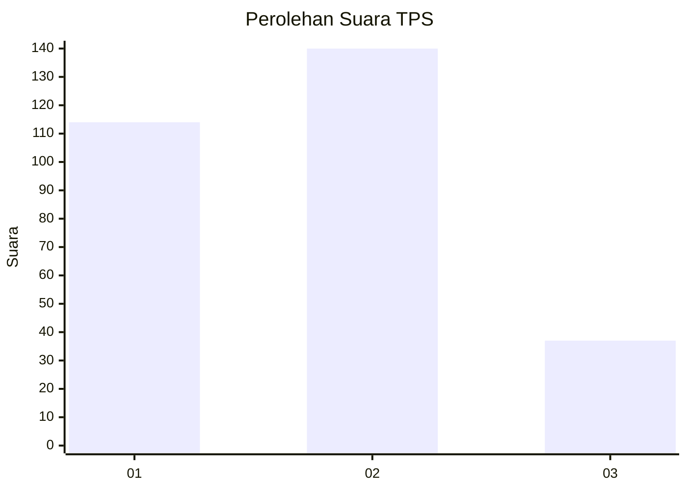
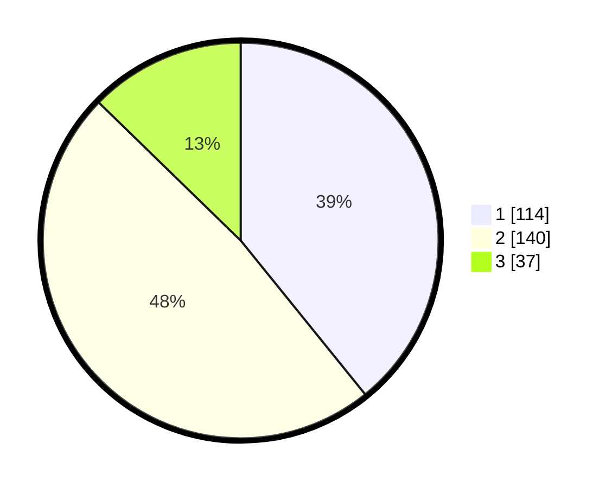

# Hasil

## Grafik

## Tabel

| No. | Nama Paslon    | Suara | Suara (raw) | Persentase |
|:--- |:-------------- | -----:| -----------:| ----------:|
| 1   | ANIES MUHAIMIN | 114   | [114][p-1]  | 39,18      |
| 2   | PRABOWO GIBRAN | 140   | [140][p-2]  | 48,11      |
| 3   | GANJAR MAHFUD  | 37    | [37][p-3]   | 12,71      |

[p-1]: https://github.com/gigit-pemilu/pemilu-2024-33-jawa-tengah/blob/main/pilpres/hitung-suara/sub/33-jawa-tengah/sub/16-blora/sub/12-ngawen/sub/2004-kendayaan/sub/002-tps/sub/paslon-1.txt
[p-2]: https://github.com/gigit-pemilu/pemilu-2024-33-jawa-tengah/blob/main/pilpres/hitung-suara/sub/33-jawa-tengah/sub/16-blora/sub/12-ngawen/sub/2004-kendayaan/sub/002-tps/sub/paslon-2.txt
[p-3]: https://github.com/gigit-pemilu/pemilu-2024-33-jawa-tengah/blob/main/pilpres/hitung-suara/sub/33-jawa-tengah/sub/16-blora/sub/12-ngawen/sub/2004-kendayaan/sub/002-tps/sub/paslon-3.txt

## Foto C Plano

https://sirekap-obj-formc.kpu.go.id/f6dd/pemilu/ppwp/33/16/12/20/04/3316122004002-20240215-002035--d577cae0-555c-49b7-9c4e-619a16a92830.jpg

https://sirekap-obj-formc.kpu.go.id/f6dd/pemilu/ppwp/33/16/12/20/04/3316122004002-20240215-002239--edb50eef-fc6d-4fc6-8f0f-4ebc523bc47e.jpg

https://sirekap-obj-formc.kpu.go.id/f6dd/pemilu/ppwp/33/16/12/20/04/3316122004002-20240215-002630--f76919e0-0c0d-44e5-906c-a4280ea9b489.jpg

## Metadata

| Key        | Value               |
| ---------- | ------------------- |
| Time Stamp | 2024-02-15 23:29:50 |

