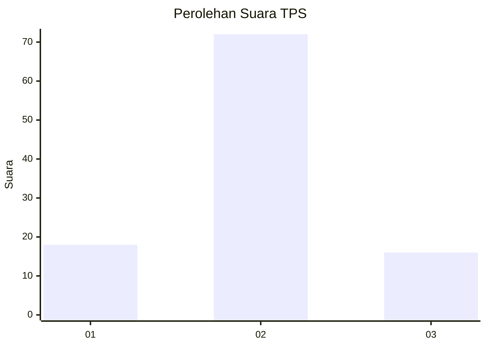
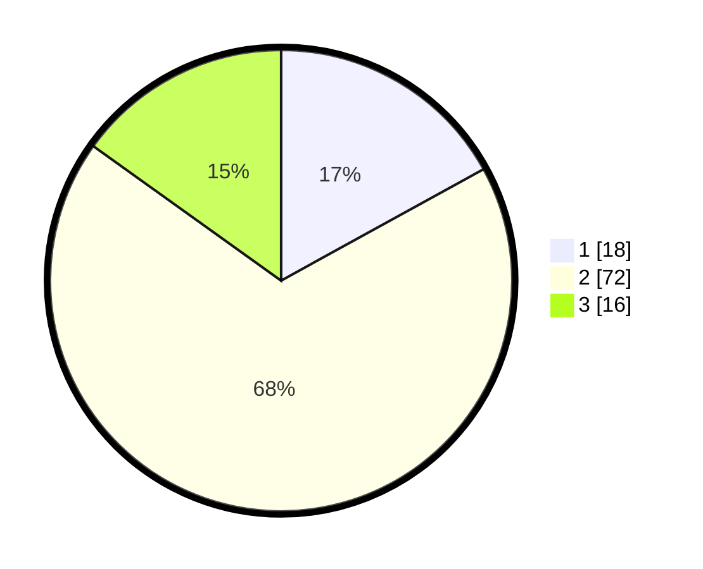

# Hasil

## Grafik

## Tabel

| No. | Nama Paslon    | Suara | Suara (raw) | Persentase |
|:--- |:-------------- | -----:| -----------:| ----------:|
| 1   | ANIES MUHAIMIN | 18    | [18][p-1]   | 16,98      |
| 2   | PRABOWO GIBRAN | 72    | [72][p-2]   | 67,92      |
| 3   | GANJAR MAHFUD  | 16    | [16][p-3]   | 15,09      |

[p-1]: https://github.com/gigit-pemilu/pemilu-2024-33-jawa-tengah/blob/main/pilpres/hitung-suara/sub/33-jawa-tengah/sub/16-blora/sub/12-ngawen/sub/2005-plumbon/sub/006-tps/sub/paslon-1.txt
[p-2]: https://github.com/gigit-pemilu/pemilu-2024-33-jawa-tengah/blob/main/pilpres/hitung-suara/sub/33-jawa-tengah/sub/16-blora/sub/12-ngawen/sub/2005-plumbon/sub/006-tps/sub/paslon-2.txt
[p-3]: https://github.com/gigit-pemilu/pemilu-2024-33-jawa-tengah/blob/main/pilpres/hitung-suara/sub/33-jawa-tengah/sub/16-blora/sub/12-ngawen/sub/2005-plumbon/sub/006-tps/sub/paslon-3.txt

## Foto C Plano

https://sirekap-obj-formc.kpu.go.id/455d/pemilu/ppwp/33/16/12/20/05/3316122005006-20240217-121001--e085cb8e-7443-40f8-88c3-0540932f97bd.jpg

https://sirekap-obj-formc.kpu.go.id/455d/pemilu/ppwp/33/16/12/20/05/3316122005006-20240217-130833--c1c53c1c-70cf-4c4e-a231-2f0c23339b9c.jpg

https://sirekap-obj-formc.kpu.go.id/455d/pemilu/ppwp/33/16/12/20/05/3316122005006-20240215-004444--acd7ae74-b536-4e16-a60e-0404e3b5d423.jpg

## Metadata

| Key        | Value               |
| ---------- | ------------------- |
| Time Stamp | 2024-02-19 06:16:00 |

