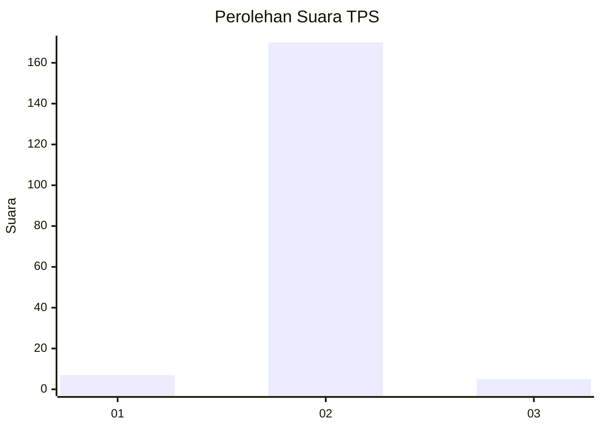
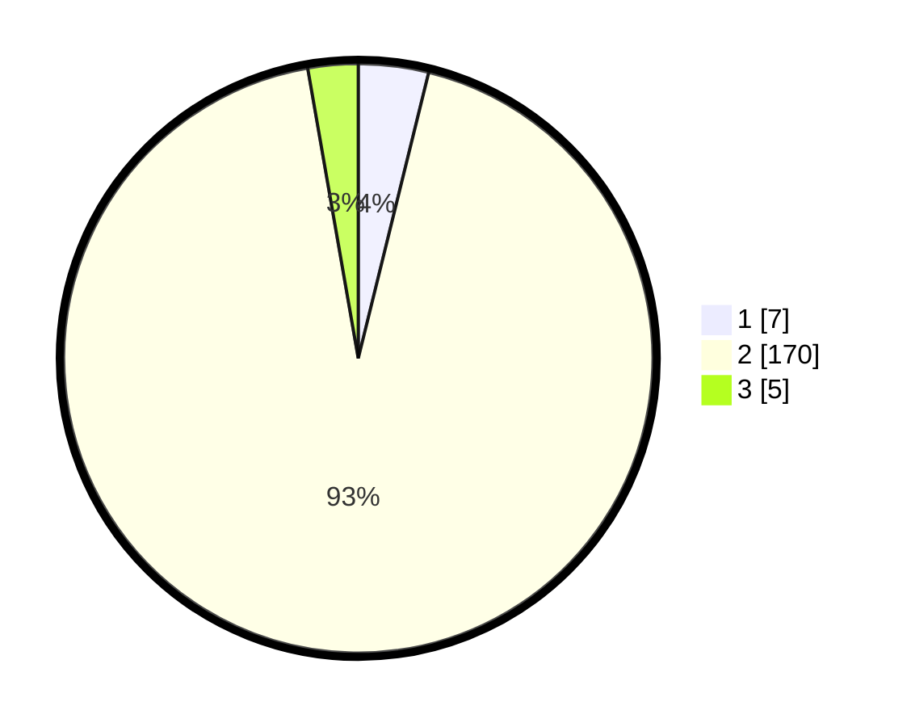

# Hasil

## Grafik

## Tabel

| No. | Nama Paslon    | Suara | Suara (raw) | Persentase |
|:--- |:-------------- | -----:| -----------:| ----------:|
| 1   | ANIES MUHAIMIN | 7     | [7][p-1]    | 3,85       |
| 2   | PRABOWO GIBRAN | 170   | [170][p-2]  | 93,41      |
| 3   | GANJAR MAHFUD  | 5     | [5][p-3]    | 2,75       |

[p-1]: https://github.com/gigit-pemilu/pemilu-2024-33-jawa-tengah/blob/main/pilpres/hitung-suara/sub/33-jawa-tengah/sub/16-blora/sub/12-ngawen/sub/2010-jetakwanger/sub/001-tps/sub/paslon-1.txt
[p-2]: https://github.com/gigit-pemilu/pemilu-2024-33-jawa-tengah/blob/main/pilpres/hitung-suara/sub/33-jawa-tengah/sub/16-blora/sub/12-ngawen/sub/2010-jetakwanger/sub/001-tps/sub/paslon-2.txt
[p-3]: https://github.com/gigit-pemilu/pemilu-2024-33-jawa-tengah/blob/main/pilpres/hitung-suara/sub/33-jawa-tengah/sub/16-blora/sub/12-ngawen/sub/2010-jetakwanger/sub/001-tps/sub/paslon-3.txt

## Foto C Plano

https://sirekap-obj-formc.kpu.go.id/df44/pemilu/ppwp/33/16/12/20/10/3316122010001-20240214-192808--a24ba960-83b9-47f4-a0cf-46f71c3be2c3.jpg

https://sirekap-obj-formc.kpu.go.id/df44/pemilu/ppwp/33/16/12/20/10/3316122010001-20240214-224846--d533b289-a883-42b1-8e83-f23c7450ca28.jpg

https://sirekap-obj-formc.kpu.go.id/df44/pemilu/ppwp/33/16/12/20/10/3316122010001-20240214-192649--a3a07c11-05db-4777-8f66-9891627203e0.jpg

## Metadata

| Key        | Value               |
| ---------- | ------------------- |
| Time Stamp | 2024-02-16 09:00:28 |

