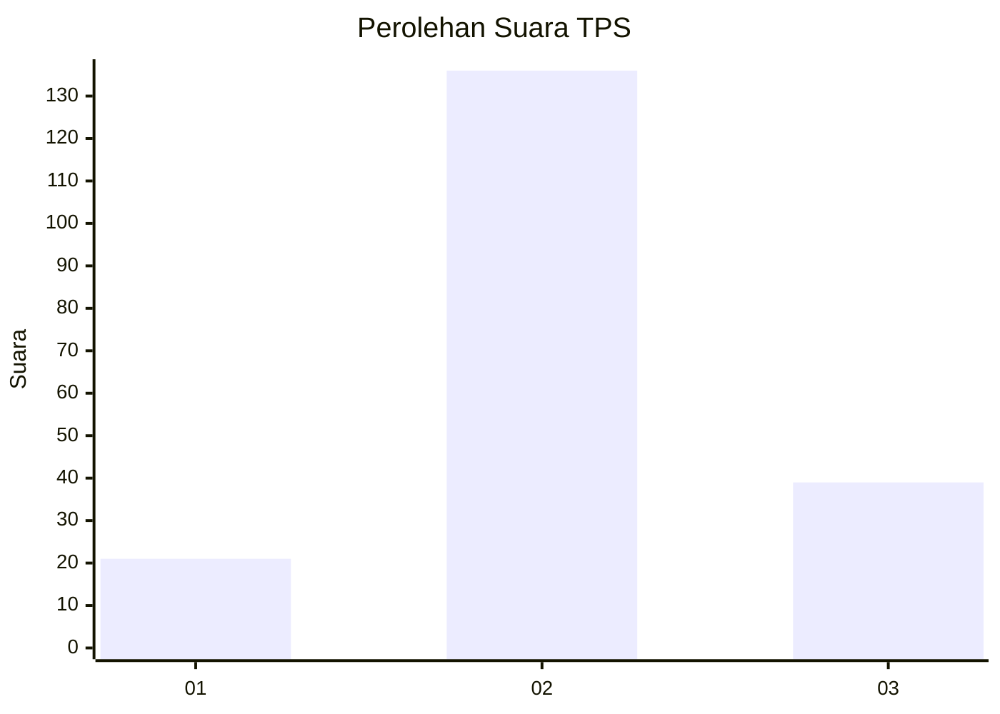
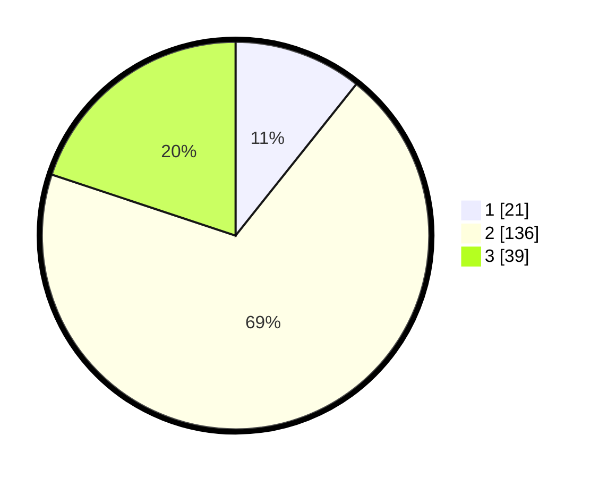

# Hasil

## Grafik

## Tabel

| No. | Nama Paslon    | Suara | Suara (raw) | Persentase |
|:--- |:-------------- | -----:| -----------:| ----------:|
| 1   | ANIES MUHAIMIN | 21    | [21][p-1]   | 10,71      |
| 2   | PRABOWO GIBRAN | 136   | [136][p-2]  | 69,39      |
| 3   | GANJAR MAHFUD  | 39    | [39][p-3]   | 19,90      |

[p-1]: https://github.com/gigit-pemilu/pemilu-2024/blob/main/pilpres/hitung-suara/sub/33-jawa-tengah/sub/16-blora/sub/12-ngawen/sub/2010-jetakwanger/sub/005-tps/sub/paslon-1.txt
[p-2]: https://github.com/gigit-pemilu/pemilu-2024/blob/main/pilpres/hitung-suara/sub/33-jawa-tengah/sub/16-blora/sub/12-ngawen/sub/2010-jetakwanger/sub/005-tps/sub/paslon-2.txt
[p-3]: https://github.com/gigit-pemilu/pemilu-2024/blob/main/pilpres/hitung-suara/sub/33-jawa-tengah/sub/16-blora/sub/12-ngawen/sub/2010-jetakwanger/sub/005-tps/sub/paslon-3.txt

## Foto C Plano

https://sirekap-obj-formc.kpu.go.id/1c40/pemilu/ppwp/33/16/12/20/10/3316122010005-20240214-155231--de36d603-63b5-47bf-8cfd-5539f79e77cb.jpg

https://sirekap-obj-formc.kpu.go.id/1c40/pemilu/ppwp/33/16/12/20/10/3316122010005-20240214-155427--7b1d26a0-ee22-4b39-a19c-1c3c534b9e01.jpg

https://sirekap-obj-formc.kpu.go.id/1c40/pemilu/ppwp/33/16/12/20/10/3316122010005-20240214-155526--2f6f5ce6-5b77-41ca-b9fb-9839365851e7.jpg

## Metadata

| Key        | Value               |
| ---------- | ------------------- |
| Time Stamp | 2024-02-14 21:46:01 |

## DATA PEMILIH TETAP

Jumlah pemilih dalam DPT: **259**.
 * L: **132**.
 * P: **127**.

## DATA PENGGUNA HAK PILIH

Jumlah pengguna hak pilih dalam DPT: **208**.
 * L: **96**.
 * P: **112**.

Jumlah pengguna hak pilih dalam DPTb: **666**.
 * L: **10**.
 * P: **15**.

Jumlah pengguna hak pilih dalam DPK: **0**.
 * L: **556**.
 * P: **560**.

Jumlah pengguna hak pilih: **209**.
 * L: **555**.
 * P: **513**.

## JUMLAH SUARA SAH DAN TIDAK SAH

JUMLAH SELURUH SUARA SAH: **196**.

JUMLAH SUARA TIDAK SAH: **813**.

JUMLAH SELURUH SUARA SAH DAN SUARA TIDAK SAH: **209**.

