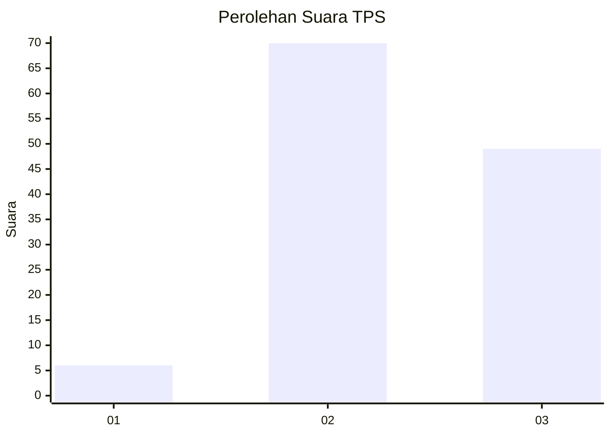
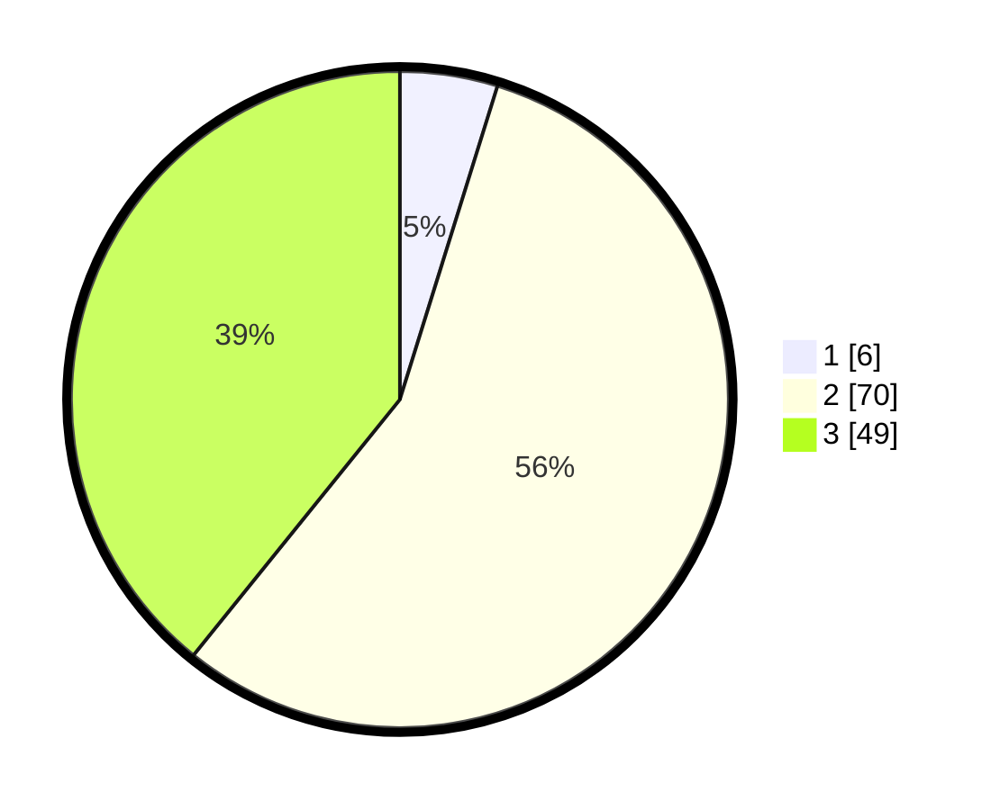

# Hasil

## Grafik

## Tabel

| No. | Nama Paslon    | Suara | Suara (raw) | Persentase |
|:--- |:-------------- | -----:| -----------:| ----------:|
| 1   | ANIES MUHAIMIN | 6     | [6][p-1]    | 4,80       |
| 2   | PRABOWO GIBRAN | 70    | [70][p-2]   | 56,00      |
| 3   | GANJAR MAHFUD  | 49    | [49][p-3]   | 39,20      |

[p-1]: https://github.com/gigit-pemilu/pemilu-2024-33-jawa-tengah/blob/main/pilpres/hitung-suara/sub/33-jawa-tengah/sub/16-blora/sub/12-ngawen/sub/2013-talokwohmojo/sub/006-tps/sub/paslon-1.txt
[p-2]: https://github.com/gigit-pemilu/pemilu-2024-33-jawa-tengah/blob/main/pilpres/hitung-suara/sub/33-jawa-tengah/sub/16-blora/sub/12-ngawen/sub/2013-talokwohmojo/sub/006-tps/sub/paslon-2.txt
[p-3]: https://github.com/gigit-pemilu/pemilu-2024-33-jawa-tengah/blob/main/pilpres/hitung-suara/sub/33-jawa-tengah/sub/16-blora/sub/12-ngawen/sub/2013-talokwohmojo/sub/006-tps/sub/paslon-3.txt

## Foto C Plano

https://sirekap-obj-formc.kpu.go.id/4c0e/pemilu/ppwp/33/16/12/20/13/3316122013006-20240217-115317--ecf5a4ba-e89b-4ee4-a812-7a2e4ab09d75.jpg

https://sirekap-obj-formc.kpu.go.id/4c0e/pemilu/ppwp/33/16/12/20/13/3316122013006-20240214-232353--70fd57d5-5bce-442d-b3dd-d251e26fa468.jpg

https://sirekap-obj-formc.kpu.go.id/4c0e/pemilu/ppwp/33/16/12/20/13/3316122013006-20240215-053715--1e34d26a-615c-40d1-a078-c9eba24f0bde.jpg

## Metadata

| Key        | Value               |
| ---------- | ------------------- |
| Time Stamp | 2024-02-17 12:00:00 |

