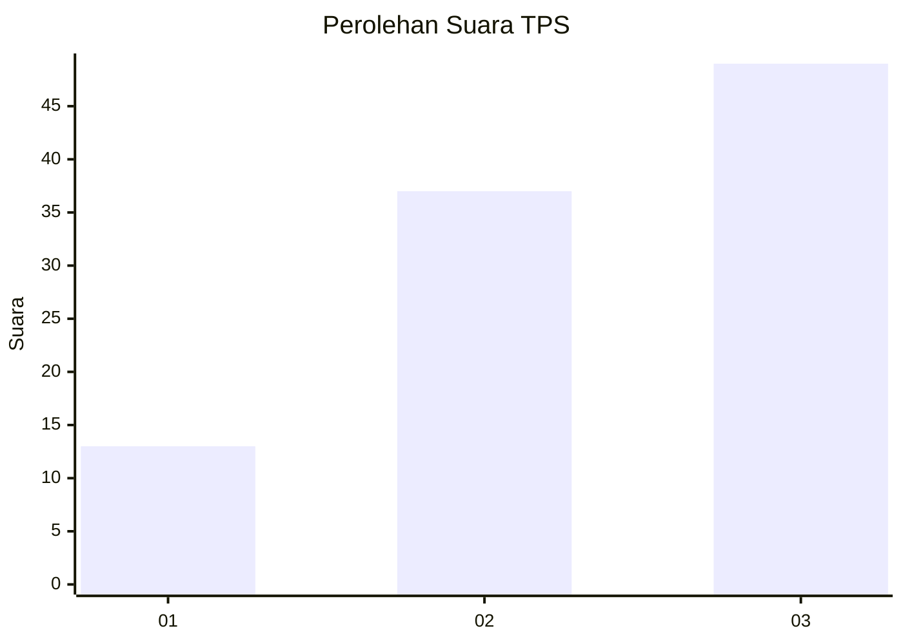
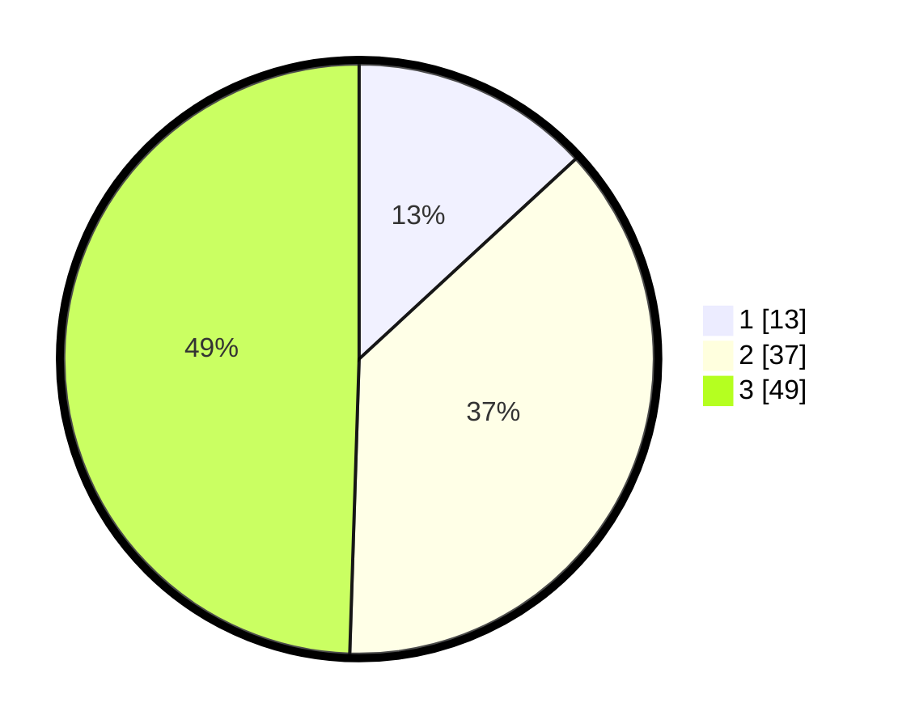

# Hasil

## Grafik

## Tabel

| No. | Nama Paslon    | Suara | Suara (raw) | Persentase |
|:--- |:-------------- | -----:| -----------:| ----------:|
| 1   | ANIES MUHAIMIN | 13    | [13][p-1]   | 13,13      |
| 2   | PRABOWO GIBRAN | 37    | [37][p-2]   | 37,37      |
| 3   | GANJAR MAHFUD  | 49    | [49][p-3]   | 49,49      |

[p-1]: https://github.com/gigit-pemilu/pemilu-2024/blob/main/pilpres/hitung-suara/sub/33-jawa-tengah/sub/16-blora/sub/12-ngawen/sub/2024-sendangmulyo/sub/007-tps/sub/paslon-1.txt
[p-2]: https://github.com/gigit-pemilu/pemilu-2024/blob/main/pilpres/hitung-suara/sub/33-jawa-tengah/sub/16-blora/sub/12-ngawen/sub/2024-sendangmulyo/sub/007-tps/sub/paslon-2.txt
[p-3]: https://github.com/gigit-pemilu/pemilu-2024/blob/main/pilpres/hitung-suara/sub/33-jawa-tengah/sub/16-blora/sub/12-ngawen/sub/2024-sendangmulyo/sub/007-tps/sub/paslon-3.txt

## Foto C Plano

https://sirekap-obj-formc.kpu.go.id/f3a7/pemilu/ppwp/33/16/12/20/24/3316122024007-20240214-214816--17917922-cdb6-4df2-8260-9c8a770f5550.jpg

https://sirekap-obj-formc.kpu.go.id/f3a7/pemilu/ppwp/33/16/12/20/24/3316122024007-20240214-215116--f6b65980-2473-4f98-8e41-140f857dde10.jpg

https://sirekap-obj-formc.kpu.go.id/f3a7/pemilu/ppwp/33/16/12/20/24/3316122024007-20240214-215419--cf2f7896-34c7-44ee-b053-2f298d06bab9.jpg

## Metadata

| Key        | Value               |
| ---------- | ------------------- |
| Time Stamp | 2024-02-16 10:00:28 |

