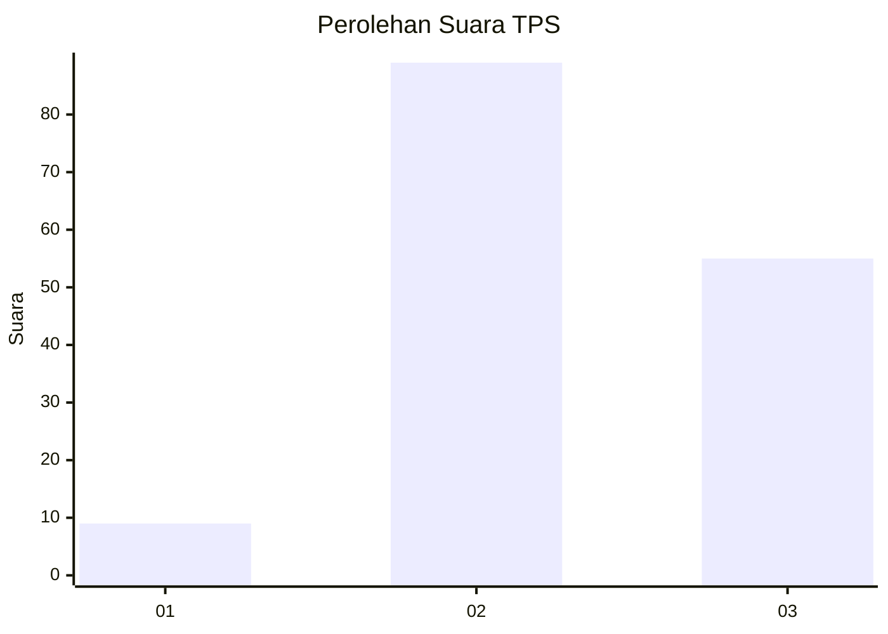
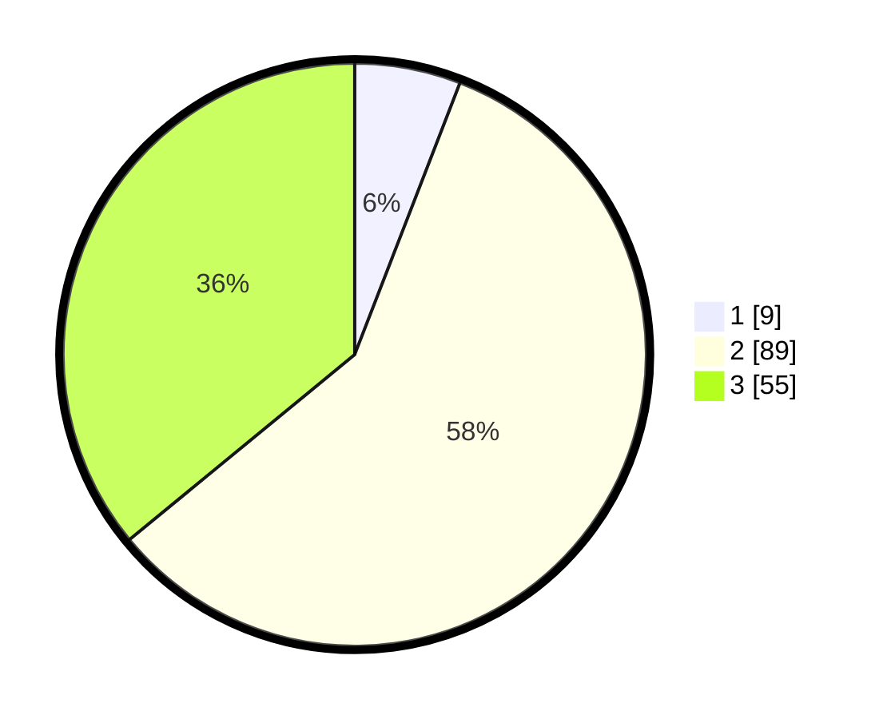

# Hasil

## Grafik

## Tabel

| No. | Nama Paslon    | Suara | Suara (raw) | Persentase |
|:--- |:-------------- | -----:| -----------:| ----------:|
| 1   | ANIES MUHAIMIN | 9     | [9][p-1]    | 5,88       |
| 2   | PRABOWO GIBRAN | 89    | [89][p-2]   | 58,17      |
| 3   | GANJAR MAHFUD  | 55    | [55][p-3]   | 35,95      |

[p-1]: https://github.com/gigit-pemilu/pemilu-2024/blob/main/pilpres/hitung-suara/sub/33-jawa-tengah/sub/16-blora/sub/12-ngawen/sub/2028-srigading/sub/005-tps/sub/paslon-1.txt
[p-2]: https://github.com/gigit-pemilu/pemilu-2024/blob/main/pilpres/hitung-suara/sub/33-jawa-tengah/sub/16-blora/sub/12-ngawen/sub/2028-srigading/sub/005-tps/sub/paslon-2.txt
[p-3]: https://github.com/gigit-pemilu/pemilu-2024/blob/main/pilpres/hitung-suara/sub/33-jawa-tengah/sub/16-blora/sub/12-ngawen/sub/2028-srigading/sub/005-tps/sub/paslon-3.txt

## Foto C Plano

https://sirekap-obj-formc.kpu.go.id/d0e5/pemilu/ppwp/33/16/12/20/28/3316122028005-20240219-121709--c431f723-02f1-4959-875e-9eb3a7e8ee58.jpg

https://sirekap-obj-formc.kpu.go.id/d0e5/pemilu/ppwp/33/16/12/20/28/3316122028005-20240215-015255--8be26d82-1d3a-402e-af02-0fc7d0ca1fb7.jpg

https://sirekap-obj-formc.kpu.go.id/d0e5/pemilu/ppwp/33/16/12/20/28/3316122028005-20240219-124720--f06d1cde-007c-4e01-af8e-b16616e28a03.jpg

## Metadata

| Key        | Value               |
| ---------- | ------------------- |
| Time Stamp | 2024-02-19 13:00:00 |

