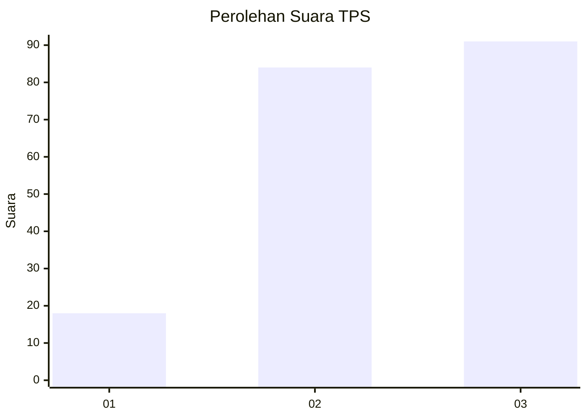
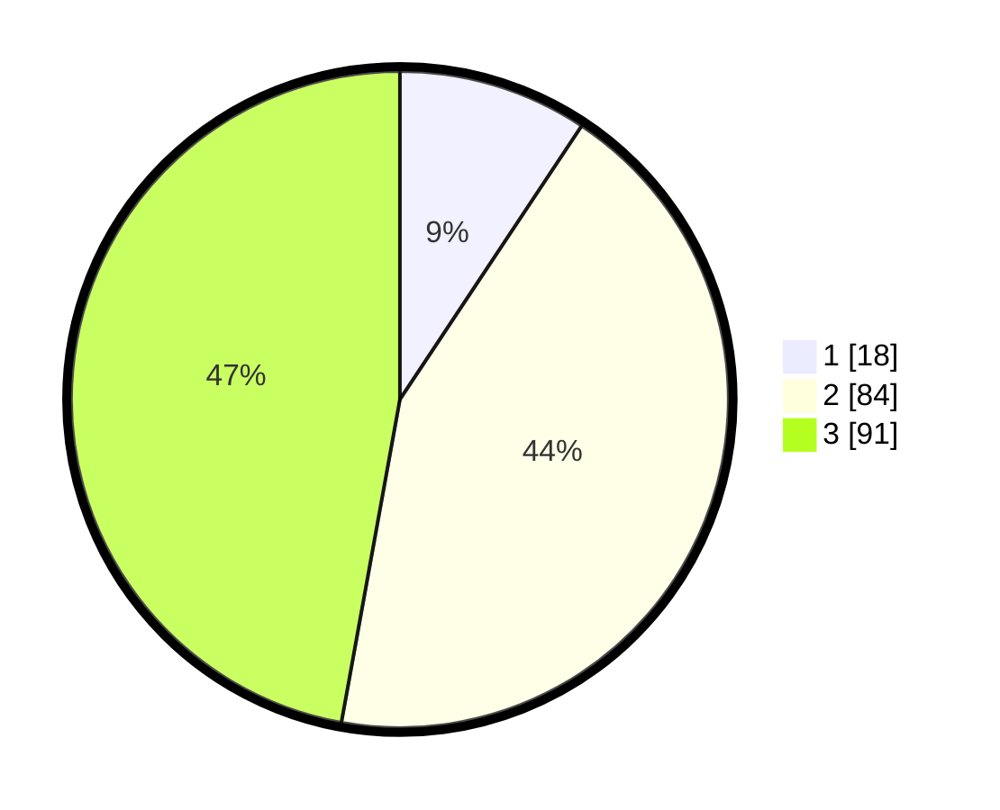

# Hasil

## Grafik

## Tabel

| No. | Nama Paslon    | Suara | Suara (raw) | Persentase |
|:--- |:-------------- | -----:| -----------:| ----------:|
| 1   | ANIES MUHAIMIN | 18    | [18][p-1]   | 9,33       |
| 2   | PRABOWO GIBRAN | 84    | [84][p-2]   | 43,52      |
| 3   | GANJAR MAHFUD  | 91    | [91][p-3]   | 47,15      |

[p-1]: https://github.com/gigit-pemilu/pemilu-2024-33-jawa-tengah/blob/main/pilpres/hitung-suara/sub/33-jawa-tengah/sub/16-blora/sub/13-kunduran/sub/1017-kunduran/sub/002-tps/sub/paslon-1.txt
[p-2]: https://github.com/gigit-pemilu/pemilu-2024-33-jawa-tengah/blob/main/pilpres/hitung-suara/sub/33-jawa-tengah/sub/16-blora/sub/13-kunduran/sub/1017-kunduran/sub/002-tps/sub/paslon-2.txt
[p-3]: https://github.com/gigit-pemilu/pemilu-2024-33-jawa-tengah/blob/main/pilpres/hitung-suara/sub/33-jawa-tengah/sub/16-blora/sub/13-kunduran/sub/1017-kunduran/sub/002-tps/sub/paslon-3.txt

## Foto C Plano

https://sirekap-obj-formc.kpu.go.id/1646/pemilu/ppwp/33/16/13/10/17/3316131017002-20240215-005523--0dda2ac2-11ce-42c0-847a-29b13e30c16f.jpg

https://sirekap-obj-formc.kpu.go.id/1646/pemilu/ppwp/33/16/13/10/17/3316131017002-20240214-230220--6aac2466-bc2d-4570-b7a9-e497771dfacb.jpg

https://sirekap-obj-formc.kpu.go.id/1646/pemilu/ppwp/33/16/13/10/17/3316131017002-20240215-005648--0bf90ae8-d442-4728-b3b2-ef1246adfada.jpg

## Metadata

| Key        | Value               |
| ---------- | ------------------- |
| Time Stamp | 2024-02-16 08:00:28 |

