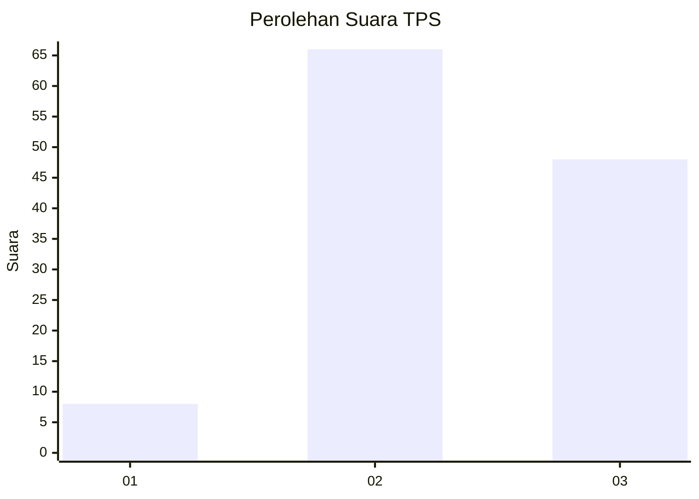
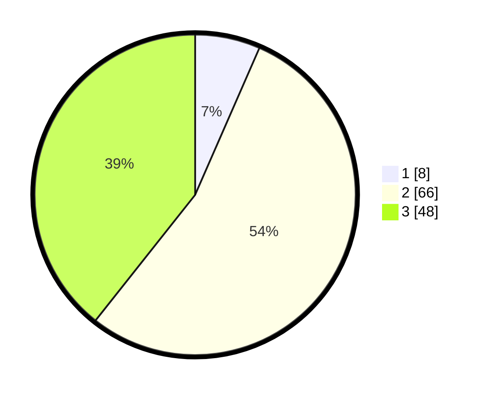

# Hasil

## Grafik

## Tabel

| No. | Nama Paslon    | Suara | Suara (raw) | Persentase |
|:--- |:-------------- | -----:| -----------:| ----------:|
| 1   | ANIES MUHAIMIN | 8     | [8][p-1]    | 6,56       |
| 2   | PRABOWO GIBRAN | 66    | [66][p-2]   | 54,10      |
| 3   | GANJAR MAHFUD  | 48    | [48][p-3]   | 39,34      |

[p-1]: https://github.com/gigit-pemilu/pemilu-2024/blob/main/pilpres/hitung-suara/sub/33-jawa-tengah/sub/16-blora/sub/13-kunduran/sub/2005-sonokidul/sub/009-tps/sub/paslon-1.txt
[p-2]: https://github.com/gigit-pemilu/pemilu-2024/blob/main/pilpres/hitung-suara/sub/33-jawa-tengah/sub/16-blora/sub/13-kunduran/sub/2005-sonokidul/sub/009-tps/sub/paslon-2.txt
[p-3]: https://github.com/gigit-pemilu/pemilu-2024/blob/main/pilpres/hitung-suara/sub/33-jawa-tengah/sub/16-blora/sub/13-kunduran/sub/2005-sonokidul/sub/009-tps/sub/paslon-3.txt

## Foto C Plano

https://sirekap-obj-formc.kpu.go.id/db66/pemilu/ppwp/33/16/13/20/05/3316132005009-20240215-144644--b83cbaf8-6a91-42b3-9d26-0d7570018747.jpg

https://sirekap-obj-formc.kpu.go.id/db66/pemilu/ppwp/33/16/13/20/05/3316132005009-20240217-210811--8a5c2789-c212-4ee2-ab8f-9896d93ed22e.jpg

https://sirekap-obj-formc.kpu.go.id/db66/pemilu/ppwp/33/16/13/20/05/3316132005009-20240215-154401--ca239496-5995-49d7-8d33-a91b41bbc38f.jpg

## Metadata

| Key        | Value               |
| ---------- | ------------------- |
| Time Stamp | 2024-02-19 06:16:00 |

