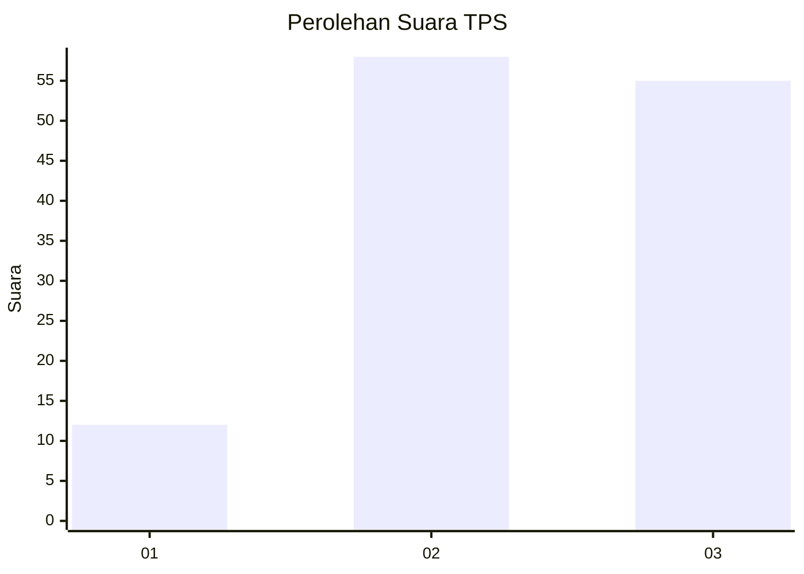
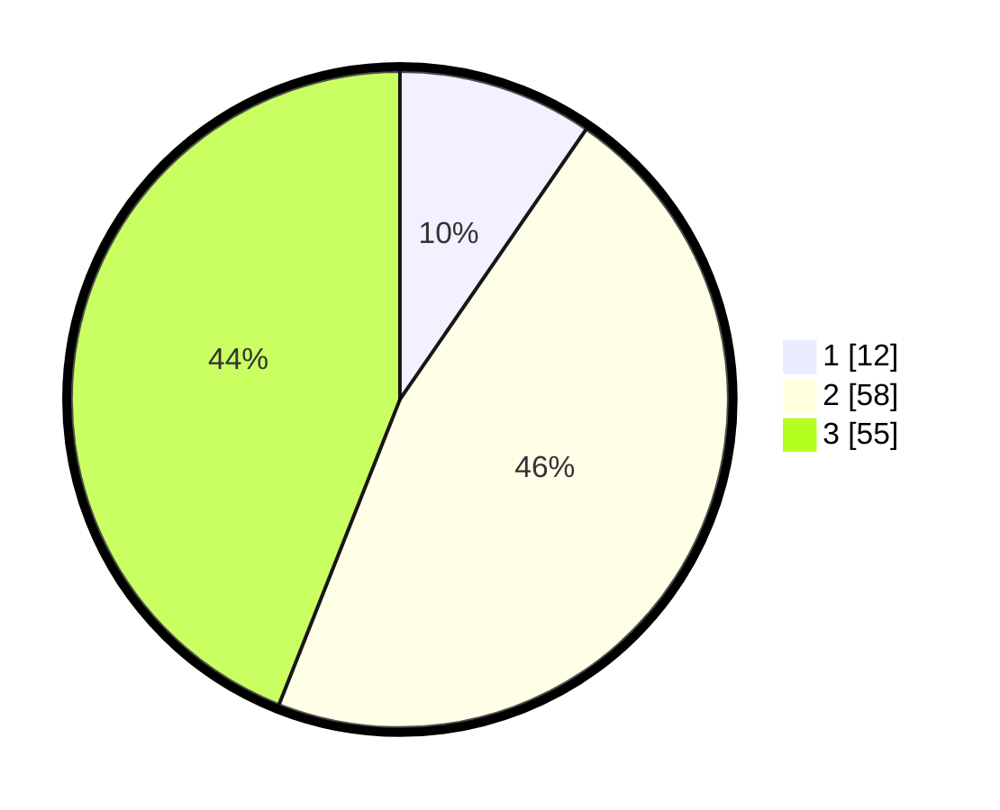

# Hasil

## Grafik

## Tabel

| No. | Nama Paslon    | Suara | Suara (raw) | Persentase |
|:--- |:-------------- | -----:| -----------:| ----------:|
| 1   | ANIES MUHAIMIN | 12    | [12][p-1]   | 9,60       |
| 2   | PRABOWO GIBRAN | 58    | [58][p-2]   | 46,40      |
| 3   | GANJAR MAHFUD  | 55    | [55][p-3]   | 44,00      |

[p-1]: https://github.com/gigit-pemilu/pemilu-2024/blob/main/pilpres/hitung-suara/sub/33-jawa-tengah/sub/16-blora/sub/13-kunduran/sub/2006-sempu/sub/006-tps/sub/paslon-1.txt
[p-2]: https://github.com/gigit-pemilu/pemilu-2024/blob/main/pilpres/hitung-suara/sub/33-jawa-tengah/sub/16-blora/sub/13-kunduran/sub/2006-sempu/sub/006-tps/sub/paslon-2.txt
[p-3]: https://github.com/gigit-pemilu/pemilu-2024/blob/main/pilpres/hitung-suara/sub/33-jawa-tengah/sub/16-blora/sub/13-kunduran/sub/2006-sempu/sub/006-tps/sub/paslon-3.txt

## Foto C Plano

https://sirekap-obj-formc.kpu.go.id/a48a/pemilu/ppwp/33/16/13/20/06/3316132006006-20240214-141605--3f6f3976-69f8-48b2-b06f-193869e76529.jpg

https://sirekap-obj-formc.kpu.go.id/a48a/pemilu/ppwp/33/16/13/20/06/3316132006006-20240214-141653--d2319214-39d5-49f6-94fb-0a1991956f76.jpg

https://sirekap-obj-formc.kpu.go.id/a48a/pemilu/ppwp/33/16/13/20/06/3316132006006-20240214-141938--ed06ffe0-68ad-4a43-885c-06ebeeee7fb7.jpg

## Metadata

| Key        | Value               |
| ---------- | ------------------- |
| Time Stamp | 2024-02-14 21:46:01 |

