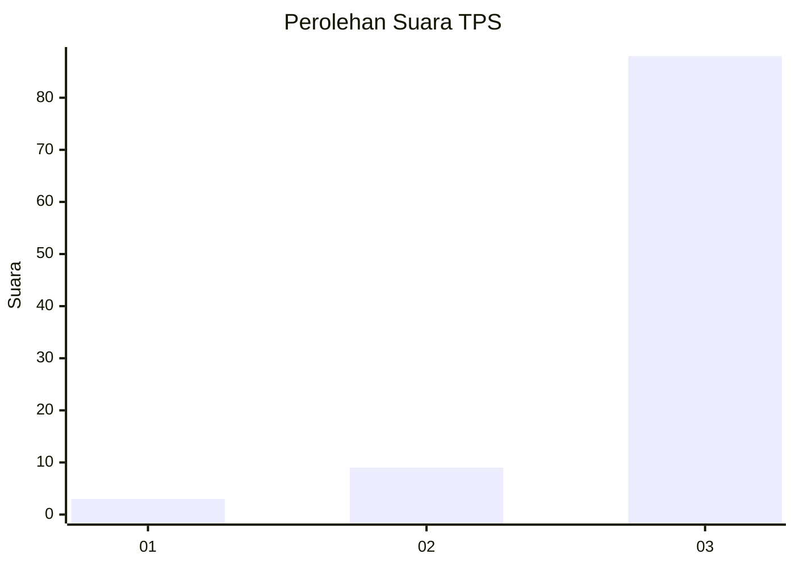
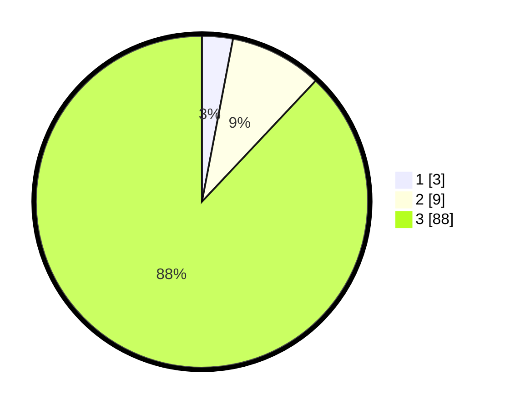

# Hasil

## Grafik

## Tabel

| No. | Nama Paslon    | Suara | Suara (raw) | Persentase |
|:--- |:-------------- | -----:| -----------:| ----------:|
| 1   | ANIES MUHAIMIN | 3     | [3][p-1]    | 3,00       |
| 2   | PRABOWO GIBRAN | 9     | [9][p-2]    | 9,00       |
| 3   | GANJAR MAHFUD  | 88    | [88][p-3]   | 88,00      |

[p-1]: https://github.com/gigit-pemilu/pemilu-2024/blob/main/pilpres/hitung-suara/sub/33-jawa-tengah/sub/16-blora/sub/13-kunduran/sub/2008-plosorejo/sub/006-tps/sub/paslon-1.txt
[p-2]: https://github.com/gigit-pemilu/pemilu-2024/blob/main/pilpres/hitung-suara/sub/33-jawa-tengah/sub/16-blora/sub/13-kunduran/sub/2008-plosorejo/sub/006-tps/sub/paslon-2.txt
[p-3]: https://github.com/gigit-pemilu/pemilu-2024/blob/main/pilpres/hitung-suara/sub/33-jawa-tengah/sub/16-blora/sub/13-kunduran/sub/2008-plosorejo/sub/006-tps/sub/paslon-3.txt

## Foto C Plano

https://sirekap-obj-formc.kpu.go.id/920c/pemilu/ppwp/33/16/13/20/08/3316132008006-20240215-020847--b9630b95-db68-4eb9-8487-a3ec25c683a9.jpg

https://sirekap-obj-formc.kpu.go.id/920c/pemilu/ppwp/33/16/13/20/08/3316132008006-20240215-021051--b688a6b3-c078-4070-a185-6f14a9570385.jpg

https://sirekap-obj-formc.kpu.go.id/920c/pemilu/ppwp/33/16/13/20/08/3316132008006-20240215-021209--be20a79a-21fa-4998-afb0-3907293114e2.jpg

## Metadata

| Key        | Value               |
| ---------- | ------------------- |
| Time Stamp | 2024-02-16 10:30:29 |

