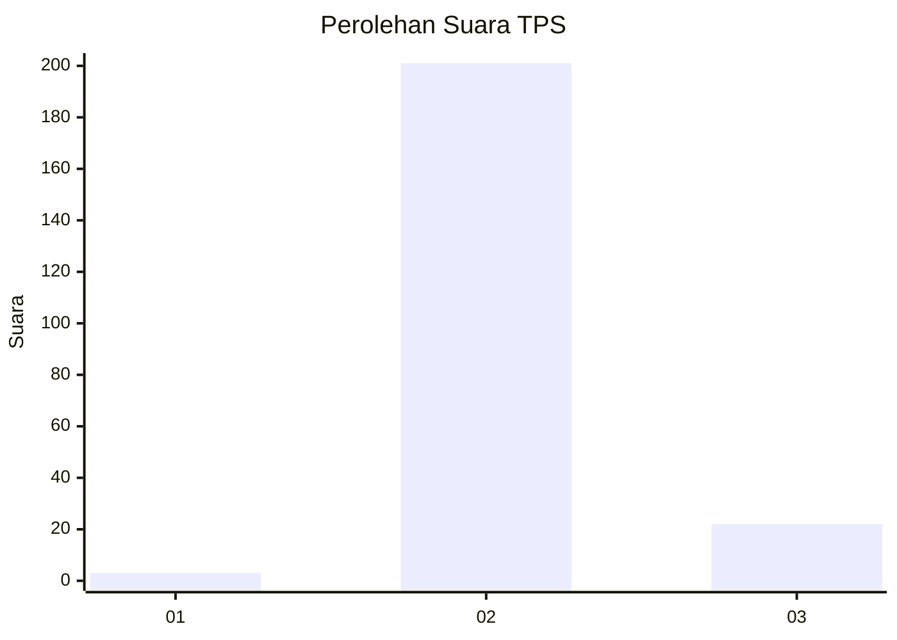
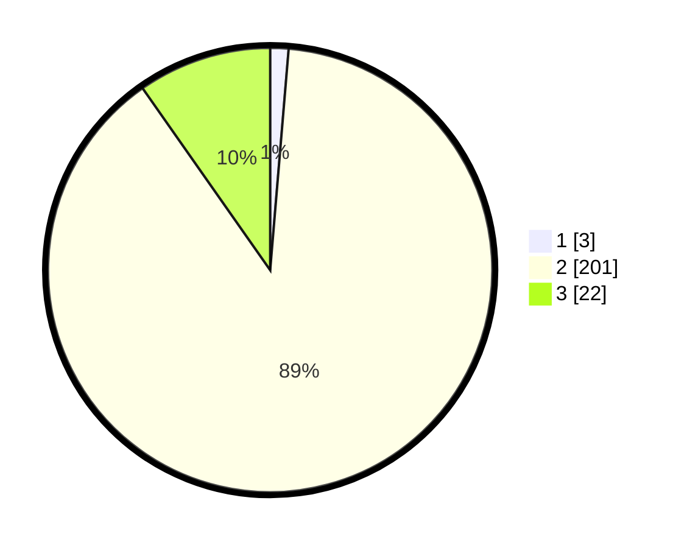

# Hasil

## Grafik

## Tabel

| No. | Nama Paslon    | Suara | Suara (raw) | Persentase |
|:--- |:-------------- | -----:| -----------:| ----------:|
| 1   | ANIES MUHAIMIN | 3     | [3][p-1]    | 1,33       |
| 2   | PRABOWO GIBRAN | 201   | [201][p-2]  | 88,94      |
| 3   | GANJAR MAHFUD  | 22    | [22][p-3]   | 9,73       |

[p-1]: https://github.com/gigit-pemilu/pemilu-2024/blob/main/pilpres/hitung-suara/sub/33-jawa-tengah/sub/16-blora/sub/13-kunduran/sub/2009-ngilen/sub/002-tps/sub/paslon-1.txt
[p-2]: https://github.com/gigit-pemilu/pemilu-2024/blob/main/pilpres/hitung-suara/sub/33-jawa-tengah/sub/16-blora/sub/13-kunduran/sub/2009-ngilen/sub/002-tps/sub/paslon-2.txt
[p-3]: https://github.com/gigit-pemilu/pemilu-2024/blob/main/pilpres/hitung-suara/sub/33-jawa-tengah/sub/16-blora/sub/13-kunduran/sub/2009-ngilen/sub/002-tps/sub/paslon-3.txt

## Foto C Plano

https://sirekap-obj-formc.kpu.go.id/80b7/pemilu/ppwp/33/16/13/20/09/3316132009002-20240214-222526--51f0fb86-eb2f-4da3-9754-a4f78571021e.jpg

https://sirekap-obj-formc.kpu.go.id/80b7/pemilu/ppwp/33/16/13/20/09/3316132009002-20240214-222819--52b101c6-0d9b-4783-841a-28908a18f552.jpg

https://sirekap-obj-formc.kpu.go.id/80b7/pemilu/ppwp/33/16/13/20/09/3316132009002-20240214-222937--7c318fe6-2bc2-4b80-a5ec-5d131b26a07b.jpg

## Metadata

| Key        | Value               |
| ---------- | ------------------- |
| Time Stamp | 2024-02-16 10:30:29 |

