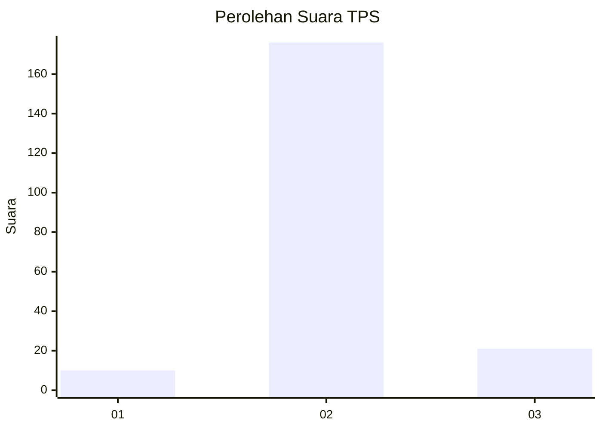
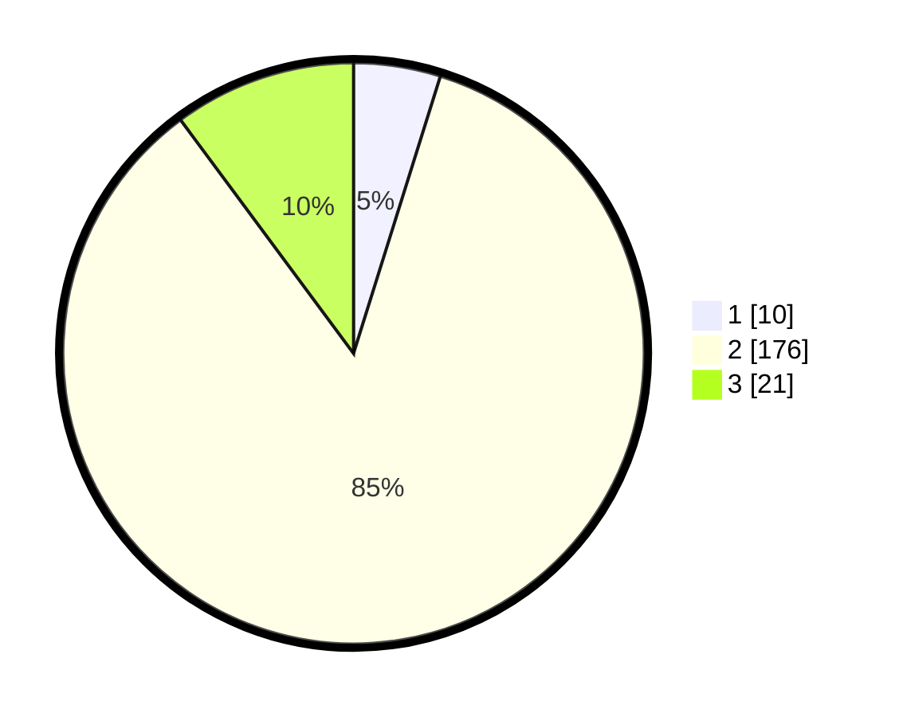

# Hasil

## Grafik

## Tabel

| No. | Nama Paslon    | Suara | Suara (raw) | Persentase |
|:--- |:-------------- | -----:| -----------:| ----------:|
| 1   | ANIES MUHAIMIN | 10    | [10][p-1]   | 4,83       |
| 2   | PRABOWO GIBRAN | 176   | [176][p-2]  | 85,02      |
| 3   | GANJAR MAHFUD  | 21    | [21][p-3]   | 10,14      |

[p-1]: https://github.com/gigit-pemilu/pemilu-2024-33-jawa-tengah/blob/main/pilpres/hitung-suara/sub/33-jawa-tengah/sub/16-blora/sub/13-kunduran/sub/2009-ngilen/sub/005-tps/sub/paslon-1.txt
[p-2]: https://github.com/gigit-pemilu/pemilu-2024-33-jawa-tengah/blob/main/pilpres/hitung-suara/sub/33-jawa-tengah/sub/16-blora/sub/13-kunduran/sub/2009-ngilen/sub/005-tps/sub/paslon-2.txt
[p-3]: https://github.com/gigit-pemilu/pemilu-2024-33-jawa-tengah/blob/main/pilpres/hitung-suara/sub/33-jawa-tengah/sub/16-blora/sub/13-kunduran/sub/2009-ngilen/sub/005-tps/sub/paslon-3.txt

## Foto C Plano

https://sirekap-obj-formc.kpu.go.id/49be/pemilu/ppwp/33/16/13/20/09/3316132009005-20240214-221437--c2079ba0-518f-4291-b9c1-d577873974ee.jpg

https://sirekap-obj-formc.kpu.go.id/49be/pemilu/ppwp/33/16/13/20/09/3316132009005-20240214-221532--0749e563-6439-43d0-9490-f82f4e0f55d1.jpg

https://sirekap-obj-formc.kpu.go.id/49be/pemilu/ppwp/33/16/13/20/09/3316132009005-20240214-221611--f4dcf116-d8ad-43be-9141-b6e8f2e3426f.jpg

## Metadata

| Key        | Value               |
| ---------- | ------------------- |
| Time Stamp | 2024-02-16 10:30:29 |

