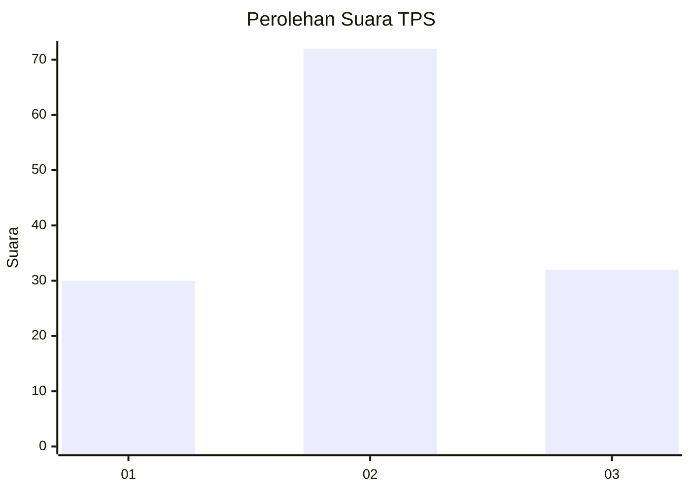
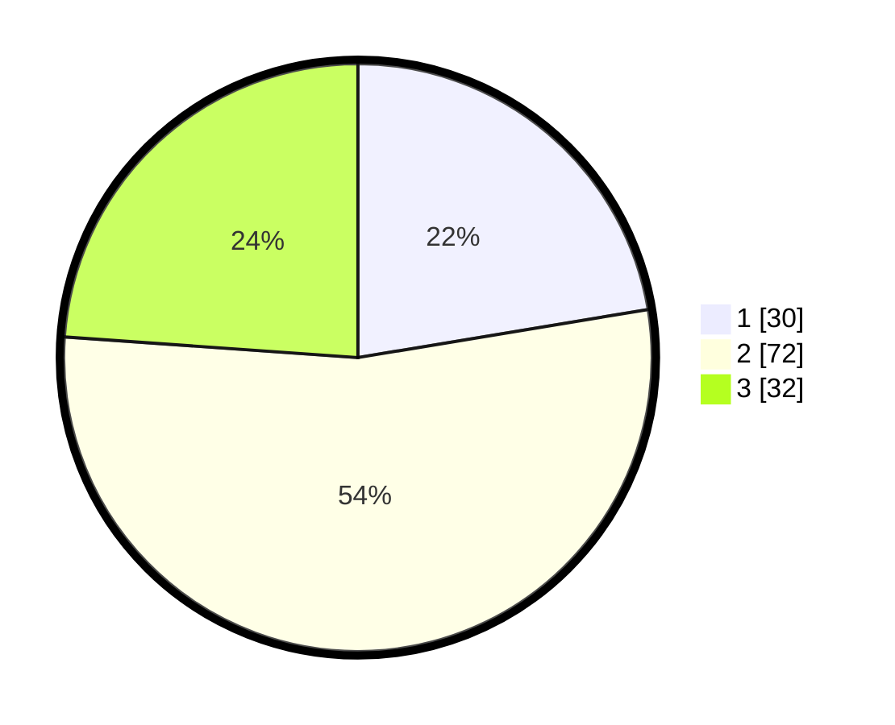

# Hasil

## Grafik

## Tabel

| No. | Nama Paslon    | Suara | Suara (raw) | Persentase |
|:--- |:-------------- | -----:| -----------:| ----------:|
| 1   | ANIES MUHAIMIN | 30    | [30][p-1]   | 22,39      |
| 2   | PRABOWO GIBRAN | 72    | [72][p-2]   | 53,73      |
| 3   | GANJAR MAHFUD  | 32    | [32][p-3]   | 23,88      |

[p-1]: https://github.com/gigit-pemilu/pemilu-2024/blob/main/pilpres/hitung-suara/sub/33-jawa-tengah/sub/16-blora/sub/13-kunduran/sub/2012-blumbangrejo/sub/002-tps/sub/paslon-1.txt
[p-2]: https://github.com/gigit-pemilu/pemilu-2024/blob/main/pilpres/hitung-suara/sub/33-jawa-tengah/sub/16-blora/sub/13-kunduran/sub/2012-blumbangrejo/sub/002-tps/sub/paslon-2.txt
[p-3]: https://github.com/gigit-pemilu/pemilu-2024/blob/main/pilpres/hitung-suara/sub/33-jawa-tengah/sub/16-blora/sub/13-kunduran/sub/2012-blumbangrejo/sub/002-tps/sub/paslon-3.txt

## Foto C Plano

https://sirekap-obj-formc.kpu.go.id/4bba/pemilu/ppwp/33/16/13/20/12/3316132012002-20240214-212650--c5bf933a-e2a3-4dbc-9d81-1ebdc1141c33.jpg

https://sirekap-obj-formc.kpu.go.id/4bba/pemilu/ppwp/33/16/13/20/12/3316132012002-20240214-212952--ea772e41-7f9b-435f-b6cf-a51ea8bde8f2.jpg

https://sirekap-obj-formc.kpu.go.id/4bba/pemilu/ppwp/33/16/13/20/12/3316132012002-20240214-213226--0829d9ab-3eb2-41f1-8dbc-9a20751f3296.jpg

## Metadata

| Key        | Value               |
| ---------- | ------------------- |
| Time Stamp | 2024-02-16 10:30:29 |

