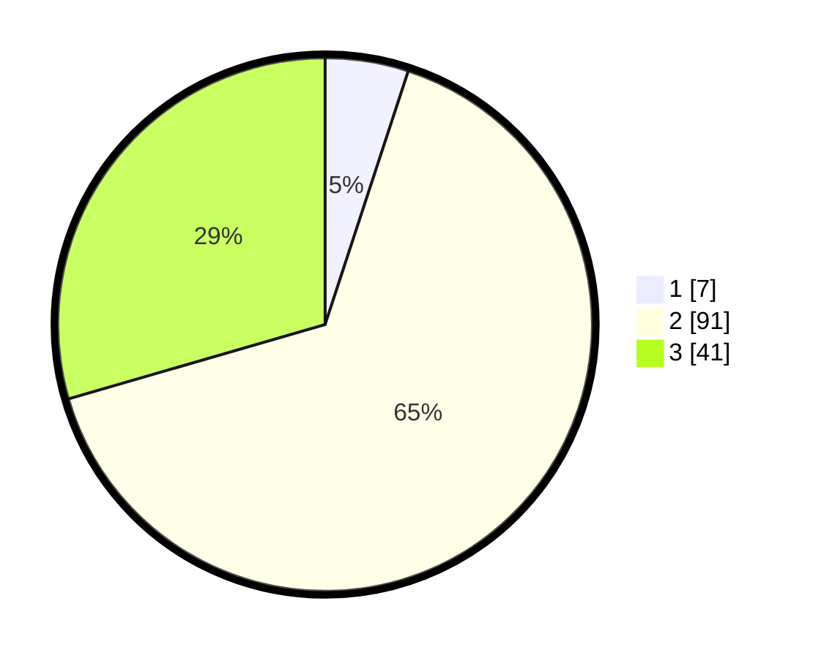

# Hasil

## Grafik

## Tabel

| No. | Nama Paslon    | Suara | Suara (raw) | Persentase |
|:--- |:-------------- | -----:| -----------:| ----------:|
| 1   | ANIES MUHAIMIN | 7     | [7][p-1]    | 5,04       |
| 2   | PRABOWO GIBRAN | 91    | [91][p-2]   | 65,47      |
| 3   | GANJAR MAHFUD  | 41    | [41][p-3]   | 29,50      |

[p-1]: https://github.com/gigit-pemilu/pemilu-2024-33-jawa-tengah/blob/main/pilpres/hitung-suara/sub/33-jawa-tengah/sub/16-blora/sub/14-todanan/sub/2011-cokrowati/sub/003-tps/sub/paslon-1.txt
[p-2]: https://github.com/gigit-pemilu/pemilu-2024-33-jawa-tengah/blob/main/pilpres/hitung-suara/sub/33-jawa-tengah/sub/16-blora/sub/14-todanan/sub/2011-cokrowati/sub/003-tps/sub/paslon-2.txt
[p-3]: https://github.com/gigit-pemilu/pemilu-2024-33-jawa-tengah/blob/main/pilpres/hitung-suara/sub/33-jawa-tengah/sub/16-blora/sub/14-todanan/sub/2011-cokrowati/sub/003-tps/sub/paslon-3.txt

## Foto C Plano

https://sirekap-obj-formc.kpu.go.id/21cf/pemilu/ppwp/33/16/14/20/11/3316142011003-20240214-141521--06cc868a-4133-4961-9d44-a6a202df42a8.jpg

https://sirekap-obj-formc.kpu.go.id/21cf/pemilu/ppwp/33/16/14/20/11/3316142011003-20240214-141903--f84c30ad-6b97-426f-a72e-8cab5c9cc0c4.jpg

https://sirekap-obj-formc.kpu.go.id/21cf/pemilu/ppwp/33/16/14/20/11/3316142011003-20240214-141740--ce7adfae-1dc9-490d-9fd6-f6a6e0af6a01.jpg

## Metadata

| Key        | Value               |
| ---------- | ------------------- |
| Time Stamp | 2024-02-14 21:46:01 |

