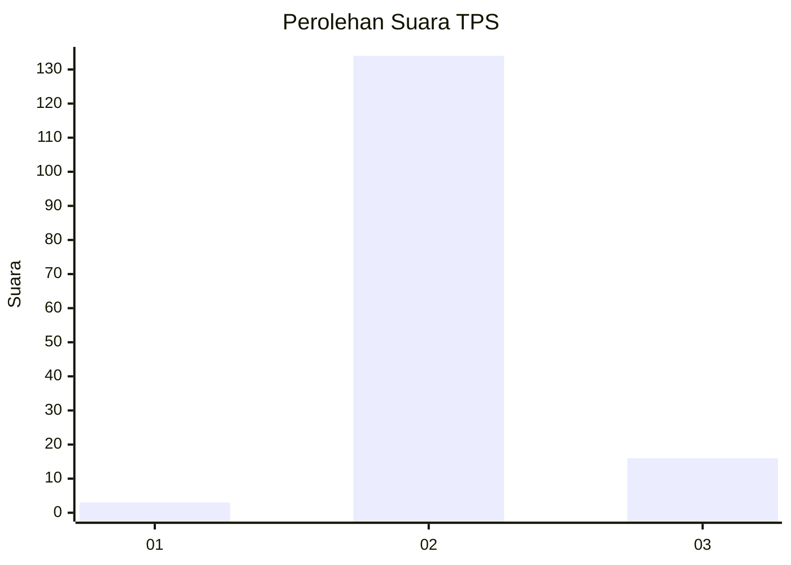
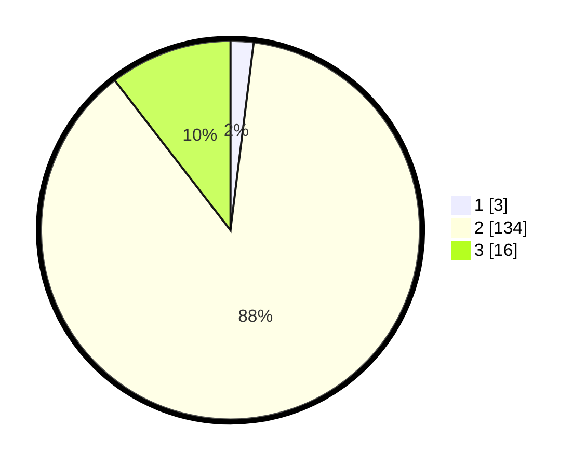

# Hasil

## Grafik

## Tabel

| No. | Nama Paslon    | Suara | Suara (raw) | Persentase |
|:--- |:-------------- | -----:| -----------:| ----------:|
| 1   | ANIES MUHAIMIN | 3     | [3][p-1]    | 1,96       |
| 2   | PRABOWO GIBRAN | 134   | [134][p-2]  | 87,58      |
| 3   | GANJAR MAHFUD  | 16    | [16][p-3]   | 10,46      |

[p-1]: https://github.com/gigit-pemilu/pemilu-2024/blob/main/pilpres/hitung-suara/sub/33-jawa-tengah/sub/16-blora/sub/16-japah/sub/2011-bogorejo/sub/002-tps/sub/paslon-1.txt
[p-2]: https://github.com/gigit-pemilu/pemilu-2024/blob/main/pilpres/hitung-suara/sub/33-jawa-tengah/sub/16-blora/sub/16-japah/sub/2011-bogorejo/sub/002-tps/sub/paslon-2.txt
[p-3]: https://github.com/gigit-pemilu/pemilu-2024/blob/main/pilpres/hitung-suara/sub/33-jawa-tengah/sub/16-blora/sub/16-japah/sub/2011-bogorejo/sub/002-tps/sub/paslon-3.txt

## Foto C Plano

https://sirekap-obj-formc.kpu.go.id/bee4/pemilu/ppwp/33/16/16/20/11/3316162011002-20240214-201714--9db6c5ad-9e0e-4f4a-9a76-1d6df7e18715.jpg

https://sirekap-obj-formc.kpu.go.id/bee4/pemilu/ppwp/33/16/16/20/11/3316162011002-20240214-201833--d5ab27c8-54c5-41e8-8fc2-7d30a74237ee.jpg

https://sirekap-obj-formc.kpu.go.id/bee4/pemilu/ppwp/33/16/16/20/11/3316162011002-20240214-201937--cb50e3ec-a087-47f3-8d86-659fb4297257.jpg

## Metadata

| Key        | Value               |
| ---------- | ------------------- |
| Time Stamp | 2024-02-15 09:00:24 |

