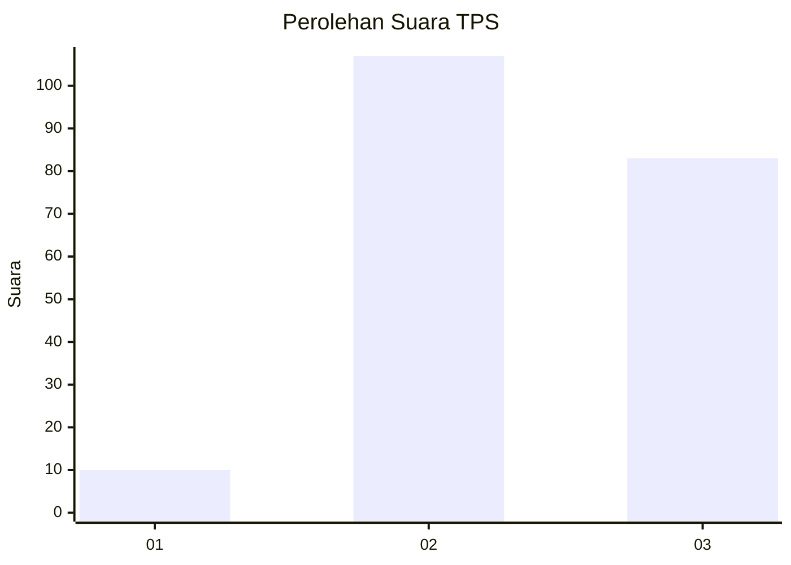
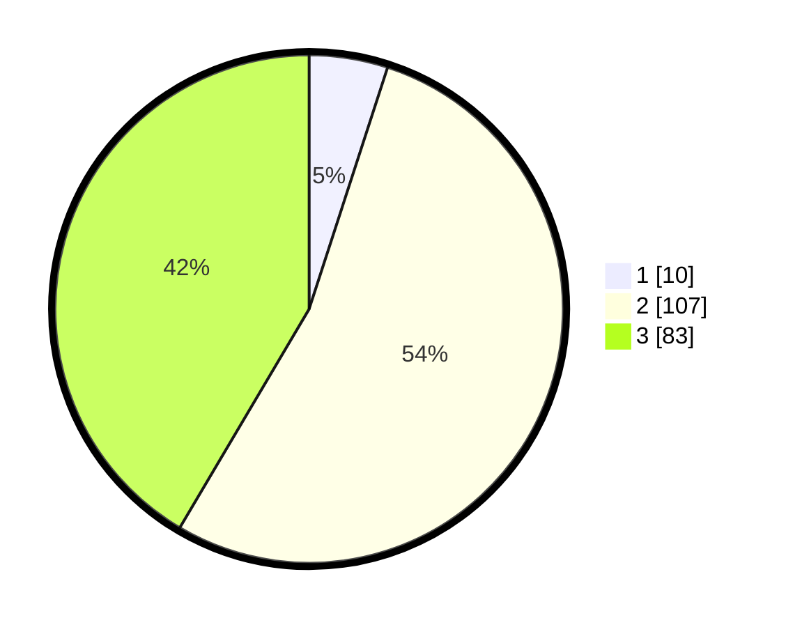

# Hasil

## Grafik

## Tabel

| No. | Nama Paslon    | Suara | Suara (raw) | Persentase |
|:--- |:-------------- | -----:| -----------:| ----------:|
| 1   | ANIES MUHAIMIN | 10    | [10][p-1]   | 5,00       |
| 2   | PRABOWO GIBRAN | 107   | [107][p-2]  | 53,50      |
| 3   | GANJAR MAHFUD  | 83    | [83][p-3]   | 41,50      |

[p-1]: https://github.com/gigit-pemilu/pemilu-2024/blob/main/pilpres/hitung-suara/sub/33-jawa-tengah/sub/17-rembang/sub/01-sumber/sub/2004-logung/sub/001-tps/sub/paslon-1.txt
[p-2]: https://github.com/gigit-pemilu/pemilu-2024/blob/main/pilpres/hitung-suara/sub/33-jawa-tengah/sub/17-rembang/sub/01-sumber/sub/2004-logung/sub/001-tps/sub/paslon-2.txt
[p-3]: https://github.com/gigit-pemilu/pemilu-2024/blob/main/pilpres/hitung-suara/sub/33-jawa-tengah/sub/17-rembang/sub/01-sumber/sub/2004-logung/sub/001-tps/sub/paslon-3.txt

## Foto C Plano

https://sirekap-obj-formc.kpu.go.id/27fc/pemilu/ppwp/33/17/01/20/04/3317012004001-20240216-155531--a6408a6a-2c88-432c-8124-a75b8a98dc54.jpg

https://sirekap-obj-formc.kpu.go.id/27fc/pemilu/ppwp/33/17/01/20/04/3317012004001-20240216-160620--d873d39b-72e4-4f96-aa50-3e27be1b5834.jpg

https://sirekap-obj-formc.kpu.go.id/27fc/pemilu/ppwp/33/17/01/20/04/3317012004001-20240216-170713--ae89096e-a322-467a-80a2-4b00d19cb4e8.jpg

## Metadata

| Key        | Value               |
| ---------- | ------------------- |
| Time Stamp | 2024-02-16 21:01:00 |

## DATA PEMILIH TETAP

Jumlah pemilih dalam DPT: **332**.
 * L: **506**.
 * P: **336**.

## DATA PENGGUNA HAK PILIH

Jumlah pengguna hak pilih dalam DPT: **364**.
 * L: **94**.
 * P: **320**.

Jumlah pengguna hak pilih dalam DPTb: **2**.
 * L: **2**.
 * P: **800**.

Jumlah pengguna hak pilih dalam DPK: **0**.
 * L: **20**.
 * P: **0**.

Jumlah pengguna hak pilih: **296**.
 * L: **96**.
 * P: **489**.

## JUMLAH SUARA SAH DAN TIDAK SAH

JUMLAH SELURUH SUARA SAH: **200**.

JUMLAH SUARA TIDAK SAH: **6**.

JUMLAH SELURUH SUARA SAH DAN SUARA TIDAK SAH: **206**.

