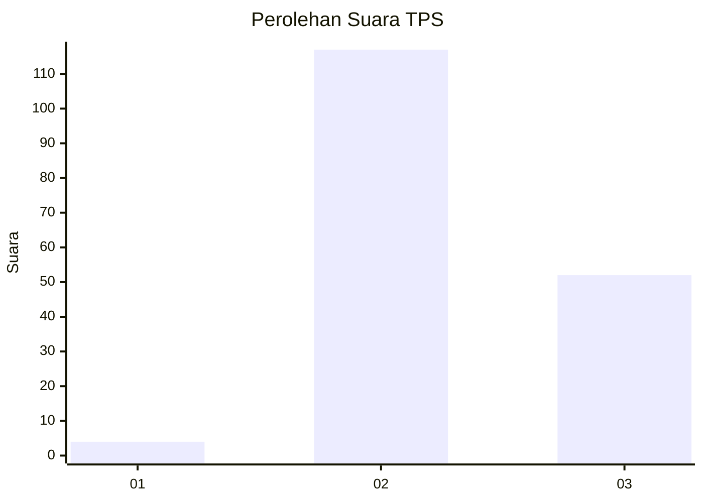

# Hasil

## Grafik

## Tabel

| No. | Nama Paslon    | Suara | Suara (raw) | Persentase |
|:--- |:-------------- | -----:| -----------:| ----------:|
| 1   | ANIES MUHAIMIN | 4     | [4][p-1]    | 2,31       |
| 2   | PRABOWO GIBRAN | 117   | [117][p-2]  | 67,63      |
| 3   | GANJAR MAHFUD  | 52    | [52][p-3]   | 30,06      |

[p-1]: https://github.com/gigit-pemilu/pemilu-2024-33-jawa-tengah/blob/main/pilpres/hitung-suara/sub/33-jawa-tengah/sub/17-rembang/sub/02-bulu/sub/2001-mlatirejo/sub/001-tps/sub/paslon-1.txt
[p-2]: https://github.com/gigit-pemilu/pemilu-2024-33-jawa-tengah/blob/main/pilpres/hitung-suara/sub/33-jawa-tengah/sub/17-rembang/sub/02-bulu/sub/2001-mlatirejo/sub/001-tps/sub/paslon-2.txt
[p-3]: https://github.com/gigit-pemilu/pemilu-2024-33-jawa-tengah/blob/main/pilpres/hitung-suara/sub/33-jawa-tengah/sub/17-rembang/sub/02-bulu/sub/2001-mlatirejo/sub/001-tps/sub/paslon-3.txt

## Foto C Plano

https://sirekap-obj-formc.kpu.go.id/7306/pemilu/ppwp/33/17/02/20/01/3317022001001-20240214-203748--a082350e-5fde-41ea-9b2e-efa52948ec45.jpg

https://sirekap-obj-formc.kpu.go.id/7306/pemilu/ppwp/33/17/02/20/01/3317022001001-20240215-010255--dd002498-1fbb-41fc-99ad-bcd0a023f4f0.jpg

https://sirekap-obj-formc.kpu.go.id/7306/pemilu/ppwp/33/17/02/20/01/3317022001001-20240215-010408--cf9edc27-5b4b-47c8-bf8b-f416f040516f.jpg

## Metadata

| Key        | Value               |
| ---------- | ------------------- |
| Time Stamp | 2024-02-15 15:00:29 |

