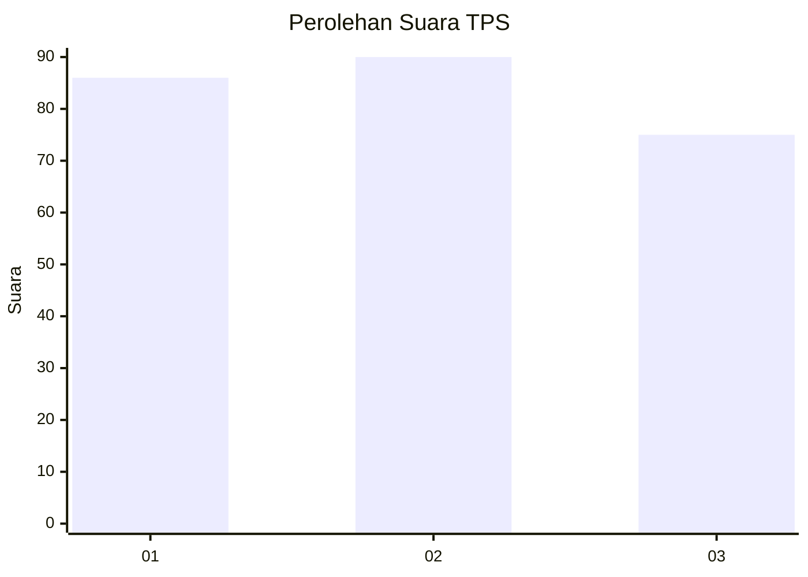
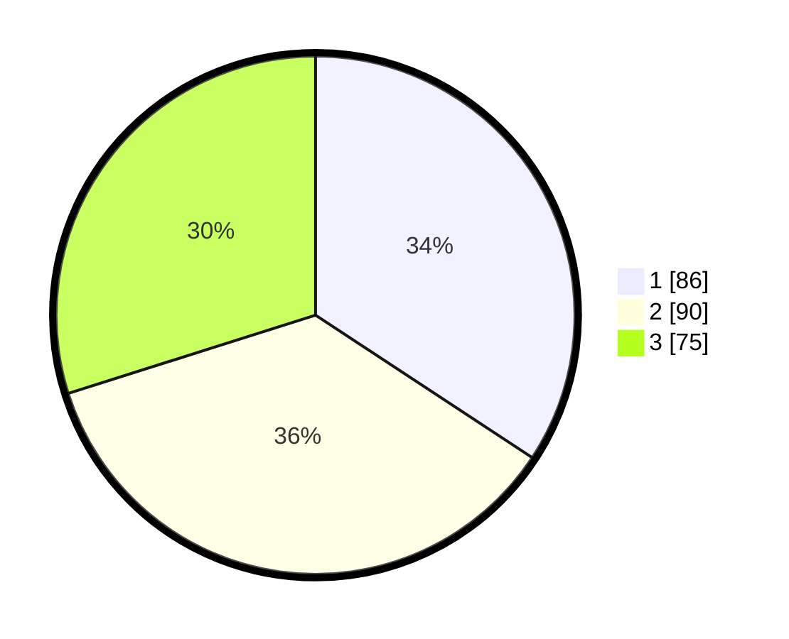

# Hasil

## Grafik

## Tabel

| No. | Nama Paslon    | Suara | Suara (raw) | Persentase |
|:--- |:-------------- | -----:| -----------:| ----------:|
| 1   | ANIES MUHAIMIN | 86    | [86][p-1]   | 34,26      |
| 2   | PRABOWO GIBRAN | 90    | [90][p-2]   | 35,86      |
| 3   | GANJAR MAHFUD  | 75    | [75][p-3]   | 29,88      |

[p-1]: https://github.com/gigit-pemilu/pemilu-2024/blob/main/pilpres/hitung-suara/sub/33-jawa-tengah/sub/17-rembang/sub/02-bulu/sub/2010-karangasem/sub/001-tps/sub/paslon-1.txt
[p-2]: https://github.com/gigit-pemilu/pemilu-2024/blob/main/pilpres/hitung-suara/sub/33-jawa-tengah/sub/17-rembang/sub/02-bulu/sub/2010-karangasem/sub/001-tps/sub/paslon-2.txt
[p-3]: https://github.com/gigit-pemilu/pemilu-2024/blob/main/pilpres/hitung-suara/sub/33-jawa-tengah/sub/17-rembang/sub/02-bulu/sub/2010-karangasem/sub/001-tps/sub/paslon-3.txt

## Foto C Plano

https://sirekap-obj-formc.kpu.go.id/368d/pemilu/ppwp/33/17/02/20/10/3317022010001-20240223-143712--be18b1bb-6b6d-4023-bf85-2b8a8bd27735.jpg

https://sirekap-obj-formc.kpu.go.id/368d/pemilu/ppwp/33/17/02/20/10/3317022010001-20240223-143206--f5086373-192d-4a3e-b426-719d724d8969.jpg

https://sirekap-obj-formc.kpu.go.id/368d/pemilu/ppwp/33/17/02/20/10/3317022010001-20240223-143333--d0022cd0-6f19-4b31-a2c6-8fee32738838.jpg

## Metadata

| Key        | Value               |
| ---------- | ------------------- |
| Time Stamp | 2024-02-24 22:31:28 |

