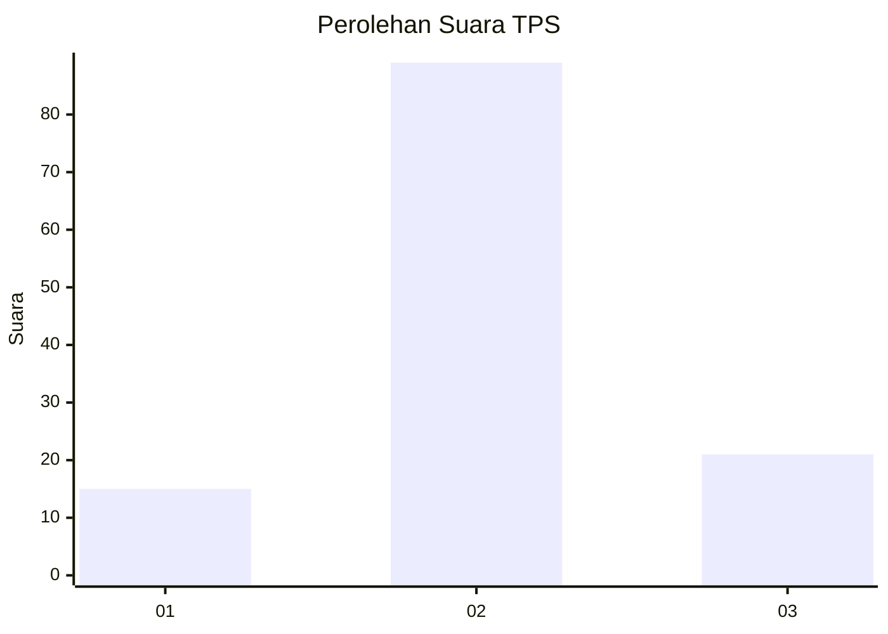
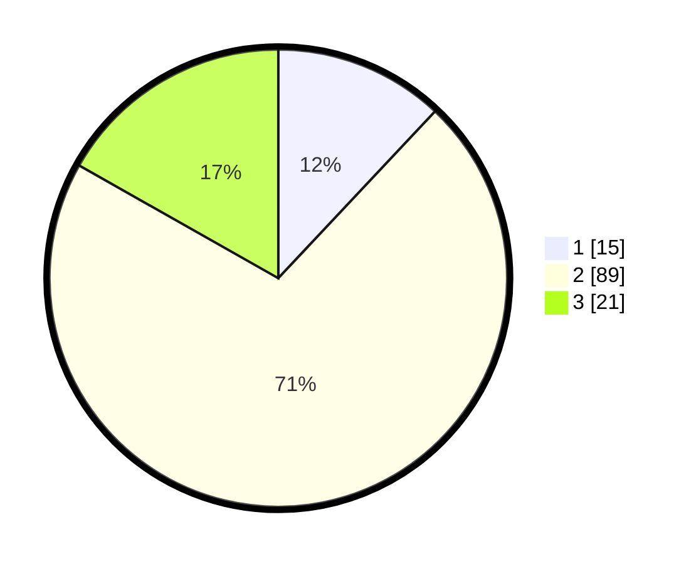

# Hasil

## Grafik

## Tabel

| No. | Nama Paslon    | Suara | Suara (raw) | Persentase |
|:--- |:-------------- | -----:| -----------:| ----------:|
| 1   | ANIES MUHAIMIN | 15    | [15][p-1]   | 12,00      |
| 2   | PRABOWO GIBRAN | 89    | [89][p-2]   | 71,20      |
| 3   | GANJAR MAHFUD  | 21    | [21][p-3]   | 16,80      |

[p-1]: https://github.com/gigit-pemilu/pemilu-2024-33-jawa-tengah/blob/main/pilpres/hitung-suara/sub/33-jawa-tengah/sub/17-rembang/sub/03-gunem/sub/2005-suntri/sub/005-tps/sub/paslon-1.txt
[p-2]: https://github.com/gigit-pemilu/pemilu-2024-33-jawa-tengah/blob/main/pilpres/hitung-suara/sub/33-jawa-tengah/sub/17-rembang/sub/03-gunem/sub/2005-suntri/sub/005-tps/sub/paslon-2.txt
[p-3]: https://github.com/gigit-pemilu/pemilu-2024-33-jawa-tengah/blob/main/pilpres/hitung-suara/sub/33-jawa-tengah/sub/17-rembang/sub/03-gunem/sub/2005-suntri/sub/005-tps/sub/paslon-3.txt

## Foto C Plano

https://sirekap-obj-formc.kpu.go.id/ef2f/pemilu/ppwp/33/17/03/20/05/3317032005005-20240216-214930--15c4109f-e33d-4d6e-86c1-0445006bfc01.jpg

https://sirekap-obj-formc.kpu.go.id/ef2f/pemilu/ppwp/33/17/03/20/05/3317032005005-20240216-215007--5f18651e-6c94-45aa-834c-4b6f6067e522.jpg

https://sirekap-obj-formc.kpu.go.id/ef2f/pemilu/ppwp/33/17/03/20/05/3317032005005-20240216-211944--bfb936c4-bea9-4c22-ab91-be51d641a0a9.jpg

## Metadata

| Key        | Value               |
| ---------- | ------------------- |
| Time Stamp | 2024-02-16 22:01:00 |

